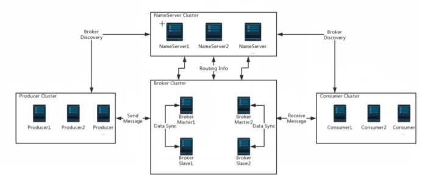
****RMQ的集群搭建****
================

主节点提供读写，从节点提供读，从节点不能提供写，主节点一旦恢复会和从节点数据同步，但是从节点消费的数据，主节点不会重复消费了

****同步刷盘和异步复制（消息保存到磁盘）****
--------------------------

同步刷盘就是等到消息保存到磁盘再返回给用户

异步就是先返回给用户再去保存到磁盘（存在数据丢失，但是速度快）

****同步和异步复制(主从之间的消息复制)****
--------------------------

同步复制(同步双写)就是主节点等到数据复制到从节点才能返回

异步就是不需要等到复制完

推荐为:同步复制异步刷盘

****总结****
----------
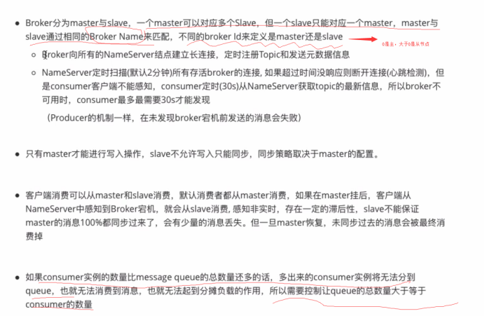
****生产者****
===========

****消息发送状态****
--------------
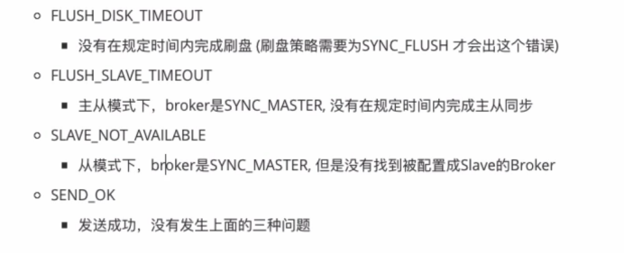
****消息发送重试****
--------------
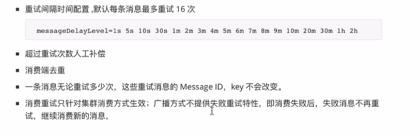
****发送消息****
------------

### ****同步发送****
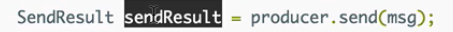
### ****异步发送****
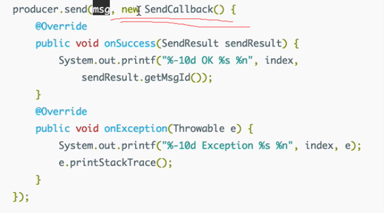
### ****One way发送****
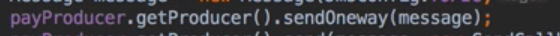
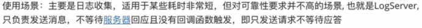
### ****消息延迟发送****
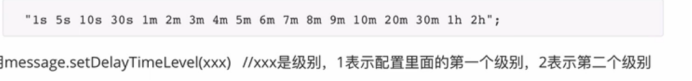
****生产者之MessageQueueSelector--指定queue投递****
-------------------------------------------

不使用的话则是随机投递的
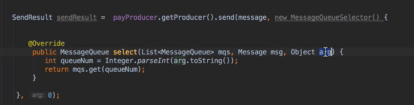
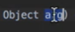就是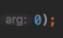，通过mqs.get选择queue

****消息的顺序消费****
---------------

### ****全局顺序****

### ****局部顺序****

顺序消费  按照进队列的顺序
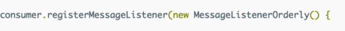
并发消费   不保证消费的顺序
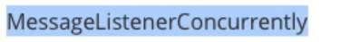
****消费者****
===========

****消费策略****
------------
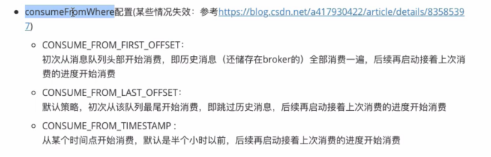
****分配queue****
---------------

如果有多个consumer监听，那么会每个consumer会平均分配queue，所以如果comsumer大于queue会有comsumer分配不到queue
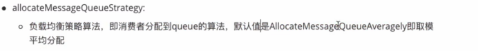
****Offset 消费消息进度（广播模式保存在本地，集群模式保存在broker）****
----------------------------------------------
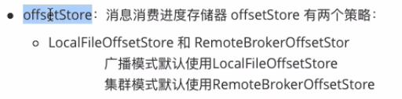
****其他配置。。****
--------------
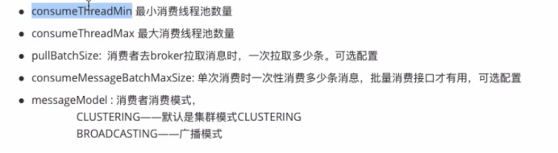
****广播模式和集群模式****
-----------------
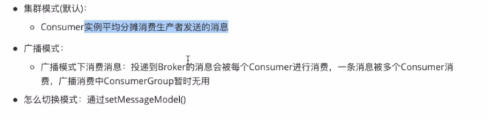
****TAG和消息过滤****
----------------

### ****Tag过滤****
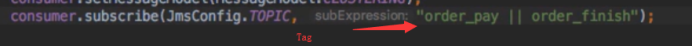

通过tag过滤的信息，同一个groupname下的consumer不会再去消费，但是不同groupname的consumer会（没有过滤这个tag）

### ****SQL过滤--->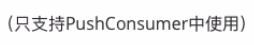****

去rmq的配置文件中配置下面的属性为true
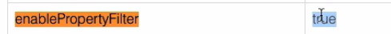

### ****Broker过滤****

Broker是通过hashcode进行过滤符合就传给consumer，consumer一般会继续过滤，不过是通过实际值比较，防止brokerhash碰撞

****PushConsumer和pullConsumer****
---------------------------------

Push是broker推送--可能push太快consumer来不及消费

Pull是consumer自己去broker拉取----拉太快可能会consumer消息为空，啦太慢可能造成消息堆积

长轮询----继承push和pull的改良版，自己去啦，如果没有消息就空等待一会，如果有消息就给comsumer（缺点是占用broker资源）
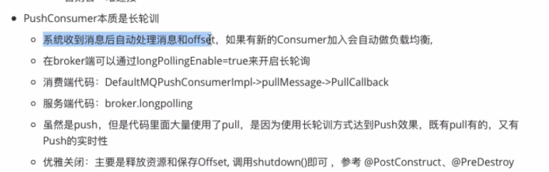
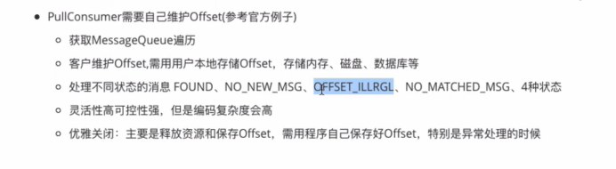
****注意点****
-----------
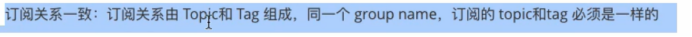
****Offset****
==============
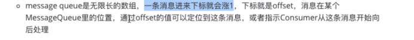
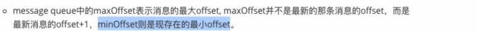
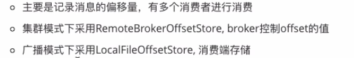
****CommitLog****
=================
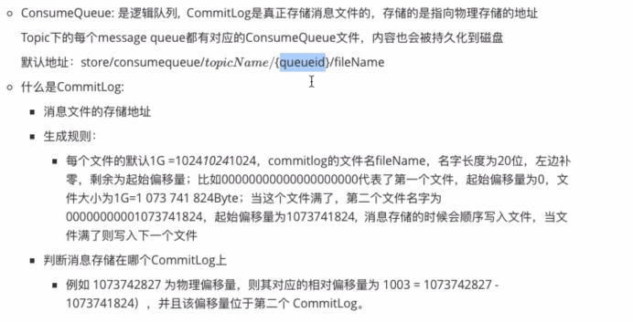
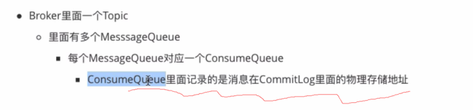
****RMQ效率高的原因****
=================

****零拷贝技术****
-------------
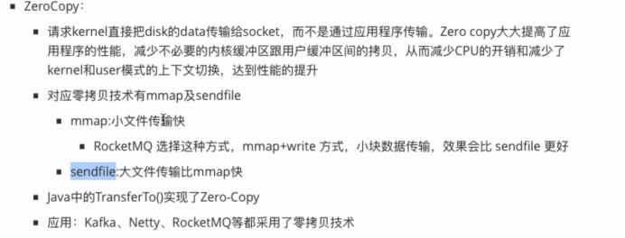

### ****普通文件的读取****
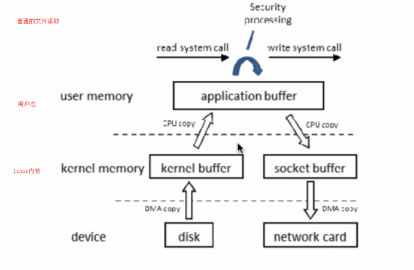
### ****零拷贝文件读取****
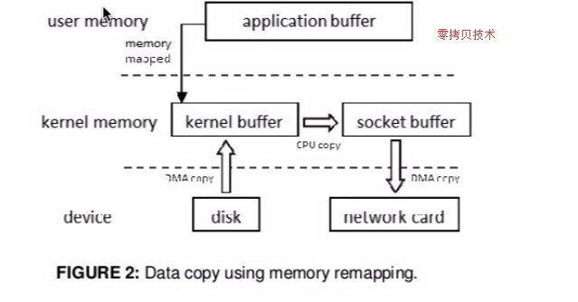
****分布式事务消息****
===============
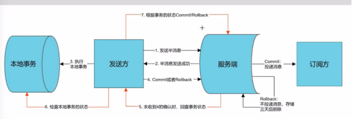
半消息

就是消息到了broker还不能被consumer消费的消息
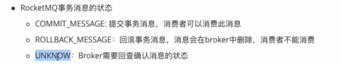
****例子（消费者和原来一样）****
--------------------

### ****生产者****

producer = new TransactionMQProducer(producerGroup);  
  
producer.setTransactionListener(transactionListener);  
producer.setNamesrvAddr(JmsConfig.__NAME_SERVER__);  
  
ExecutorService executorService = new ThreadPoolExecutor(2, 5, 100, TimeUnit.__MINUTES__,  
        new ArrayBlockingQueue<Runnable>(2000), new ThreadFactory() {  
    @Override  
    public Thread newThread(Runnable r) {  
        Thread thread = new Thread(r);  
        thread.setName("Xty\_Thread\_Transaction");  
        return thread;  
    }  
});  
//设置线程池是为了以后信息的回查  
producer.setExecutorService(executorService);

### ****事务监听器****

消息返回Unknow或者一直不返回过一会broker都会自动去调用checkLocalTransaction
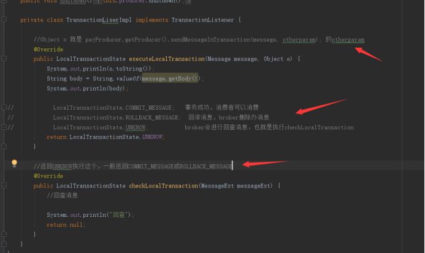
****如何保证消息不重复消费****
===================

****Redis****
-------------

通过redis setnx和setex连用，来设置对应的key

****Mysql****
-------------

在数据库中建立唯一的key，然后通过插入的返回值来判断

****RMQ的消息可靠性传输保证****
=====================

Produce--->broker:不采用oneway发送消息，做好重试的次数准备，做好日志的采集

Broker：双主双从，同步复制甚至同步刷盘

Consumer：

****RMQ消息队列消息堆积问题****
=====================

****性能分析****
============
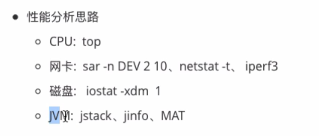