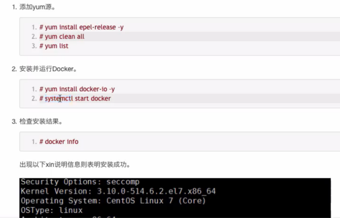
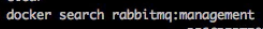
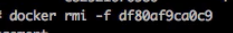
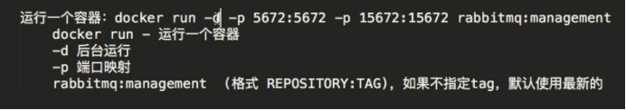
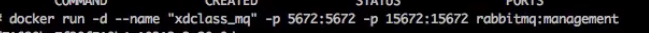
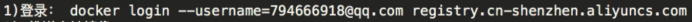
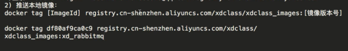
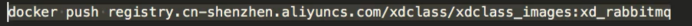

**安装**
======

****术语****
==========

****镜像****
----------

就相当于java类

****容器****
----------

就是new一个实例

****仓库****
----------

就是存放类的地方

****操作****
==========

****Docker search---查找镜像****
----------------------------

****Docker images****
---------------------

****Docker pull xxx--拉取镜像****
-----------------------------

****Docker rmi (-f强制删除) 镜像id****
--------------------------------

****Docker run(前面一个5672是宿主机器，后面一个是容器内的)****
-------------------------------------------

****Docker stop  (容器id或者容器name)---停止容器****
------------------------------------------

****Docker start (容器id或者容器name) ---开启容器****
-------------------------------------------

****Docker rm (容器name)--删除容器****
--------------------------------

****本地仓库上传流程****
================

****用maven把项目打成镜像****
---------------------

### ****添加maven插件****

步骤：maven里面添加配置pom.xml

 <properties>

   <docker.image.prefix>xdclass</docker.image.prefix>

</properties>

<build>

<finalName>docker-demo</finalName>

    <plugins>

        <plugin>

            <groupId>com.spotify</groupId>

            <artifactId>dockerfile-maven-plugin</artifactId>

            <version>1.3.6</version>

            <configuration>

                <repository>${docker.image.prefix}/${project.artifactId}</repository>

                <buildArgs>

                    <JAR\_FILE>target/${project.build.finalName}.jar</JAR\_FILE>

                </buildArgs>

            </configuration>

        </plugin>

    </plugins>

</build>

配置讲解

Spotify 的 docker-maven-plugin 插件是用maven插件方式构建docker镜像的。

${project.build.finalName} 产出物名称，缺省为${project.artifactId}-${project.version}

### ****添加dockerfile****

创建Dockerfile,默认是根目录，（可以修改为src/main/docker/Dockerfile,如果修则需要制定路径）

什么是Dockerfile : 由一系列命令和参数构成的脚本，这些命令应用于基础镜像, 最终创建一个新的镜像

FROM openjdk:8-jdk-alpine

VOLUME /tmp

ARG JAR_FILE

COPY ${JAR_FILE} app.jar

ENTRYPOINT \["java","-jar","/app.jar"\]

参数讲解：

FROM <image>:<tag> 需要一个基础镜像，可以是公共的或者是私有的， 后续构建会基于此镜像，如果同一个Dockerfile中建立多个镜像时，可以使用多个FROM指令

VOLUME  配置一个具有持久化功能的目录，主机 /var/lib/docker 目录下创建了一个临时文件，并链接到容器的/tmp。改步骤是可选的，如果涉及到文件系统的应用就很有必要了。/tmp目录用来持久化到 Docker 数据文件夹，因为 Spring Boot 使用的内嵌 Tomcat 容器默认使用/tmp作为工作目录

ARG  设置编译镜像时加入的参数， ENV 是设置容器的环境变量

COPY : 只支持将本地文件复制到容器 ,还有个ADD更强大但复杂点

ENTRYPOINT 容器启动时执行的命令

EXPOSE 8080 暴露镜像端口

### ****构建镜像****

2、构建镜像

mvn install dockerfile:build

打标签

docker tag a1b9fc71720d registry.cn-shenzhen.aliyuncs.com/xdclass/xdclass_images:docker-demo-v201808

推送到镜像仓库

docker push registry.cn-shenzhen.aliyuncs.com/xdclass/xdclass_images:docker-demo-v201808

应用服务器拉取镜像

docker pull registry.cn-shenzhen.aliyuncs.com/xdclass/xdclass_images:docker-demo-v201808

docker run -d --name xdclass\_docker\_demo1 -p 8099:8080  a1b9fc71720d

****上传****
----------

登录

为镜像打tag

Push到远端
