**Zookeeper**
=============

****节点类型****
------------

临时节点：一旦断开session链接，就会删除  create -e

永久节点：永久 create -s
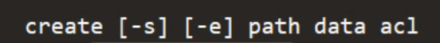
### ****查看节点信息****
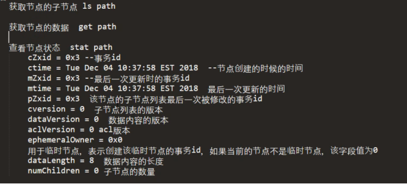
Ls2--->查看当前节点状态和包含的子节点

### ****修改节点信息****

### ****其他操作通过./zkCli.sh -h查看****

****Session---zookeeper和服务器的链接****
----------------------------------
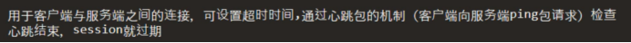
****Watcher机制---但是只能监控一次，监控到结束****
----------------------------------

get/Stat可以带上watch

Get/Stat只针对当前的节点，对子节点的变化不响应

如果ls/ls2对子节点进行watch（ls /xdclass watch）  ---->只会本身节点和第一层的子节点（子节点的子节点不会去监听可），而且只监听增，删

****ACL---权限控制****
------------------

GetAcl

SetAcl：

AddAuth：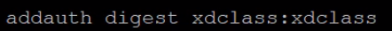

### ****Scheme****
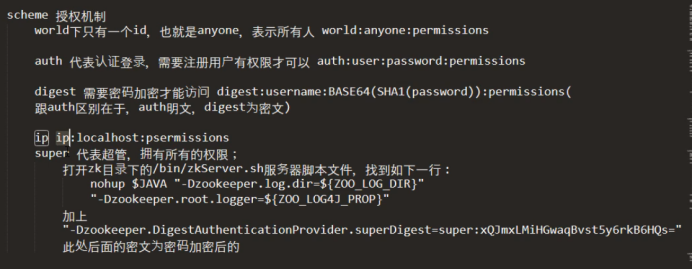
#### ****Id****
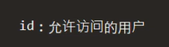
### ****Permession****
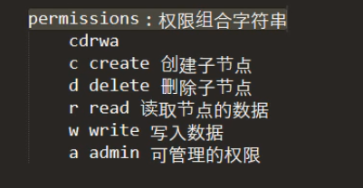
****ZK角色****
------------

### ****Leader****
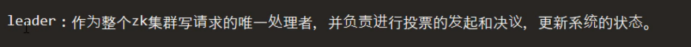
### ****Follower****

### ****Obsercer****
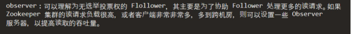
****Zk的不同模式****
---------------
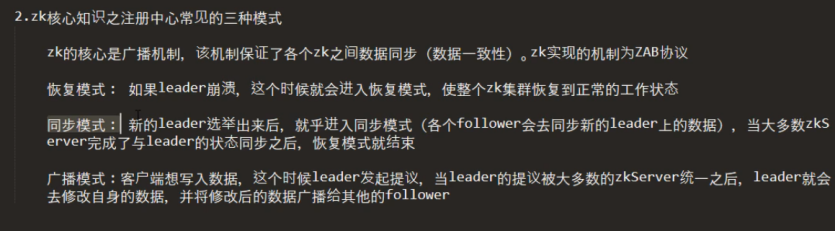
****Zk选举的机制****
---------------

Myid：服务器的编号--->1,2,3,4,5,6...

Zxid:Long型   高32是epoch的值  低32是xid

Epoch--->代表leader的时期，每产生一个新的leader epoch都会更新

Xid--->就是事务id，每一次写操作都是一个事务，每一次写操作都需要leader发起follower表决是否同意

逻辑时钟：
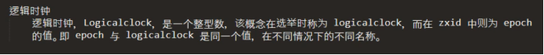
然后一旦需要选举leader 就去比较myid和zxid

****Dubbo配置解析C=consumer P=provider****
======================================
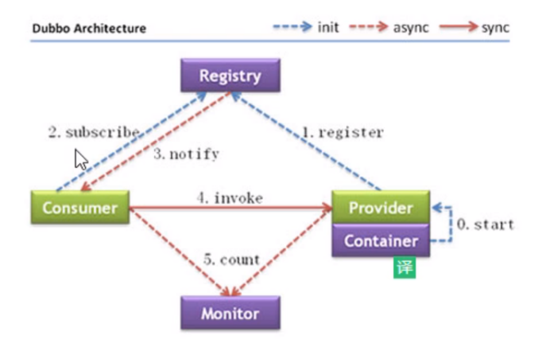
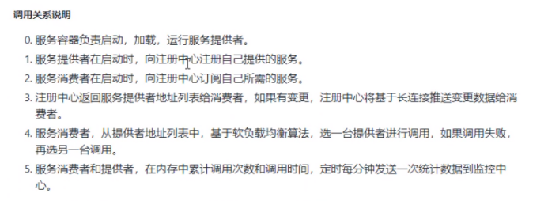
****Spring.application.name（C+P）****
------------------------------------

指定这个节点的名称，有了这个就不用去配置dubbo.application.name

Dubbo.scan.basepackage==@DubboComponentScan（P）
------------------------------------------------------------------------------------------------------

就是去扫描@Service

****Dubbo.protocol--指定调用协议（P）****
---------------------------------

就是指定consumer要去调用provider的时候需要的接口和协议

****Dubbo.register---指定注册中心（C+P）****
------------------------------------

****@Reference（C）****
---------------------

consumer调用provider的接口

****注解配置---交互的pojo类一定要实现序列化接口****
---------------------------------

### ****依赖****

<dependency>  
    <groupId>org.apache.dubbo</groupId>  
    <artifactId>dubbo</artifactId>  
    <version>2.7.2</version>  
    <exclusions>  
        <exclusion>  
            <artifactId>spring</artifactId>  
            <groupId>org.springframework</groupId>  
        </exclusion>  
    </exclusions>  
</dependency>  
  
<!\-\- https://mvnrepository.com/artifact/org.apache.dubbo/dubbo -->  
<dependency>  
    <groupId>org.apache.zookeeper</groupId>  
    <artifactId>zookeeper</artifactId>  
    <version>3.4.10</version>  
    <exclusions>  
        <exclusion>  
            <artifactId>slf4j-log4j12</artifactId>  
            <groupId>org.slf4j</groupId>  
      </exclusion>  
  </exclusions>  
</dependency>  
  
<dependency>  
    <groupId>com.github.sgroschupf</groupId>  
    <artifactId>zkclient</artifactId>  
    <version>0.1</version>  
</dependency>  
  
<dependency>  
    <groupId>org.apache.curator</groupId>  
    <artifactId>curator-recipes</artifactId>  
    <version>4.0.1</version>  
</dependency>

### ****Provider--配置****
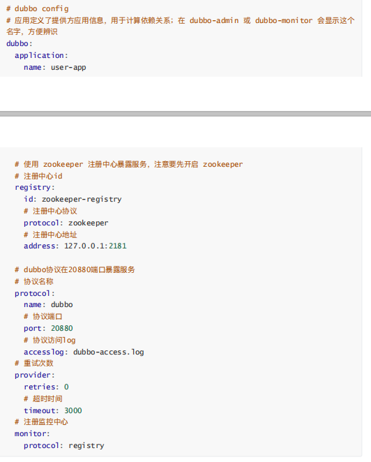
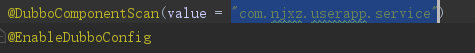
dubbComponentScan扫描的是@Service接口

### ****Consumer----配置****

和provider一样 修改一下dubbo.application.name就可以了
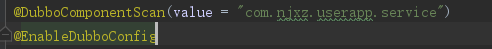
@DubboComponentScan就是吧Provider的数据扫描到本地，RPC调用

****springboot整合zookeeper****
=============================
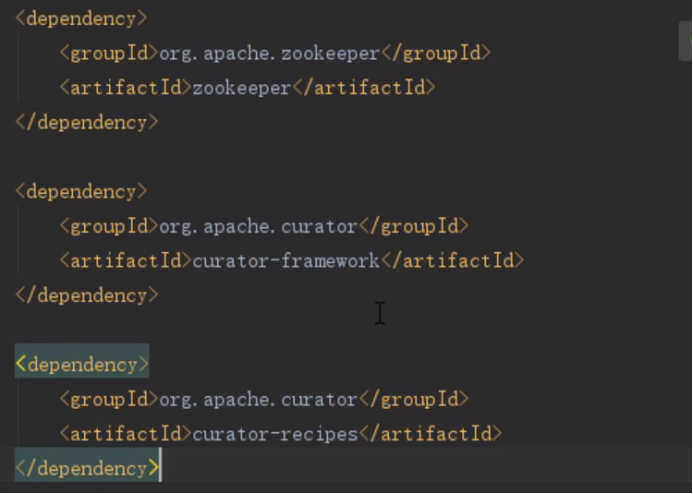
****多注册中心配置****
---------------

注解配置:（我猜的）
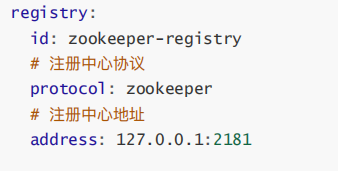
--->配置多个 id不同
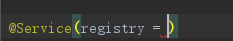
--->registry指定

XML配置：
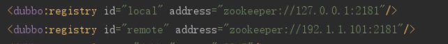
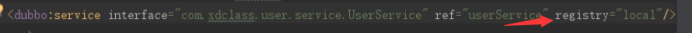
service指定注册到那个zookeeper（如果要注册多个就用，隔开  local，remote）

****Duboo分组配置---针对的是同一个接口的多个实现****
==================================

在service中添加group属性

然后再consumer调用的时候添加group属性

****Dubbo的多协议配置****
===================
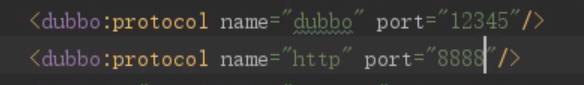
然后再service属性添加protocol属性

****Dubbo Admin--可视化配置****
==========================