**关于restful**
=============

POST一般用来更新/查询/新增

GET  查询

PUT  一般用来创建

Delte 删除

****安装搭建****
============

安装好之后进入bin目录，然后sh elasticsearch.sh

访问9200端口如果可以就启动成功了。

****目录结构****
============
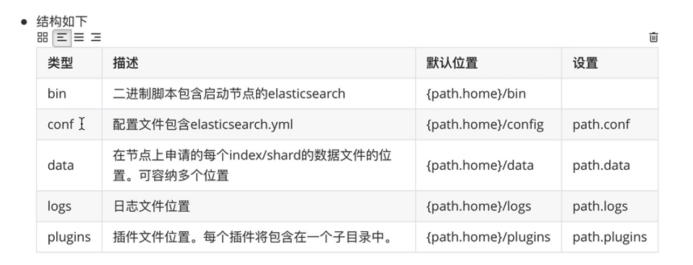
****术语****
==========
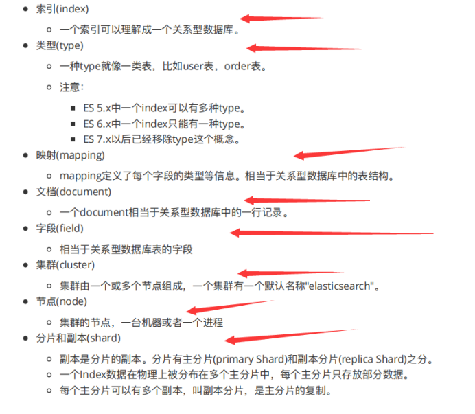
****创建index****
===============

PUT请求发送 localhost:9200/nbc---->创建nba索引

****创建mapping****
=================

****显示所有mapping****
-------------------

****获取mapping****
-----------------

****新增mapping字段****
-------------------

直接在原来的基础上新增就行了
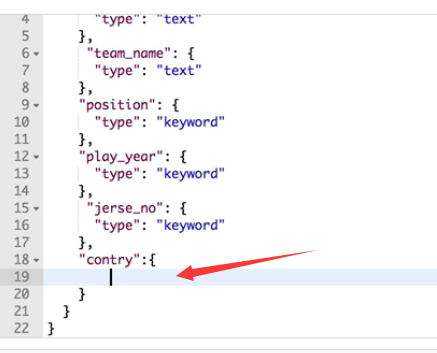
****设置mapping****
-----------------

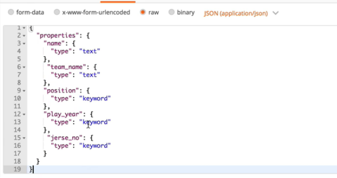
****创建文档Doucument****
=====================
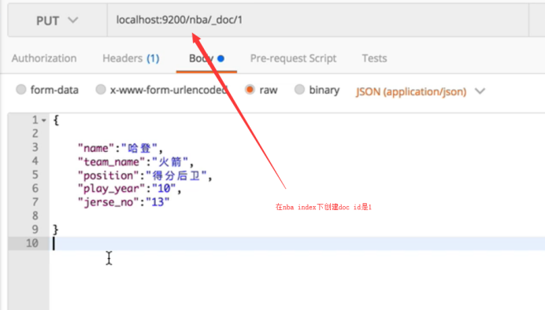
****查看文档****
------------

### ****根据下标****

### ****根据id****
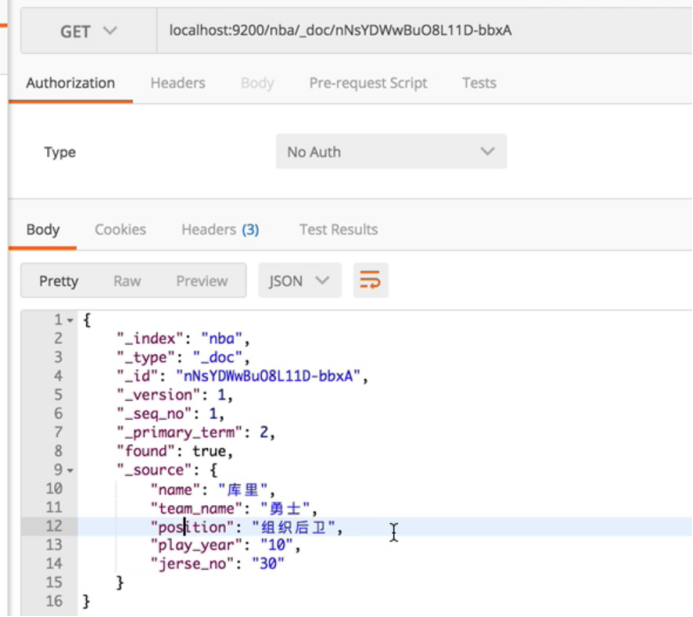
### ****查看多个文档****

第一种
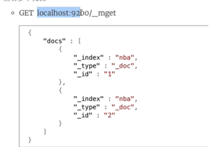
第二种
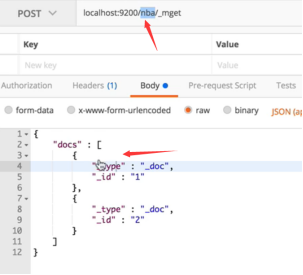
第三种
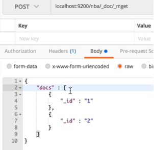
第四种
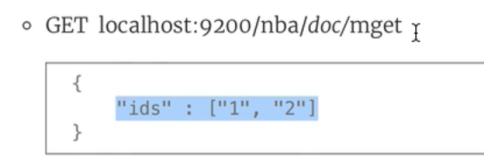
****创建doc---携带ID的（/1）****
-------------------------
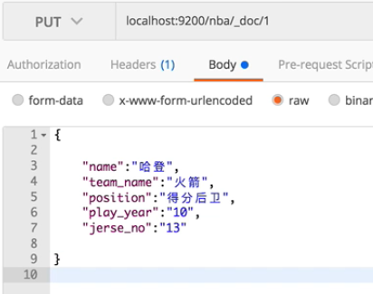
### ****不带ID的--POST****
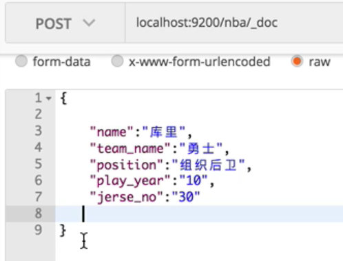
****创建文档****
------------
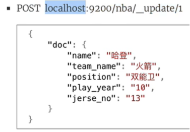
****新增doc下的字段****
-----------------
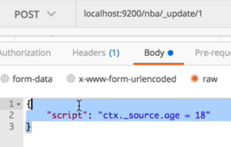

****删除doc字段****
---------------
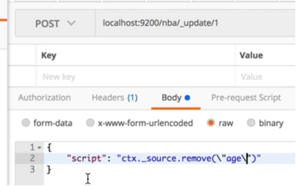
****修改字段****
------------
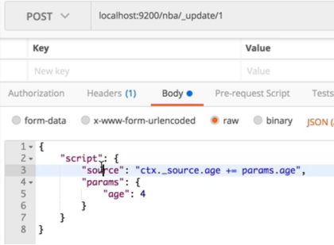
****删除文档****
------------
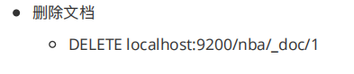
****简单搜索****
============

****Term查询---精确查询（查不了text类型字段）****
----------------------------------
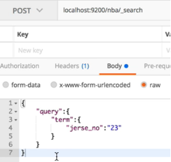
****Match查询---匹配查询（前提是查询字段类型是text，也可以查别的字段不过就是精确查询了）****
--------------------------------------------------------
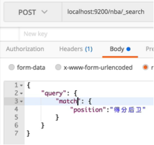
position包含’得分后位’任意一个字

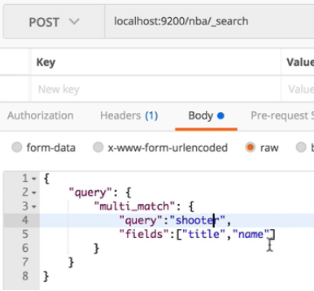title和name里面包含shooter的

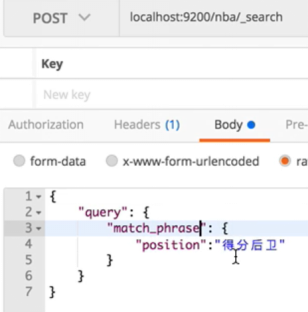match_phrase有点像精确查询（给出的字段必须连续出现）

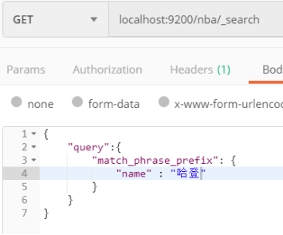和mathch\_phrase基本一样，不过match\_phrase要求单词一定要完整，例如i like swimming and,用match\_phrase查一定要i like swimming，用match\_phrase_prefix只要 i like sw

****分词器****
===========

****最基础的standard-->空格和特殊字符隔开，且全小写****
-------------------------------------

****Simple--->把除了字母的作为分隔符隔开，也全小写,类型为word****
--------------------------------------------

****Whiteapace--->空格隔开****
--------------------------

****Stop****
------------
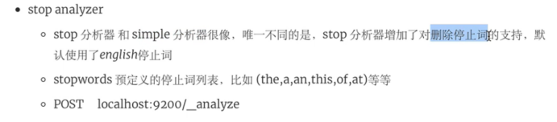
****数据类型****
============

****字符串，布尔，二进制，范围类型，日期****
--------------------------
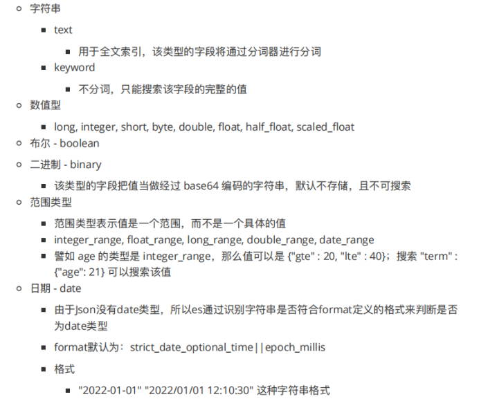
****数组类型****
------------
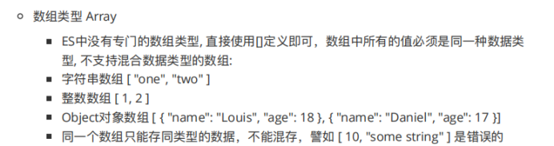
****对象类型****
------------
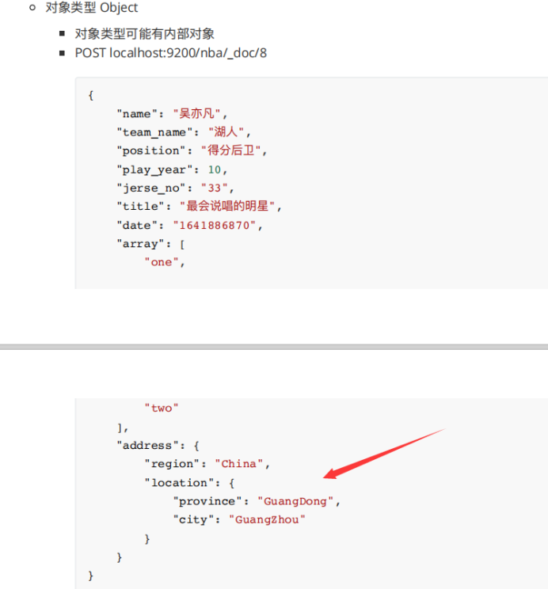
****IP类型****
------------

****批量导入数据****
==============

****term的多种查询方式（针对非text类型）****
==============================

****精确查找****
------------
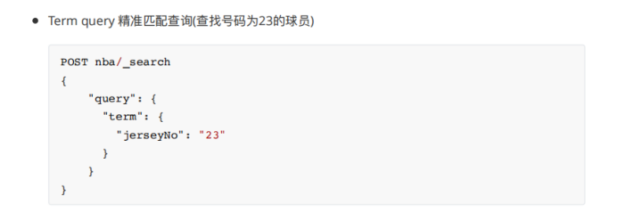
****字段非空查找****
--------------
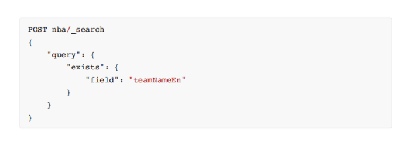
****前缀查找（只要单词中是有Rock开头的  比如xxx Rock或者Rock xxx）****
--------------------------------------------------
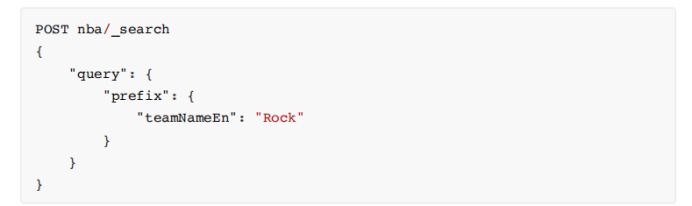
****通配符查找****
-------------
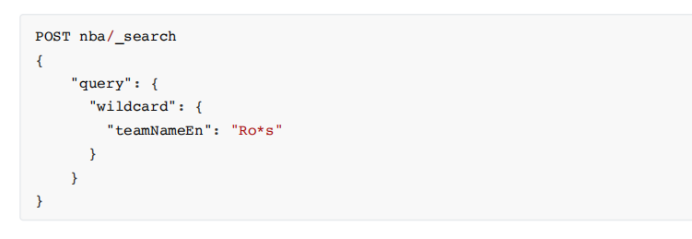
****正则表达式查找****
---------------
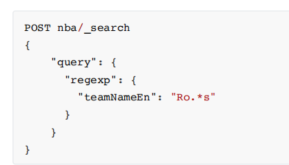
****ID查找****
------------
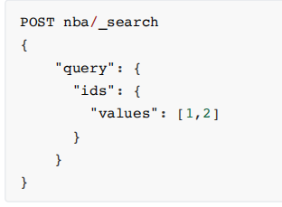
****范围查询（针对日期，数字，字符串非text）****
==============================
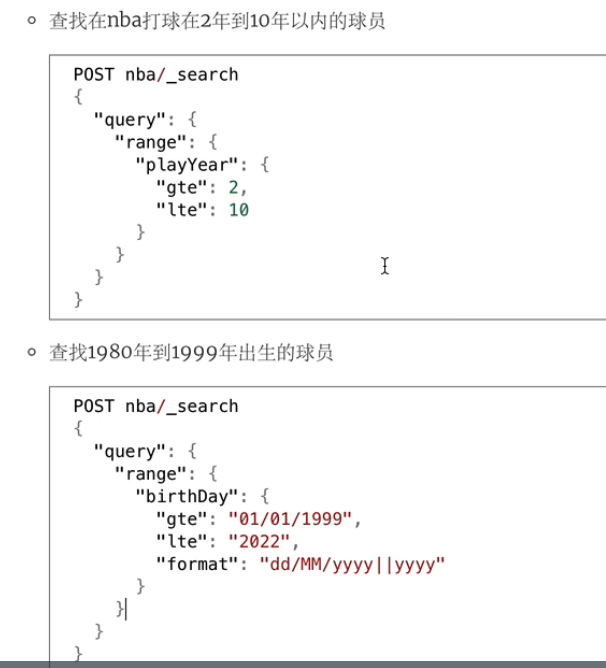
****布尔查询****
============
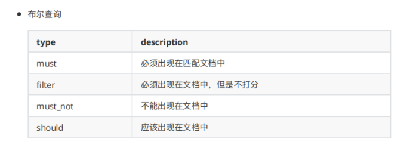
****Es排序****
============
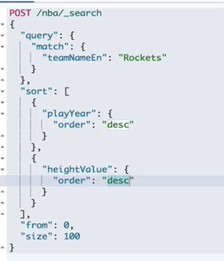
****聚合函数****
============

格式都是

“aggs”:{

“name”:{

    “type”:{

         内容

      }

}

}

Type的种类有:max min sum avg
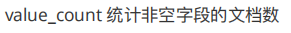

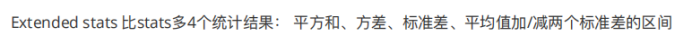

****桶聚合+范围分组聚合+时间分组****
=======================

Term:分组相当于group by

Range:范围分组聚合

Date_range:时间范围分组聚合

****Query_String****
====================
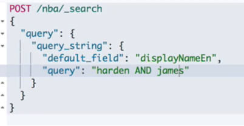
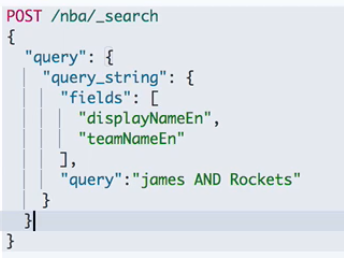
****别名_alias****
================

别名相当于给index取了一个别名，就可以用别名操作index

如果一个别名对应多个索引，可以为别名设置属性
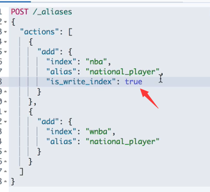
****重建索引****
============

****Refresh操作和高亮查询****
======================

****Refresh****
---------------
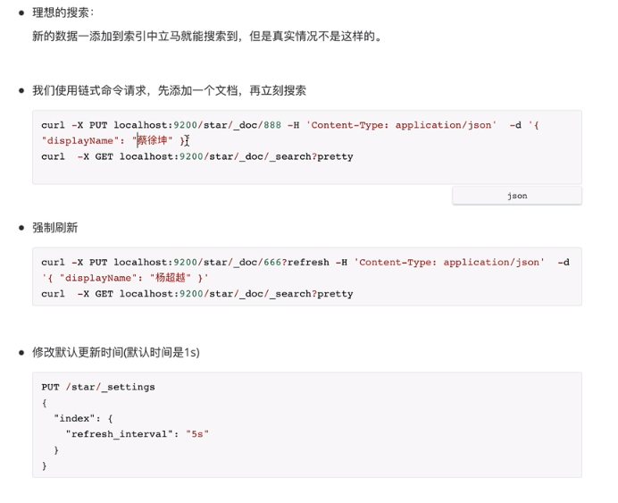
****高亮****
----------

****建议器****
===========

****Missing输入的字段，索引中不存在时提示****
------------------------------

Text是输入，suggest_mode就是建议模式，field是指明输入是哪个字段，然后根据索引下这个字段所有的值进行匹配。
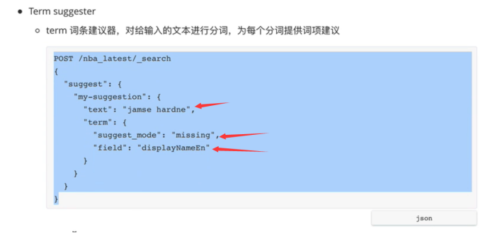
****Phrase****
--------------
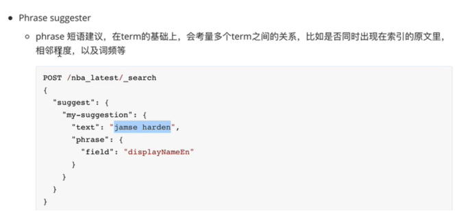
****Completion完成建议--->就补全****
-----------------------------

****整合Springboot****
====================

D:\\elsearchdemo

****相关API****
-------------

### ****Add****

通过调用IndexRequest来进行数据的添加，表明id和source（Map类型）

通过RestHighLevelClient.index的方法进行数据的添加
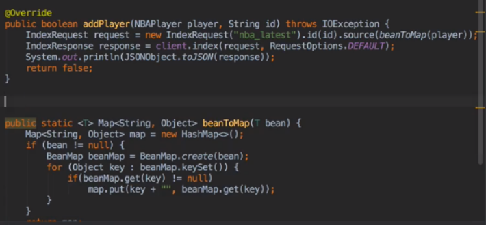
### ****Get****

GetRequest（“索引的名字”,”获取id”）

通过RestHighLevelClient.get获得
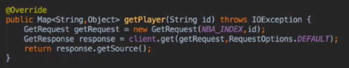
### ****Update****

通过构造UpdateRequest，设置索引和id，然后放入新的资源

通过RestHighLevelClient.update进行更新
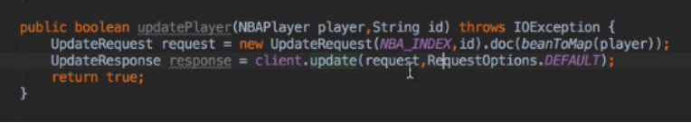
### ****Delete****
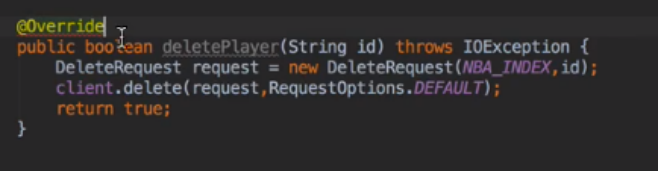
### ****DeleteAll****
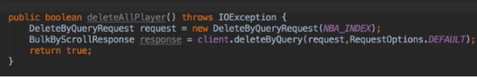
### ****Search****

通过SearchRequest，构造一个SearchBuilder

通过RestHighLevelClient.search进行搜索

把response调用getHits2次得到数据，然后转成JSON字符串进行解析
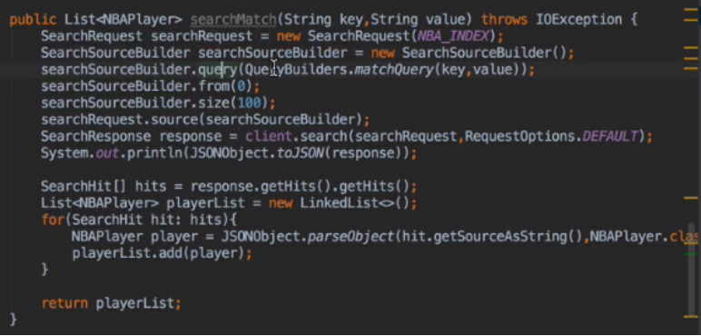
****集群的搭建--->去集群文档看****
=======================

****集群的基本概念（客户端节点用来进行负载均衡）****
==============================
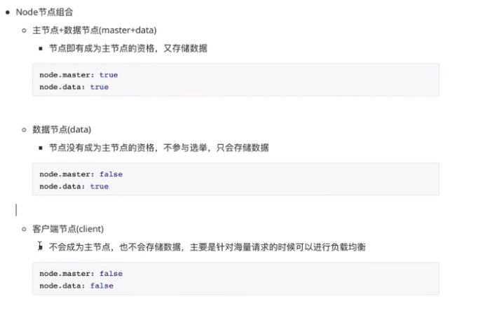
****集群工作原理****
==============

****写入****
----------

****读取（主分片副分片都可以读，会负载均衡）****
----------------------------

****集群路由原理（就是如何找到分片）****
========================

就是对主分片数取模

****Elastic的乐观锁****
===================

使用version作为控制变量，读的时候不上锁，但是去更新的时候可以带上版本号，如果带上的version比当前版本高则更新成功，否则说明有人更新了，就失败

****倒排索引****
============

就是记录每个单词的id，频率，第几个单词的一张表

