**Default--就是给接口提供默认方法**
========================

还可以在接口里添加静态方法
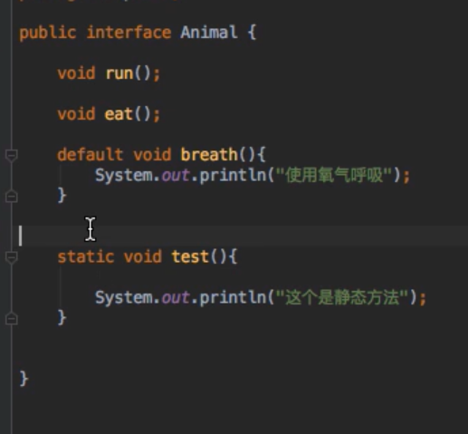
****时间类****
===========

****BASE64编码和LocalDate、LocalTime、LocalDateTime****
--------------------------------------------------

了解了解api记性了

****LocalDateTime和date互转****
----------------------------
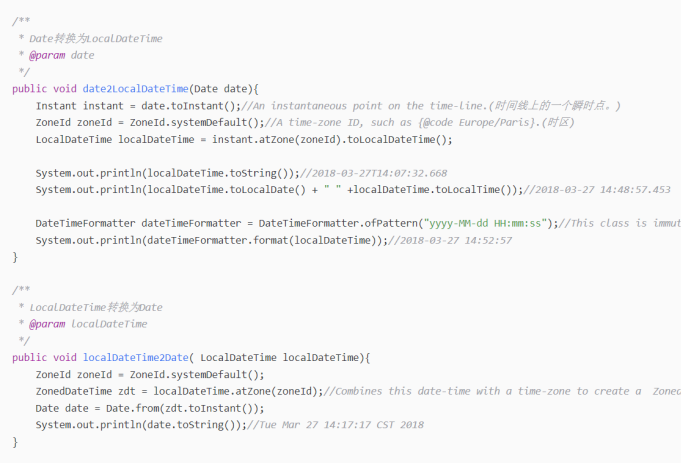
****DateTimeFormatter(线程安全) SimpleDateFormat（不安全）****
-----------------------------------------------------
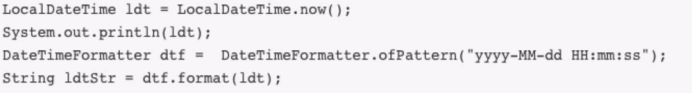
****Duration--计算时间差****
-----------------------
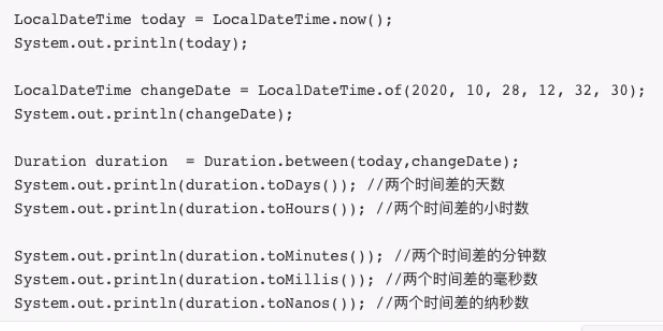
****Optional---选择****
=====================

****兜底****
----------

如果student1为空就选择student2
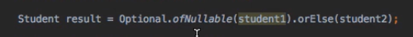
****Of  ofnullable****
----------------------

Of不能放入null；

Ofnullable可以

****Lambda****
==============
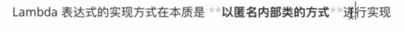

****自定义lambda表达式****
--------------------
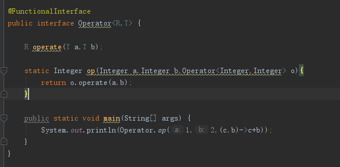
定于
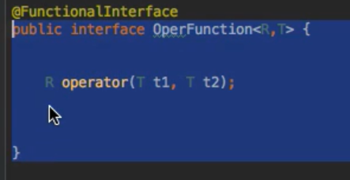
使用
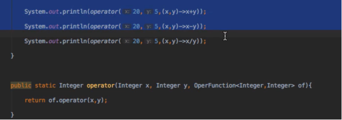
****Function---简化自定义lambda（帮你实现好了静态方法）****
------------------------------------------
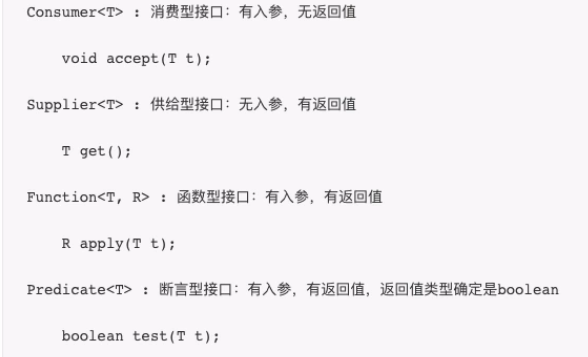
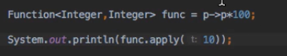
****Bifunction---function的扩展（2个参数）****
--------------------------------------

****Consumer---只有一个入参没有返回值，常用于日志的打印****
---------------------------------------
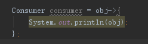
****Supplier---没有入参，有返回值，可以用于工厂创建****
-------------------------------------
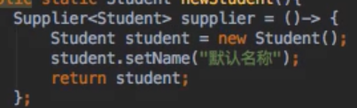
****Predicate--有入参，有返回值（boolean），用于判断****
-----------------------------------------
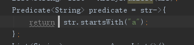
Stram的filter
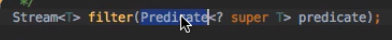
****：：********---调用方法****
-------------------------
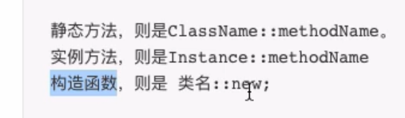
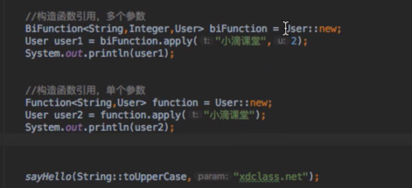
****Stream****
==============

****Map---指明如何转化（参数是一个function）****
-----------------------------------

就是如何转化
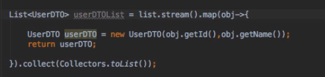
****Filter---就是过滤（参数是一个predicate）****
-------------------------------------

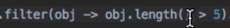（长度大于5）

****Sorted--排序****
------------------
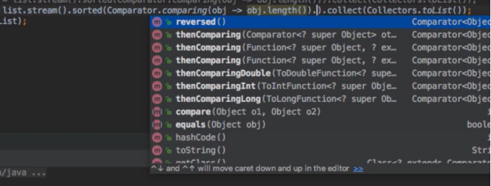
Comparing之后可以选择thenComparing追加条件，或者reversed，倒序

****Limit---就是限制查询条数****
------------------------

****Match****
-------------

全部满足  allmatch
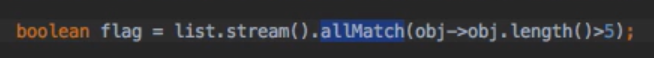
任一满足 anymaatch

****Max  min****
----------------
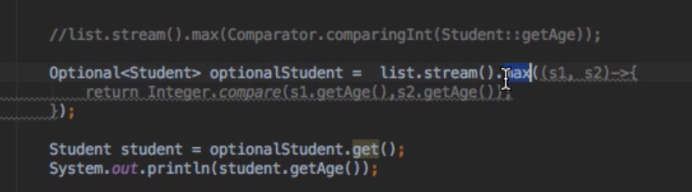
****ParallelStream---并行流****
----------------------------
开启多个线程去执行
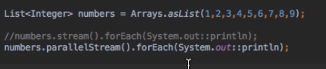
同步的stram就会输出123456。。异步就是乱序的51348...
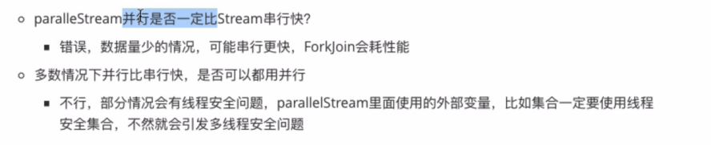
****Reduce---聚合操作****
---------------------

1+2+3+4+5
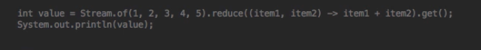
初始值为100，直接返回初始值类型的结果
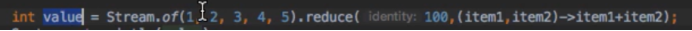
****ForEach---接收一个consumer****
------------------------------
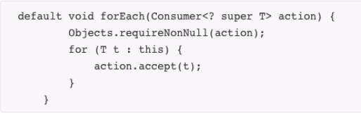
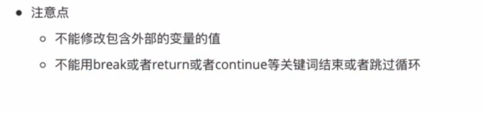
****Collector收集器****
====================

****ToCollection可以变成任一一个collection下的实现****
------------------------------------------
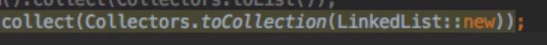
****toList、toSet等基本类型****
-------------------------

源码如下

就是帮你创建一个实例，然后调用add方法，把所有数据放入
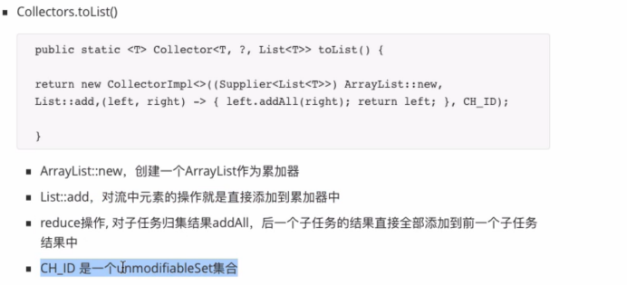
****Joining--转字符串****
---------------------

第一个参数就是new 一个stringbuilder，第二个操作调用stringbuilder的append方法

第三个参数就是reduce方法
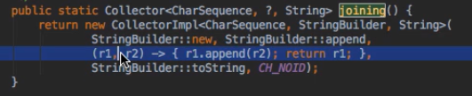
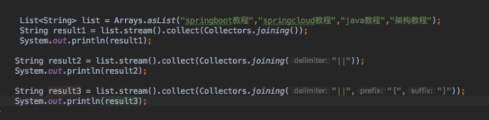
****PartitioningBy---分组（key只会是true和false）****
---------------------------------------------
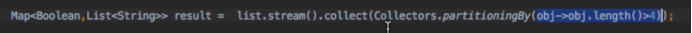
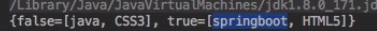
****Group By（括号里写的是根据哪个字段分组）****
--------------------------------
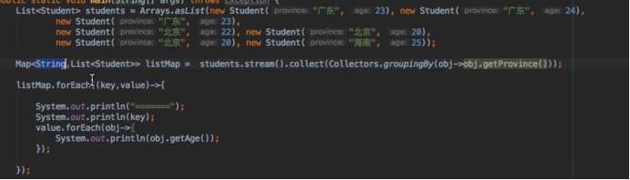
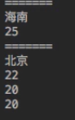
****Couting---统计个数****
----------------------
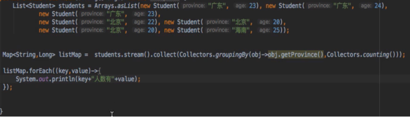
****Summarizing---集合统计****
--------------------------
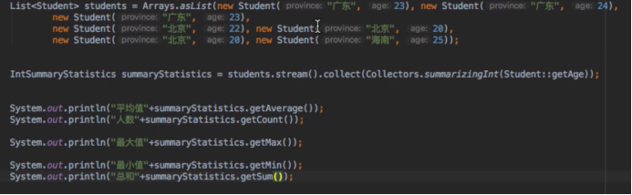
****MetaSpace****
=================

JDK8之前的永久代
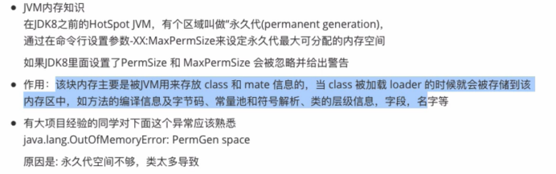
JDK8之后移除永久代
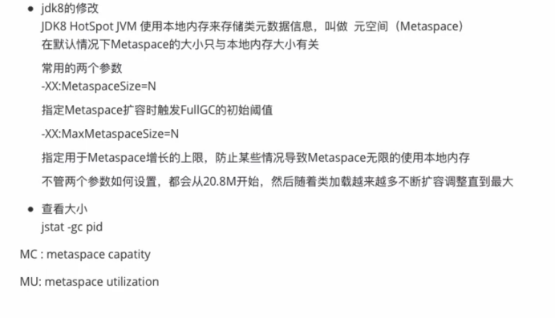