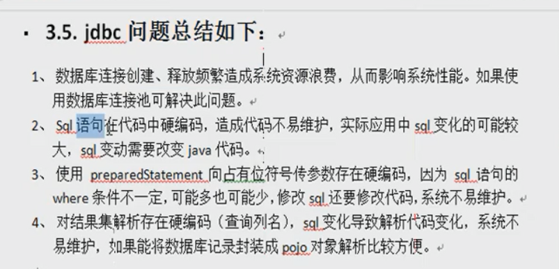
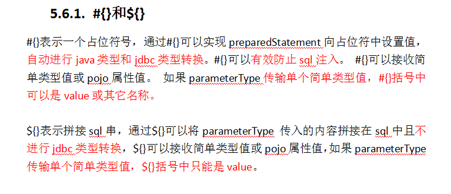
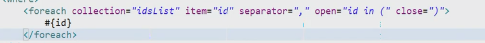
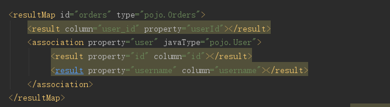
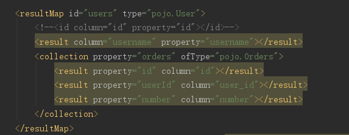
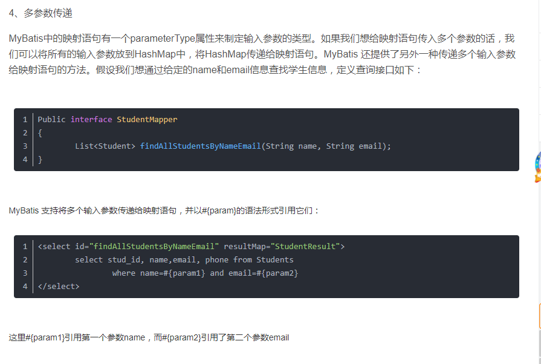

# mybatis
jdbc的问题:

typeAliases:别名，中的package标签中name属性为相同包名
<typeAliases>
    <package name="...">
</typeAliases>

<mapper resource="" class="" uri="">(3选1)
resource---->指定mapper.xml文件的位置
class----->接口的位置，要求mapper接口和mapper.xml文件名字一样而且放到同一个目录下
<mappers>中可以添加<package>和class要求相同，只要指定包名就行。

# mybatis参数
#{}---->相当于占位符？  自带''
${}----->相当于字符串拼接  

参数如果是pojo类型 则直接使用#{pojo中的名称取值}
如果参数是封装的pojo则可以用#{user.name}形式来取

# mybatis标签
<if test="..">
</if>

<where></where>去除前置and（有可能因为if判断删除后 之后条件的and多余）

collection中的idlist为parameter传入参数中的数组名称，以上等价于(1,2,3);(一定要是类中的数组，如果直接传递数组则为array)

# mybatis中的一对一，一对多
返回值一定是resultMap 手动映射
如果是一对一用association，把你2个类中想显示的都用<result>写出来就行了，association中的property属性为Orders中User user的名字user。
（result是你显示的数据，你要显示哪些写哪些，全部要显示就要全写）

如果是一对多用collection（多的一方），把你2个类中想显示的都用<result>写出来就行了，orders与一对一中的小额property同理，多了一个ofType----->List中每一个元素的类型

