**同步阻塞--同步是客户端自己去拿数据（就是去Linux kernal内核复制数据）**
---------------------------------------------

就是socket操作，客户端发送数据，服务器就在那里一直监听一个端口等待数据过来。

****同步非阻塞--阻塞就是看我内核准备数据的时候进程是否一直在等待****
---------------------------------------

服务器不用一直监听，过一会去监听一下过一会监听一下，然后等数据处理好了，客户端自己去拿数据

****异步阻塞--->基本没有****
--------------------

****异步非阻塞****
-------------

就是客户端把数据丢过去，然后就不用管了，等服务器处理好了就自动返回结果

****同步与异步的区别****
----------------

就是看数据是否要我自己去拿

****阻塞和非阻塞的区别****
-----------------

就是看我服务器是不是要一致干等客户端的数据

****5种IO模型（除了异步IO 其他都是同步IO 就是都要自己去内核拿数据）****
============================================

****阻塞IO****
------------
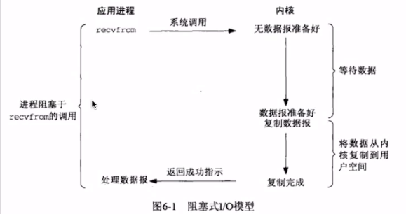
****非阻塞IO****
-------------
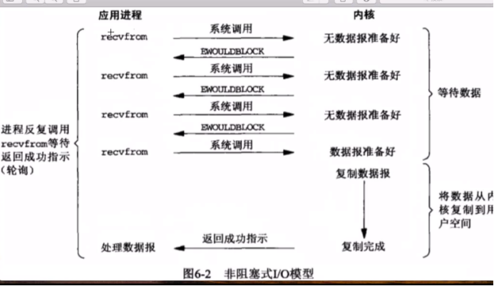
****多路复用IO--阻塞于select一旦拿到链接，下面的执行都是非阻塞的****
-------------------------------------------
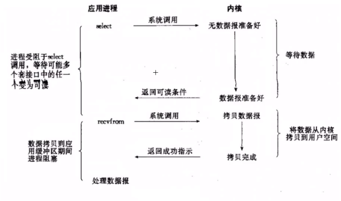
****信号驱动IO****
--------------
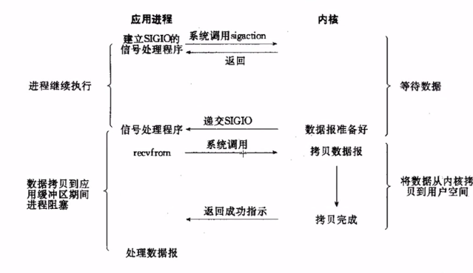
****异步IO****
------------
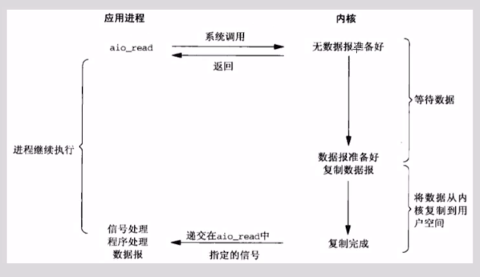
****总结****
----------

同步和异步的区别就是数据获取的方式，同步是自己去内核复制，异步是系统帮你准备好

阻塞和非阻塞在于第一步，数据的准备，调用方是否要一直等待数据

****多路复用技术****
==============
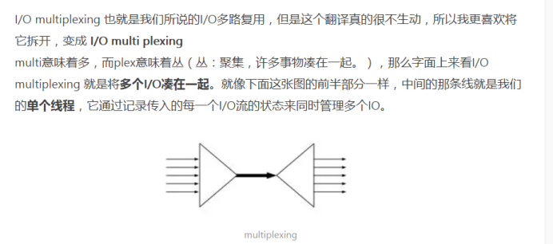
****Select****
--------------

客户端请求的操作就是一种fd（操作符）

Linux的操作符基本有3种，wirtefds，readfds，exceptfds--->写。读。异常fd

一旦调用select就会阻塞，等有数据满足fd的状态，可读，可写，出异常就会返回，select就会遍历所有的fds去查找对应的已经就绪的fd然后进行操作
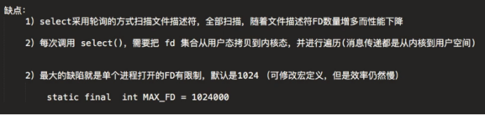
****Poll****
------------

Poll和select基本一样，只不过没有最大FD限制

****Epoll****
-------------

1.  没有fd大小限制
2.  内核和用户控件mmap同一块内存实现，不用每次调用都把fd从拥护他该拷贝到内核态
3.  不用采用轮询去扫描全部fd，采用事件通知机制--->通过epoll_ctl注册fd，一旦fd就绪就采用callback激活对应的fd
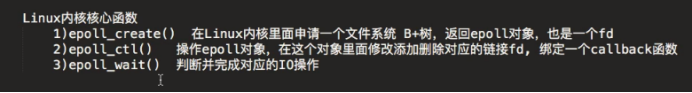
****使用例子****
------------
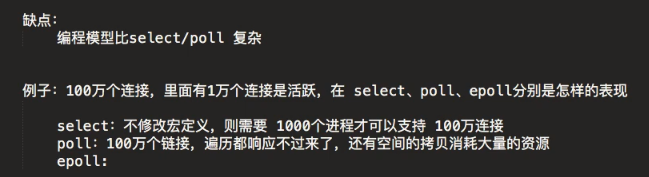
****Reactor模式（NIO）---反应器设计模式****
================================

设计模式——Reactor模式（反应器设计模式），是一种基于事件驱动的设计模式，在事件驱动的应用中，将一个或多个客户的服务请求分离（demultiplex）和调度（dispatch）给应用程序。

****单线程模式（一个线程既做acceptor也做NIO线程处理）---容易挂掉，一次响应一个线程****
------------------------------------------------------

****多线程模式（1个Acceptor+一组NIO线程）****
---------------------------------
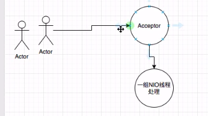
****Reactor主从线程模型--1组+1组****
----------------------------

****Netty的echo服务****
====================

1.  导包
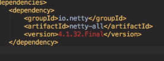
2.  架构（CS体系， 由Handler来处理信息）

3.  组件

EventLoop和EventLoopGroup----->线程和线程组

Bootstrap---->启动类

Channel---->链接管道  相当于客户端和服务器的链接

ChannelHandler----<链接处理器

ChannelPopeLine---->流水线 相当于可以添加多个channelHandler的容器

****EventLoop和EventLoopGroup****
--------------------------------
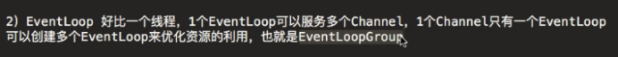
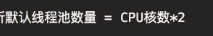
EventLoopGroup包含多个EventLoop，他来分配EventLoop到不同的channel

每个EventLoop维护这一个Selector

Selector就是用来让一个线程去维护多个通道的组件，每个通道注册到selector中，selector调用select方法来使用channel

****BootStrap****
-----------------

单线程模式---对应的就是Reactor的单线程模式（一个线程既当接待员也当服务员）
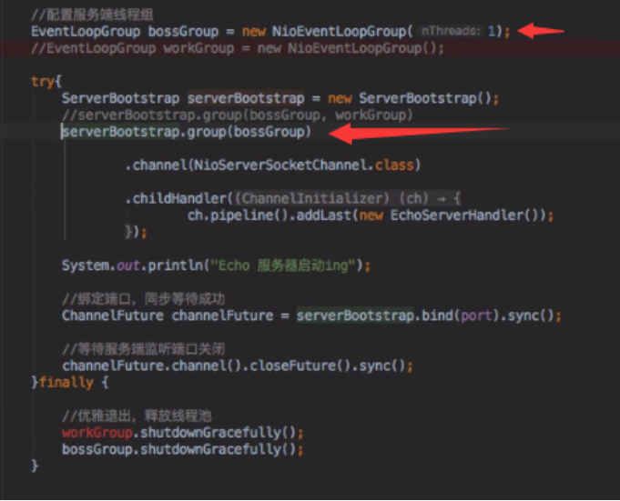
多线程模式

和单线程比较，把注释的部分不注释就行了

主从模式

就是bossGroup不是1个线程了

### ****参数---对于server端的****

Channel---->指定通道类型

childHandler---->指定处理器

Option---->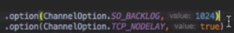给每个channel设置参数
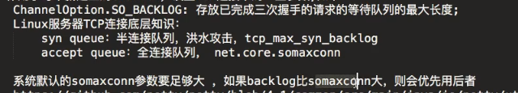
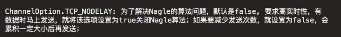
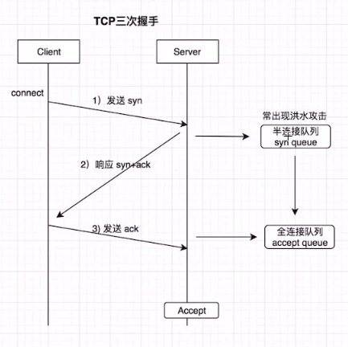第一次握手半连接，第三次全连接

ChildOption---->作用于呗accept之后的链接，也就是work线程处理的时候的参数

****Channel****
---------------
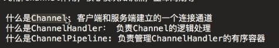
### ****channelHandler(负责Channel的逻辑处理)---有2个子接口****
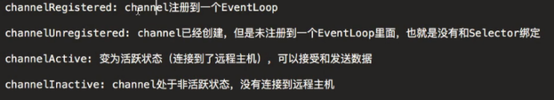
顺序：registered--->Active--->Inactive--->unregistered

#### ****ChannelInboundHandler（数据进入逻辑）****

#### ****ChannelOutboundHandler（数据写出逻辑）****

### ****ChannelPipeLine(负责管理ChannelHandler的有序容器)****

### ****ChannelHandlerContext(连接ChannelHandler和ChannelPipeline的桥梁)****

Pipeline中有好多ChannelHadler，context包含着指向下一个handler的信息
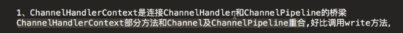
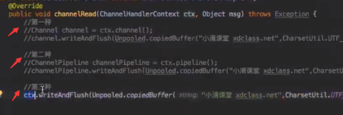
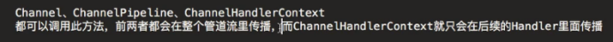
### ****ChannelHandler的执行顺序****
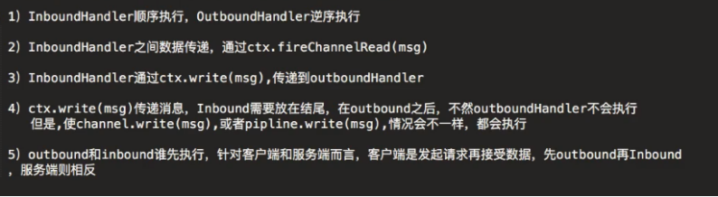
InBound之间传递数据 -->fireChannelRead                  
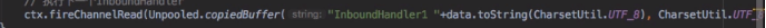
Inbound到OutBound传递数据--->write
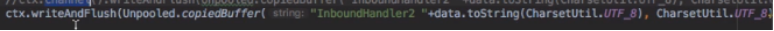
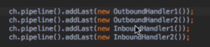
-->inbound在outbound之后（只针对channelHandlerContext传递消息的情况下）  最后一个inbound之前的outbound都会执行，之后的就不会了--->针对的是****channelHandlerContext****传输

****ChannelFuture---I/O返回的结果****
--------------------------------
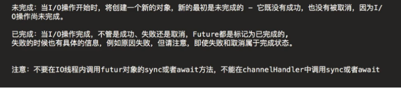
****ChannelPromise---继承ChannelFuture****
----------------------------------------

****Netty编解码器****
=================

****Decoder--解码器继承自INboundHandler和OutBoundHandler****
-----------------------------------------------------
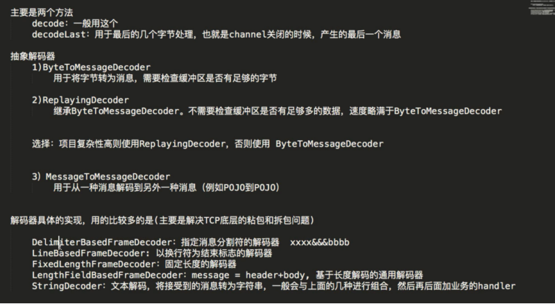
****Encoder---编码器****
---------------------

****Codec---编解码器****
--------------------
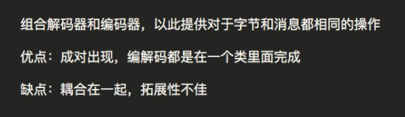
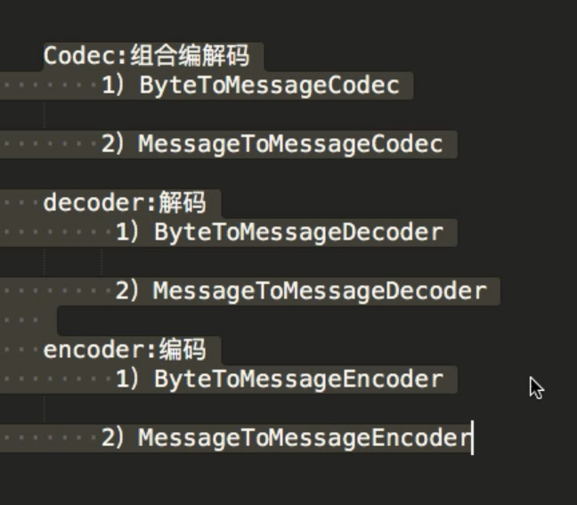

****TCP粘包和拆包****
================

****造成原因****
------------
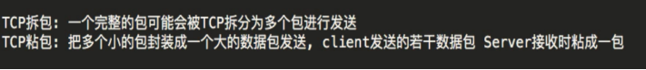
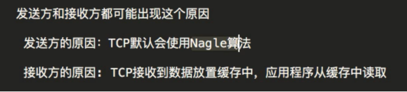
****解决方法--对应着netty的解码器解决方法****
------------------------------
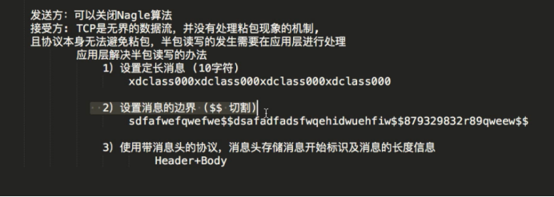
****Netty解决方法-----例子****
------------------------

### ****设置边界符号LineBasedFrame****

1.  以\\n作为分界符
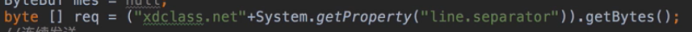
2.  添加解码器
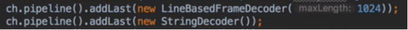
### ****自定义分隔符DelimiterBasedFrameDecoder****
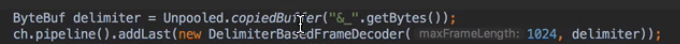
2个参数---->第一个表示最长查找长度，如果超过了还没有找到分隔符直接报错

            第二个表示分隔符

4个参数
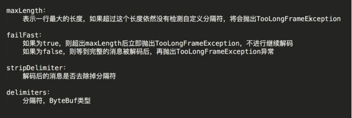
### ****固定长度解码器FixedLengthFrameDecoder****
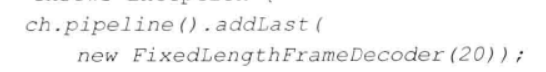
输入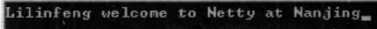

输出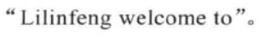

### ****自定义长度解码器LengthFieldBasedFrameDecoder ???****
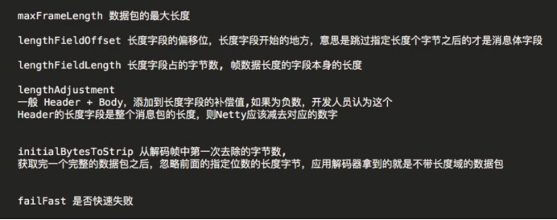
****Netty的ByteBuf和JDK的Bytebuffer****
====================================

ByteBuf有2个索引，一个读一个写，而且自动扩容

ByteBuffer读写共享索引，所以每次读写切换比较麻烦，还要记录上一个操作的位置，扩容麻烦，容易浪费资源

****ByteBuf的创建****
------------------
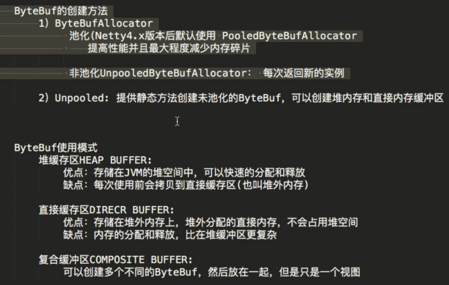