# spring注解原理
添加组件方式：
1.包扫描+注解  @Controller/@Service....
2.@Bean 导入第三方组件
3.@Import id默认是全类名
4.FactoryBean 
## bean(注意:@Bean返回的是类名  但是@Service @Controller。。。返回的是类名首字母小写)
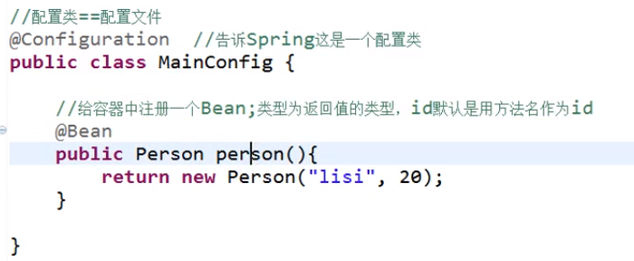

## 扫描规则
如果使用不包含excludeFilters 则直接配置
如果使用includeFilters 只想包含某些，则要加上 useDefaultFulters = false
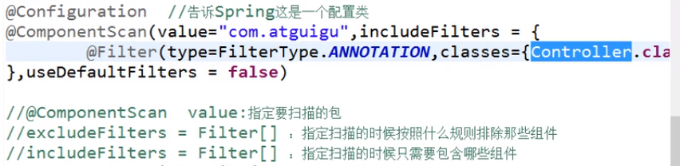

type--->ANNOTATION--->注解
              ASSIGNABLE_TYPE--->按照给定的类型 :classes-{bookService.class}
              CUSTOM---->自定义规则     -让一个类去继承TypeFilter 然后通过metadataReader读取扫描类的信息
              
## Scope  singleton prototype
单实例对象创建IOC容器的时候就已经全部创建
多例只有在使用的时候才会去创建

## @Lazy
懒加载 针对单实例--->在第一次使用的时候才创建

## @Conditional
按照一定条件进行判断，满足条件才注册bean
让一个类去继承Condition  然后返回true则创建 返回false则不创建

## @Import -->支持数组{xxx,xxx}
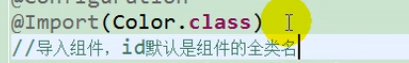
id 默认为全类名

## @ImportSelector  
继承 ImportSelector
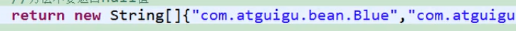
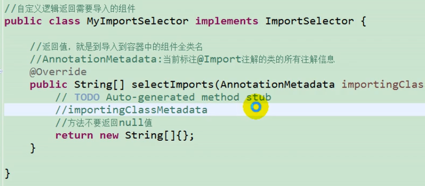

## @registerBeanDefinitions
 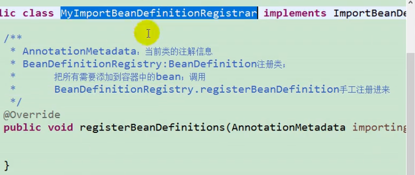
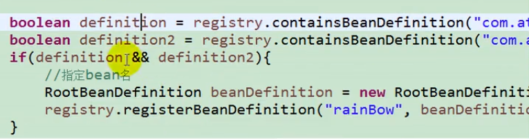
 

## FactoryBean
implement FactoryBean<xxx>  xxx-->Bean的类名

## 初始化bean的销毁bean 
可以使用init-method ，destory-method
也可以调用InitializingBean与DisposableBean---->2个接口
也可以在你需要init或者destroy的方法上添加  @PostConstruct @PreDestory

使用BeanPostProcessor 与 postProcessAfterInitialization--->对应初始化之前  和  初始化之后。(不是bean的初始化 是初始化之前和初始化之后的方法)
执行顺序：
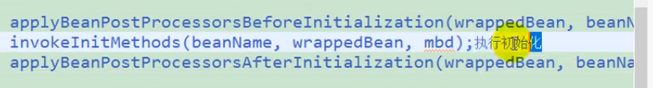

## @Value
可以用#{}  ${}
用来赋值

## @PropertySource
加载静态资源的--->加载到环境变量中  可以用getEnvironment.getProperty获取
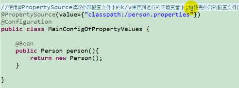

## 自动装配
@Autowired: 
          1.优先按照类型去容器中找
          2.如果有多个，再将属性的名称作为组件id去找
@Qualifier 和@Autowired配置使用
@Primary
          3给一个bean或者组件加上@Primary，那么在有多个相同类型的组件时优先选择primary
          4.@Resource：默认按照组件名称进行装配 无法支持@Primary required=false
          5.@Inject :  要导入inject包   和Autowired差不多  功能没有autowired多

## @Autowired
不仅可以标在属性上。还可以标注在构造器，方法，参数
1.添加在方法上
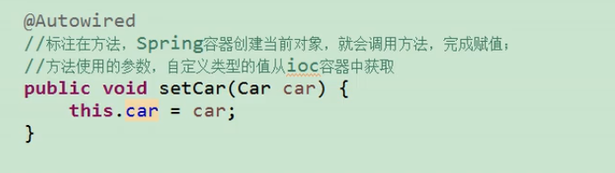

2.添加在构造器上
 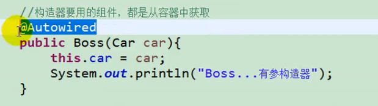

3.放在参数
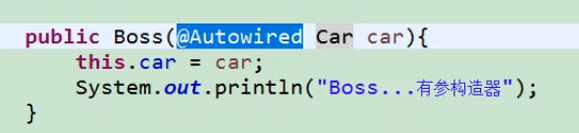

如果只有一个有参构造器，@Autowired可以省略
如果在创建bean的时候有参数，可以不写@Autowired，spring会自动从ioc容器中取

## Aware注入-->实现接口就行
可以为一些bean注入一些系统底层的属性
例如ApplicationContextAware--->注入IOC容器
 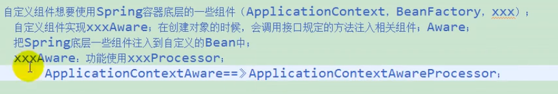

## @Profile
没有标注的默认会加载
在bean上添加@Profile（"xxx"）  xx随便取
切换环境的方法
1.配置方式  然后测试的时候 添加  -xx  就是运行的环境

2.使用代码的方式
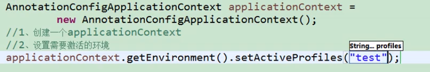

# Spring AOP
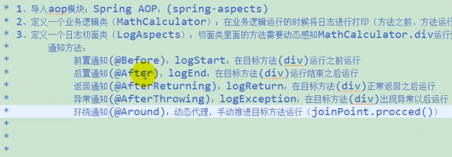
在启动类上添加注解AOP
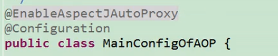
写法
1.直接@Before("excution(public int xxxxx(xx))")xxx->全类名
2.可以把相同的切点提取出来
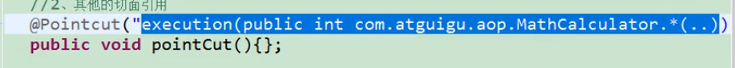

## AOP 原理
1.利用AspectJAutoProxyRegistrar给容器注册了一个AnnotationAwareAspectJAutoProxyCreator
AnnotationAwareAspectJAutoProxyCreator--->后置处理器+beanfactory
（不是一般的后置处理器他是InstantiationAwareBeanPostProcessor这种类型的     在创建bean之前尝试返回代理对象）

2.AnnotationAwareAspectJAutoProxyCreator这个东西继承了一大堆，
并且父类继承了BeanPostProcessor（创建Bean之前的初始化工作）
和BeanFactoryAware(bean工厂装配的类)

3.问题转为理解
作为BeanPostProcessor做了哪些工作：
作为BeanFactoryAware(bean工厂装配的类)做了哪些工作

创建流程
1.创建AnnotationAwareAspectJAutoProxyCreator
        1).创建ioc容器
        2).调用refresh刷新容器
        3).注册bean的后置处理器---->BeanPostProcessors还分几种优先级，根据不同的优先级创建，然后就创建bean并调用后置处理器
        4).把后置处理器注册到beanFactory中，完成beanFactory的初始化
2.创建其他单实例bean---->先看缓存中有没有，如果没有就去创建，
首先会让InstantiationAwareBeanPostProcessor在创建bean之前尝试返回代理对象
如果返回不来，就用老办法创建
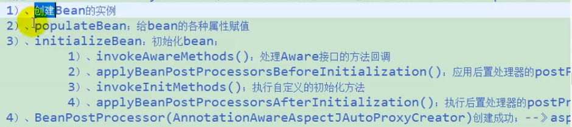

3.InstantiationAwareBeanPostProcessor在创建bean之前尝试返回代理对象？？原理：
BeanPostProcessor:
做一系列判断，判断哪个bean是切点，哪个bean是切面，是否需要被包装（是否是切面）。。然后拿出增强器（就是切面中的方法@begin。。。。），
每一个增强器的默认类型是InstantiationModelAwarePointcutAdvisor，然后就返回false。。

postProcessAfterInitialization：
线获取所有增强器，找到能在当前bean使用的增强器，并排序
然后判断如果当前bean需要被增强，那么就产生代理对象（使用cglib或jdk动态代理）
然后就返回代理增强了的对象，然后以后容器中获取的都是代理过的对象，执行方法的时候，代理对象就会执行通知方法

## AOP代理过后原方法执行流程
1.CglibAopProxy.intercept()，拦截目标执行的方法
2.根据ProxyFactory获取目标方法将要执行的拦截器链
3.如果没有连接器链，直接执行方法，
4.如果有，把需要执行的目标对象，目标方法，拦截器链的信息传入创建一个CglibMethidInvocation对象，并调用proceed方法

拦截器链的获取方法：
1.创建一个List<Object> interceptorList 增强器数组-->大小为1个默认的拦截器ExposeInvocationInterceptor + 你增强器的个数
2.遍历所有增强器，如果是MethodInterceptor类型就直接添加，如果不是就转换成MethodInterceptor
3.然后这个增强器数组就变成了一个连接器链

## 流程图
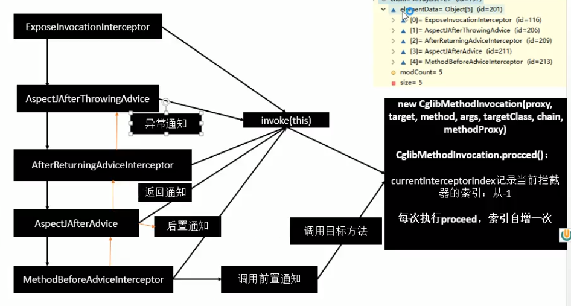

# Spring事务

1.在配置类上添加@EnableTransactionManagement
2.配置数据源
3.配置TransactionManager事务管理器
4.在方法上添加@Transactional

原理：
导入了2个组件AutoProxyRegister和ProxyTransactionManagementConfiguration

AutoProxyRegister:给容器注册了一个InfrastructureAdvisorAutoProxyCreator组件这个组件其实也是一个后置处理器
                                        InfrastructureAdvisorAutoProxyCreator：包装对象，返回一个代理对象（添加了增强器的对象），利用拦截器链进行调用

ProxyTransactionManagementConfiguration:
                      1给容器中注册事务增强器：
                                1）.需要事务的注解信息来解析事务注解 
                                2）.事务拦截器：保存了事务的信息，其实就是一个MethodInterceptor，拦截相应的方法，然后给AutoProxyRegister:返回的代理对象工作
                                 
## BeanFactoryPostProcessor--->工厂后置处理器
BeanFactory的后置处理器
让一个类继承BeanFactoryPostProcessor，然后再该类上添加@Component加入IOC容器
然后配置类中扫描该类ComponentScan

## BeanDefinitionRegistryPostProcessor--->
BeanFactoryPostProcessor是Bean信息已经被加载，但是bean还没有被实例化
 BeanDefinitionRegistryPostProcessor 是Bean信息将要被加载，但是bean还没有被实例化
BeanDefinitionRegistryPostProcessor>BeanFactoryPostProcessor>BeanPostProcessor

## ApplicationListener--->监听ioc容器
extends ApplicationListener<ApplicationEvent>
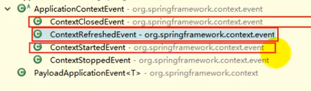
事件派发器通过applicationEventMulticaster = new SimpleApplicationEventMulticaster(beanFactory)来创建
并且把所有的监听器注册到applicationEventMulticaster(多播器)中
通过publishEvent拿到事件的多播器来派发事件

## ApplicationListener也可以使用@EventListener
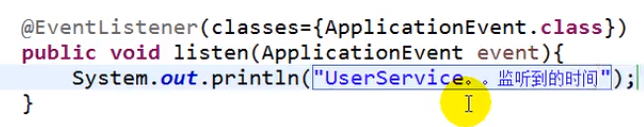

## Spring容器创建过程
**1.postProcessBeanFactory  Bean工厂的初始化**
 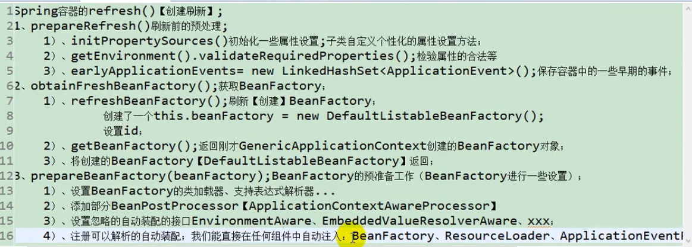
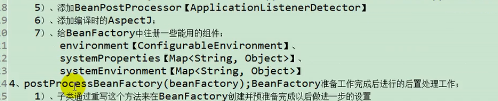
以上是BeanFactory创建以及预准备(BeanFactory标准初始化-->刷新前的预处理容器+创建并获取BeanFactory+为BeanFactory注入一些基本属性)

**2.BeanFactory的处理器**

然后就要执行invokeBeanFactoryPostProcessors(beanFactory)
这里面就是执行 BeanDefinitionRegistryPostProcessor和BeanFactoryPostProcessor 2种处理器
会根据事先接口的优先级进行执行
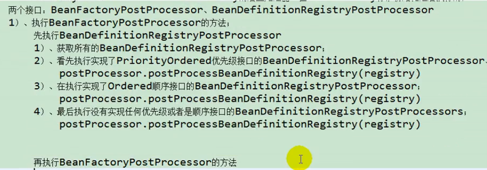

**3.BeanPostProcessor Bean后置处理器  **
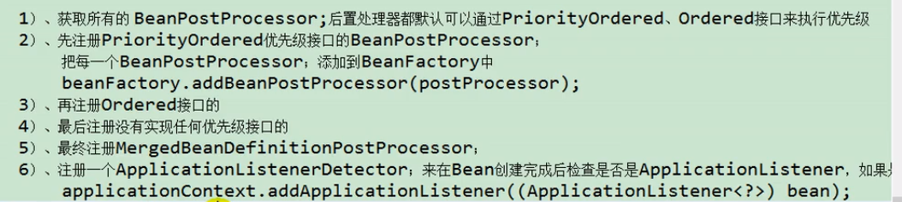

**4.initMessageSource 国际化，消息绑定，消息解析**
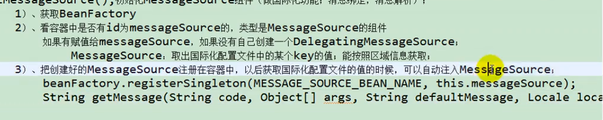

**5.initApplicationEventMulticaster  多播器初始化**

**6.onRefresh() 给子容器刷新**

**7.registerListeners()  将容器中的applicationListener注册**
会将所有监听器添加到多播器中

**8.finishBeanFactoryInitialization（beanFactory）初始化所有剩下的单例bean  完成beanFactory的初始化**
1.获取所有bean的信息，依次创建
2.获取Bean的定义信息，RootBeanDefinition
3.如果bean不是抽象的，是单实例的，不是懒加载的，就去判断是不是factorybean，如果是就用工厂bean接口创建，如果不是，就用getbean()方法创建
    会去缓存中找，如果找不到就创建，
4.先标记该bean被创建了，获取bean的定义信息
5。如果有dependon依赖其他bean，name就用getbean()先创建依赖的bean
6.启动单实例bean的创建流程
       1.）createBean（beanName,mbd,args）;
       2.)InstantiationAwareBeanPostProcessor也就是AOP自动注入创建的处理器来尝试返回代理对象
       3).如果没有返回代理对象，就去创建一个bean实例
             1）.createBeanInstance(beanName,mbd,args)创建bean实例
             2).调用MergedBeanDefinitionPostProcessor的postProcessMergedBeanDedinition(创建完bean之后执行)
             3),为bean属性赋值
                     1）.在这里调用各种后置处理器的After方法--->属性还没有赋值
                      2）.还要执行后置处理器的postProcessPropertyValues（）
                      3).这这里为属性利用set方法赋值
              4).Bean的初始化
                     1).如果当前bean实现了xxxAware接口(就是用来获取实例工厂中的一些基本属性的接口)，就给这些属性赋值
                     2).这里执行后置处理器初始化之前的方法，BeanPostProcessor.postProcessBeforeInitialization
                     3).执行bean自己定义的初始化方法
                     4).执行后置处理器初始化之后的方法
             5).Bean的销毁方法
 7,将创建bean添加到缓存中 singletonObjects

**9.finishRefresh()，BeanFactory创建成功，IOC创建完成**

# 总结

**总结下来就是首先初始化BeanFactory，然后会调用2个后置处理器，BeanDefinitionRegistryPostProcessor和BeanFactoryPostProcessor，对beanfactory进行操作
然后调用BeanPostProcessor方法对bean创建之前操作，然后进行国际化操作，多播器的创建，子容器刷新，然后获取所有监听并且添加到多播器中等待被调用
然后创建bean工厂中剩下的单例bean(属性赋值->bean的初始化(Aware接口和后置处理器和bean自定义初始化方法)---> 销毁方法)，完成bean工厂的创建
然后将创建好的bean存到缓存**

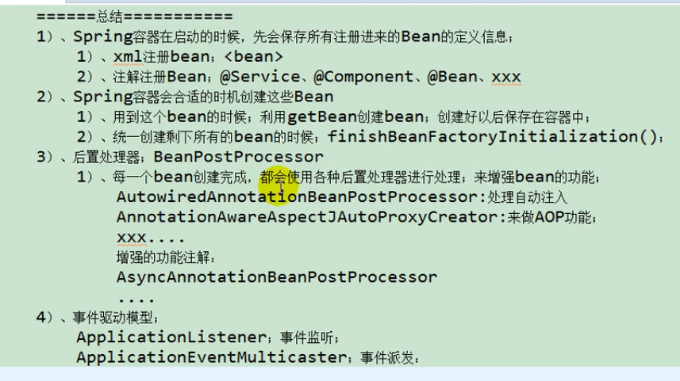

## Servlet
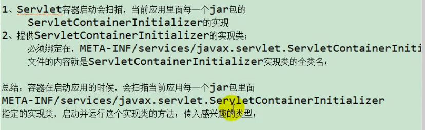

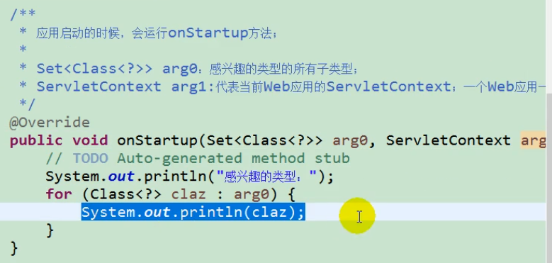

ServletContainerInitializer
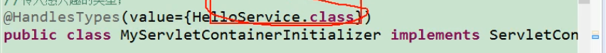

## Springmvc注解版
Spring 的监听器
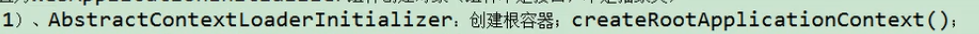

Springmvc的前端控制器

注解版配置

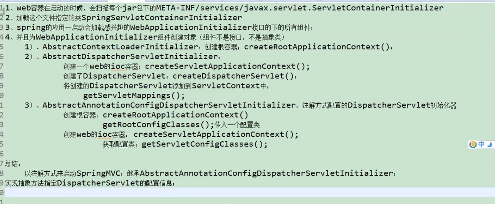

**继承AbstractAnnotationConfigDispatcherServletInitializer
要实现以下方法:**
1.编写springmvc的注解配置类
表示用filter只扫描controller.class  includeFilters要添加useDefaultFilters=false
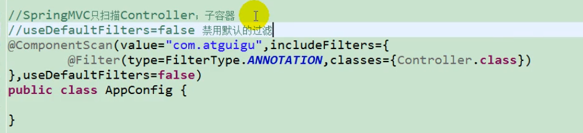

2.编写Spring的注解配置类-->不扫描controller.class
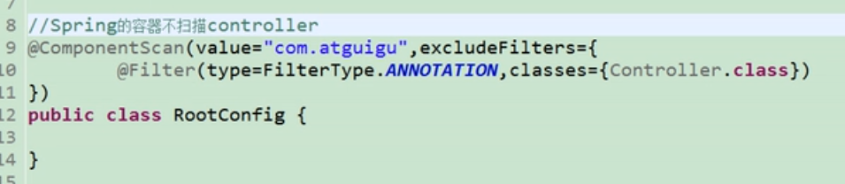

获取Spring的配置类
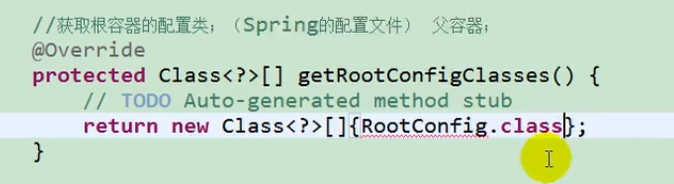

获取Springmvc的配置类
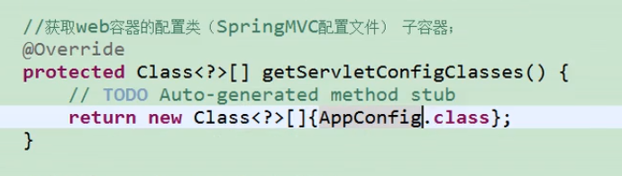

DispatcherServlet 前端控制器
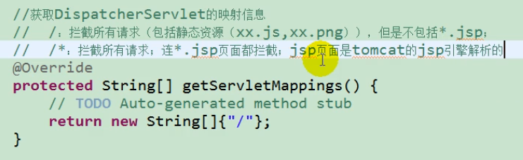

## 定制Springmvc 全注解
在springmvc的配置类上添加@EnableWebMvc
然后让其继承WebMvcConfigurerAdapter接口

1.视图解析器
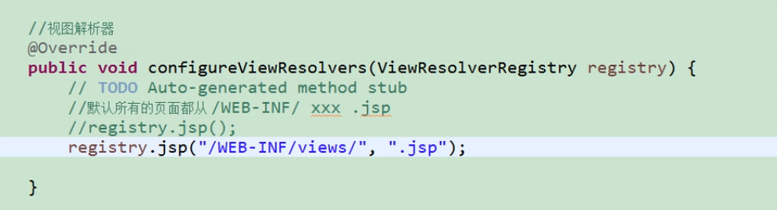

2.静态资源访问
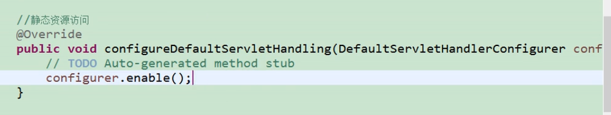

3.拦截器
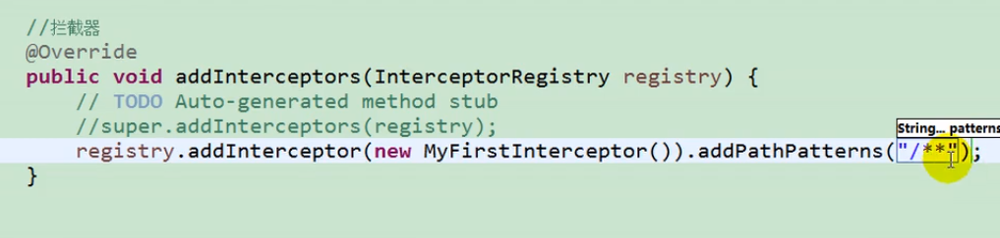

# Servlet3.0的异步处理
开启支持异步 asyncSupport = true

# Springmvc的异步请求
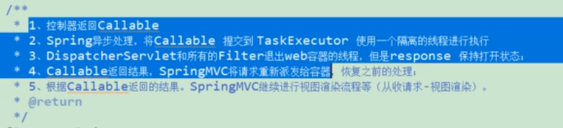
返回参数加上Callable
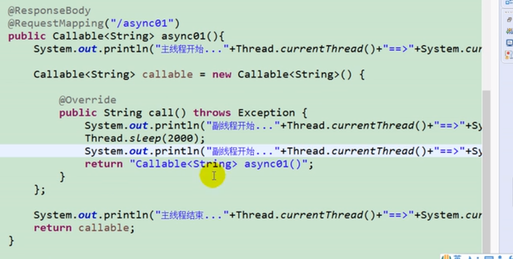

springmvc内置了DeferredResult
一旦给deferredResult.setResult()
之前的方法就会继续下去

