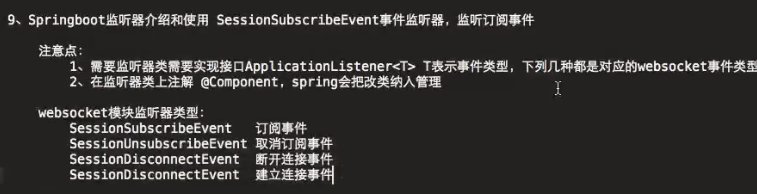

# websocket广播
单播:点对点，私信私聊，游戏中的私聊
广播:就是相当于游戏中的喇叭，游戏公告
多播,组播: 组队频道里的聊天

# 信息代理
用一个类继承WebSocket...
在重写的confirgureMessageBroke中enableSimpleBroker 表示的是服务端向客户端
setApplicationDestinationPrefixes是客户端向服务器

@SendTo发送给订阅者，不通用，每订阅者都要写一个SendTo
可以使用SimpMessagingTemplate 

StompHeaderAccessor可以用来包装消息头，可以获取消息头的内容

# 监听器

# 实现实时推送
在启动类上添加@EnableScheduling
在要推送的方法上添加@Scheduled(fixedRate = xxxx(时间))；方法上不能添加参数传入

# 拦截器
 HandshakeInterceptor
有2个方法，分别是 握手前和握手后
public boolean beforeHandshake(ServerHttpRequest serverHttpRequest, ServerHttpResponse serverHttpResponse, WebSocketHandler webSocketHandler, Map<String, Object> map) throws Exception {

    public void afterHandshake(ServerHttpRequest serverHttpRequest, ServerHttpResponse serverHttpResponse, WebSocketHandler webSocketHandler, Exception e) {

# 通道拦截器
ChannelInterceptorAdapter:
1.afterSendCompletion:在发送之后进行调用，一般用于资源清理

2.preSend ： 在消息被实际发送到频道之前被调用

3.PostSend ： 发送消息调用后立即调用

