**ACL和RBAC**
============

ACL就是直接给用户添加权限

PRAC就是给用户相应的角色，通过角色来和权限关联
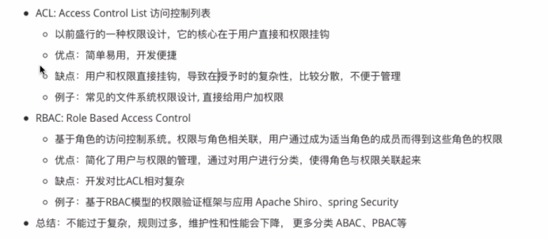
****4个模块和常见名称****
=================
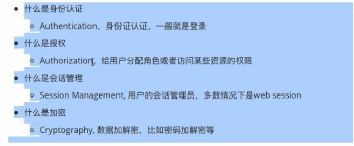
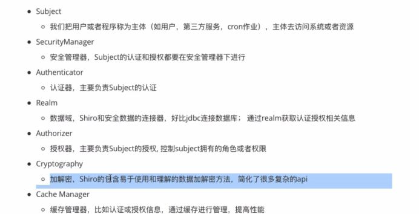
****运行流程****
============
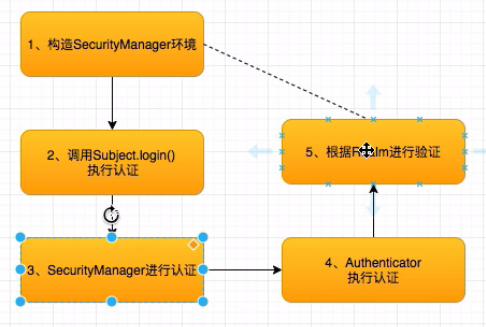
****单元测试执行顺序****
================
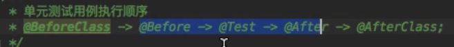
****IniRealm---文本realm****
==========================
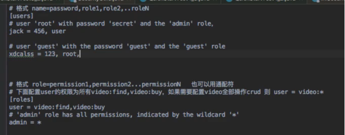
****JdbcRealm--注意字段名一定要符合规范****
===============================
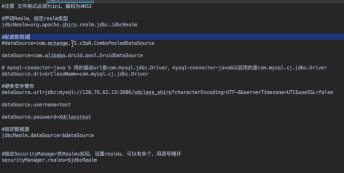
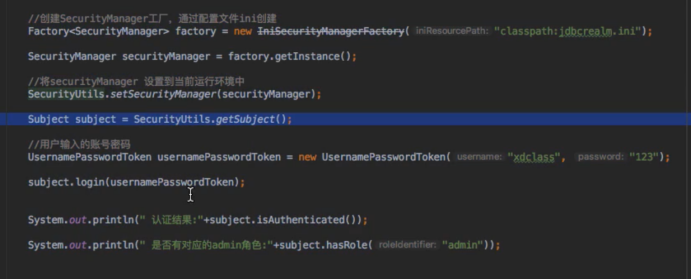
****自定义Realm--继承AuthorizingRealm****
====================================
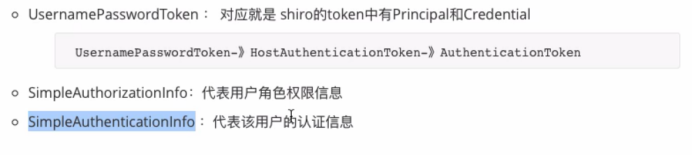
****源码流程****
------------
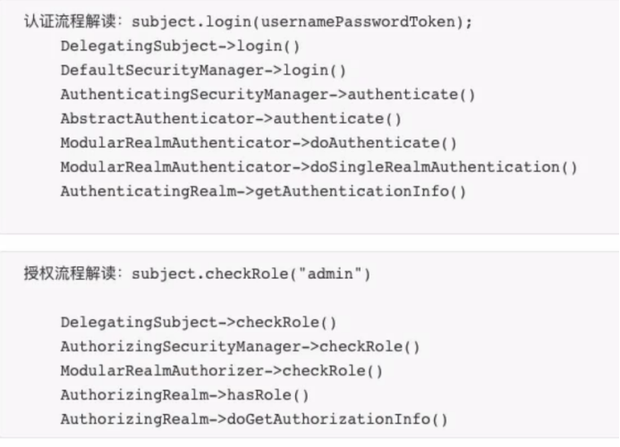
认证流程--->subject.login()就是通过一系列调用，最后通过调用AuthenticatingRealm的getAuthenticationInfo方法，调用自定义realm中的doGetAuthenticationInfo方法，

如果返回为null则抛出错误，然后通过和你配置的hashedCredentialsMatcher规则匹配

授权调用--->和认证差不多，也是通过调用查找是否有这个权限的时候，会通过一系列方法最终调用你实现的Author方法。

****过滤器****
===========

****核心过滤器****
-------------
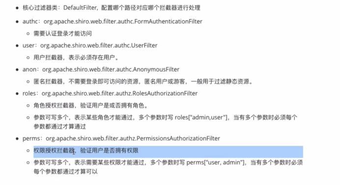
****不常用****
-----------
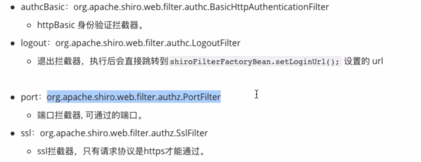
****路径配置****
------------
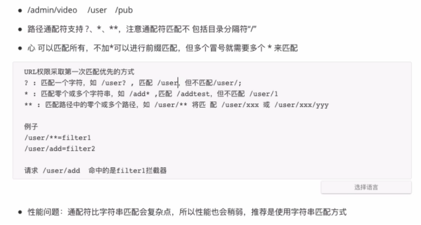
****权限控制的3种方式****
=================

****注解权限控制****
--------------
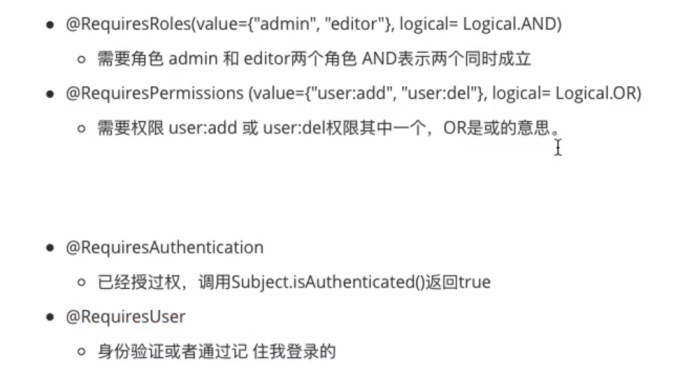
****编程方式****
------------
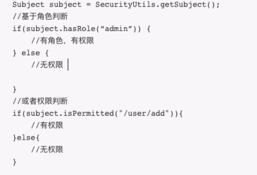
****Shiroconfig****
-------------------
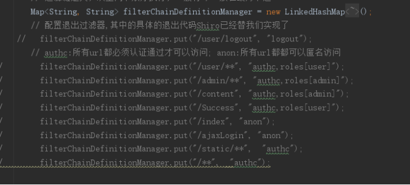
****缓存模块****
============
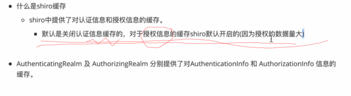
****ShiroSession****
====================

只要有这个session，就算不登录，也可以登录，因为可以通过这个session创建subject，通过subject来判断所有操作
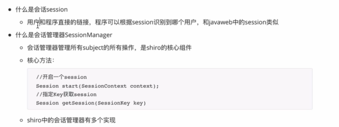
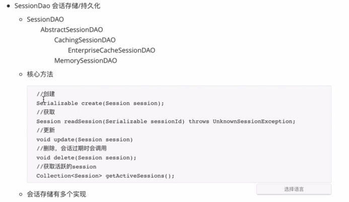
****SessionId自定义生成****
----------------------

自定义类
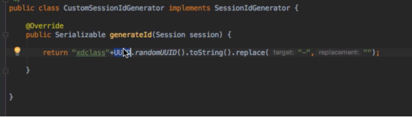
添加到配置文件中
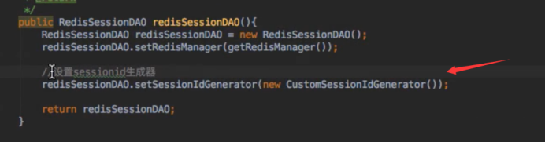
****RemenberMe****
==================
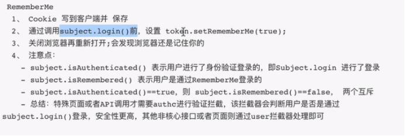
****实战****
==========

****PBAC数据表的实现****
------------------
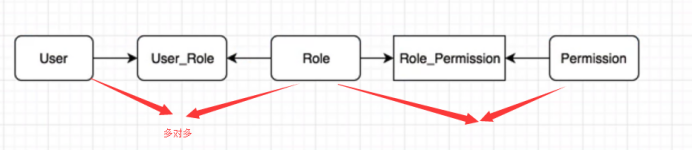
****自定义roles\[admin,user\]****
==============================
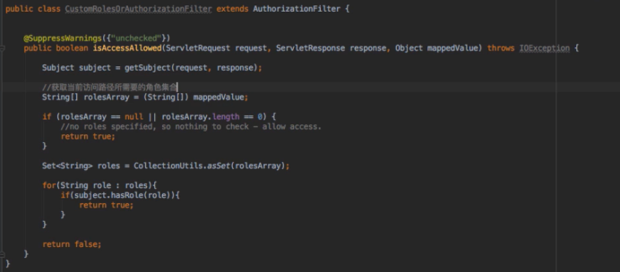
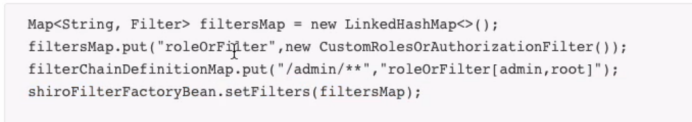
****整合redis缓存****
=================

****service业务方法中加缓存****
-----------------------

****整合redis****
---------------
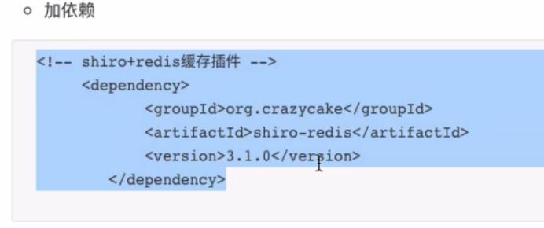
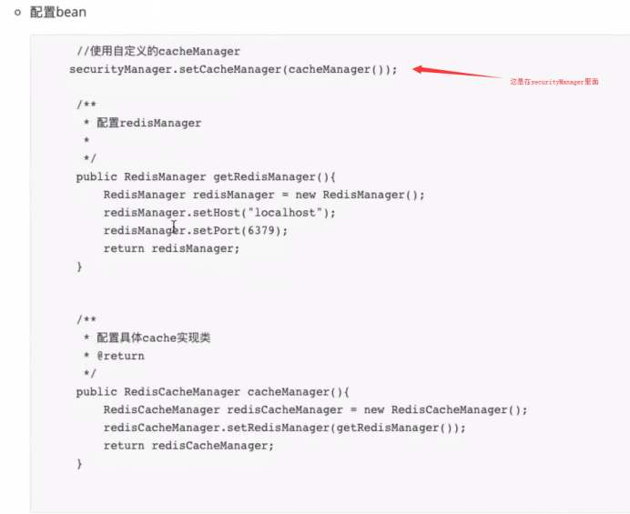
设置过期时间
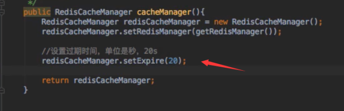
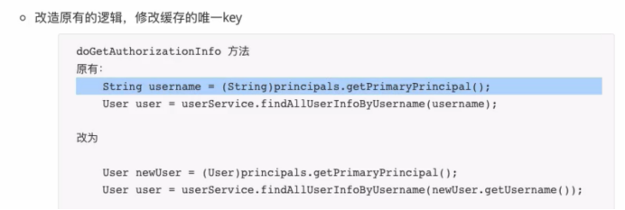
****Redis整合SessionManager****
-----------------------------
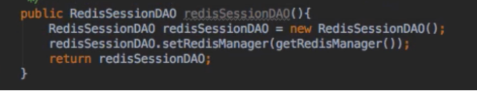
这里setGlobalSessionTimeout也对应着redis里面session的过期时间

****常用bean配置****
================
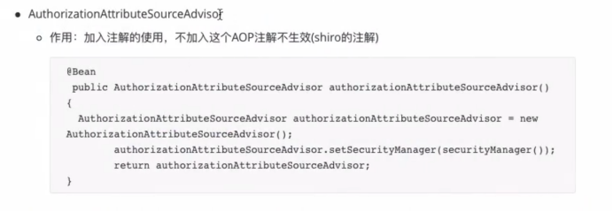
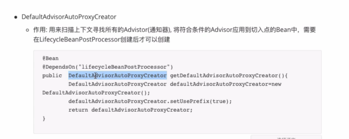