**上下文切换**
=========

线程之间的相互切换要保存切换前的状态，以便于回到上一个线程保存的状态，所以上下文切换会带来性能开销。

****解决方法（无锁编程）：****
-------------------

例如：

用hash，让不同的线程通过id取模，分段，例如concurrenthashmap

CAS，自身就是原子性的
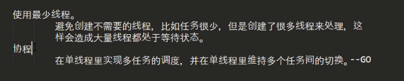
****线程的6种状态****
===============

NEW

RUNNABLE

BLOCK  

WAITING  例如 Thread.sleep  wait

TIMED_WATING 有最大等待时间的waiting，普通waiting没有时间限制

TERMINATED

BLOCK和WAITING区别： BLOCK是等待锁，WAITING是在执行过程中缺少某种条件是，先暂停叫做waiting
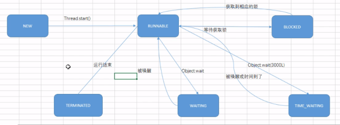
****创建线程的方式--要用start方法运行，直接调用run不会新建一个线程****
============================================

****Extends thread****
----------------------

实现run方法

****Implements Runnable****
---------------------------

实现run方法

****匿名内部类--还是实现runnable接口****
-----------------------------
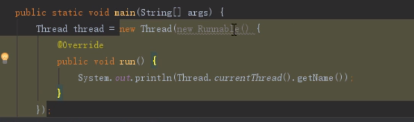
****线程池****
-----------
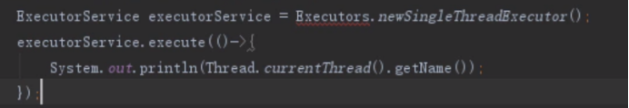
****线程挂起--线程暂停****
==================

****是什么****
-----------
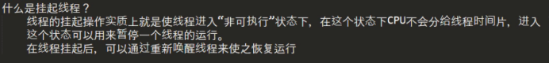
****方法****
----------

### ****Thread.Suspend--thread.resume(被废弃了 挂起--恢复)****

线程挂起但是不去释放资源--比如我有这个锁的资源然后suspend，别的线程也要我这个锁，但是别的线程占有了我这个线程resume的前提，就造成死锁
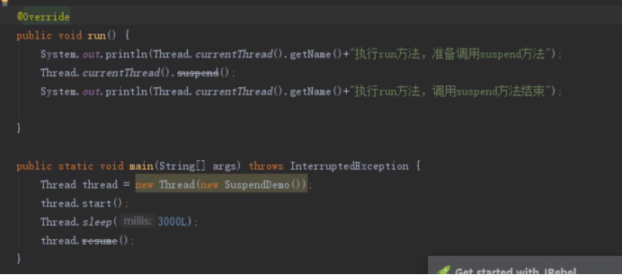
****Wait--notify--notifyAll(等待---唤醒  会释放资源)****
-----------------------------------------------

锁住的对象都要一致，而且一定要锁住对象，然后xx.wait和xx.notify和锁住的对象要是同一个
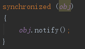
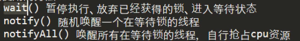
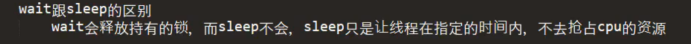
### ****实例****
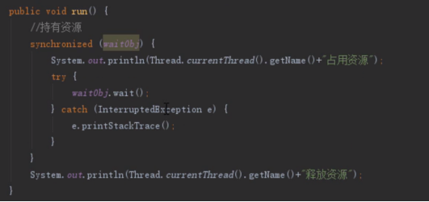
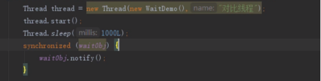
****中断操作--让线程结束****
===================

****stop方法---废弃****
-------------------

因为他是无条件中断即使原来的线程还没跑完也直接中断

****Interrupt方法****
-------------------
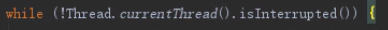
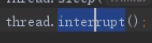
在线程中取判断是否interrupt，如果是就结束，这样就可以保证程序中断可控

****自己弄一个标记****
---------------

****线程优先级--thread.setPriority()****
===================================

****守护线程--thread.setDaemon(true)****
====================================

随着JVM一起退出，一定要在thrad.start之前设置。

****线程安全****
============

****编译字节码文件****
---------------
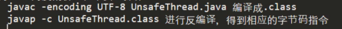
****原子性****
-----------

要么都执行，要执行都不执行，发生错误不会自动回滚！

****Sychronized****
-------------------

### ****修饰的位置****

#### ****静态方法****

锁住的整个类-->所有new的对象都共用一个锁

#### ****普通方法****

锁住的是实例对象-->就是new的对象，不同new的对象之间没关系

#### ****代码块****

锁住的是一个对象

****锁的分类****
============

****内置锁：****
------------

每个java对象都可以看成是一个锁（sychronized（obj）obj就是个对象），这就称为内置锁，进入这个锁保护的同步代码块就自动获得锁，结束就自动释放

****互斥锁：****
------------

内置锁就是互斥锁的一类，一个锁只能被一个线程占用，别的线程进不来

****自旋锁：****
------------

就是如果要执行的方法非常简单，但是如果挂起就要进行上下文切换消耗资源，所以可以执行空循环，不挂起，如果循环了几次之后还是没有获得资源就挂起

****阻塞锁：****
------------

让线程进入阻塞状态，等待唤醒信号，唤醒的时候进入就绪状态，所有就绪线程去竞争资源

****重入锁：****
------------

一个线程只要获得了这个锁就可以重复的进入，只要他没有释放这个锁

****读写锁：****
------------

****悲观锁：****
------------

就是觉得所有人都是坏人，都会去抢你的数据，所以每次去拿数据的时候都会上锁

****乐观锁：****
------------

****公平锁：****
------------

排队等待

****非公平锁：****
-------------

插队等待

****偏向锁：****
------------

只要没有人来竞争，锁就一直是你的，直到有人来竞争的时候才去释放

****独占锁：****
------------

和互斥锁基本一样

****共享锁：****
------------

相对于独占锁，可以多个线程共享锁

****Volatile关键字--线程开关，或者禁止指令重排序的对象****
======================================

仅能修饰遍变量

只能保证可见性，不能保证原子性

禁止指令重排序

****单例---饿汉，懒汉****
==================

****饿汉式：一开始就实例化好****
--------------------
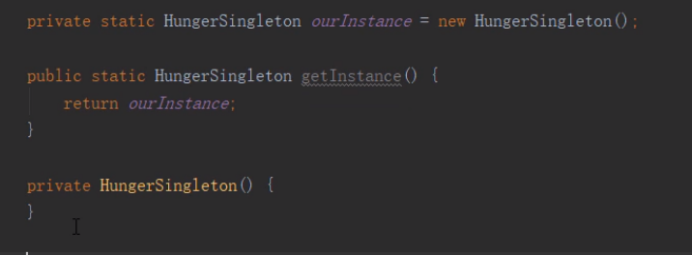
构造方法和对象都要private不能让别人直接调用

****懒汉:要用的时候再去实例化****
---------------------

要保证线程安全

第一种方法：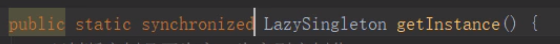

在方法上添加sychronized，但是比较耗费性能

第二种方法：第一个null判是否为null，如果是则进入锁，但是有可能许多个线程一起进去了，所以在锁里还要判断一下是否是null，但是JVM还有指令重排序，所以对lazySingleton对象添加volatile，这样就能保证线程安全
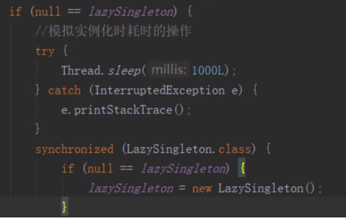
****Lock接口****
==============
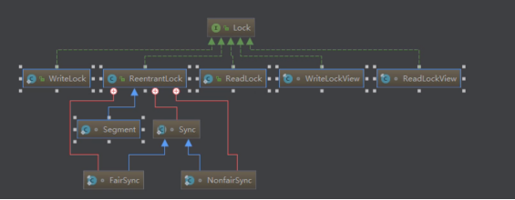
****Lock和Sychronized的区别****
---------------------------
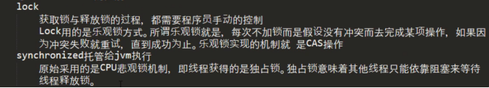
****实现自己的LOCK****
-----------------

注意点：如果使用wait和notify记得要用相同的obj，或者加上sychronized

重入的实现，要记录重入次数，一旦出的次数到0了再去释放

****AQS--AbstractQueueSychronized****
=====================================

****是什么？--底层就是用CAS操作控制并发访问****
------------------------------

ReentrantLock，ReentrantReadWriteLock内部的sync同步器都是继承AQS
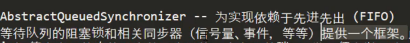
****组成--如果用单一int表示读写****
------------------------

将int分成高16位和低16位，高16位是读锁，低16位是写锁

获取读锁个数--->无符号右移16位

获取写锁个数--->与上2^16-1

****ReenTrantLock--ReenTrant就是可重入****
=====================================

****非公平锁的实现--new ReentrantLock****
----------------------------------

### ****Lock操作****
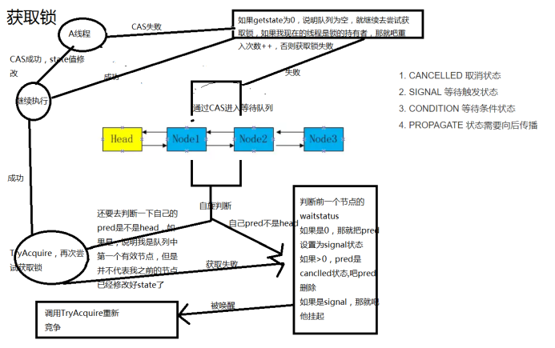
### ****Unlock操作****

就重入锁的操作，减到0的时候释放锁，释放了之后从维护的双向链表找一个最靠近头结点的waitstatus<0线程(signal状态)去唤醒，唤醒了还要去竞争锁

### ****弊端****

引起线程饥饿，后面的线程可能永远不能获得资源

****公平锁--new ReentrantLock（true）****
------------------------------------

公平锁一上来不会去CAS获取锁，会直接进行执行acquire

他和非公平锁的不同在于TryAcquire，如果获取当前状态是0，会去看看有没有人在队列中，而不会直接去尝试能不能获取锁，然后也是一个重入的判定，如果TryAcquire没有成功，和非公平锁一样，执行AcquireQueue操作（入队列操作）

****ReenTrantReadWriteLock****
==============================

****特性****
----------

读写互斥，写写互斥，读读共享

就是如果read在lock的时候write.lock是无法成功的

Write在lock的时候，其他线程write.lock也无法成功

当时read.lock的时候其他线程获取read.lock也可以成功

****锁降级--用于对于数据很敏感的地方，写了就要读****
-------------------------------

一定要写了在读（还没释放写），然后释放写，就降级为读
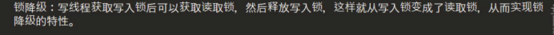
****用法****
----------

ReentrantReadWriteLock __reentrantReadWriteLock__ = new ReentrantReadWriteLock();  
Lock __read__ = __reentrantReadWriteLock__.readLock();//获取读锁  
Lock __write__ = __reentrantReadWriteLock__.writeLock();//获取写锁

****源码分析****
------------

### ****ReadLock--读锁****
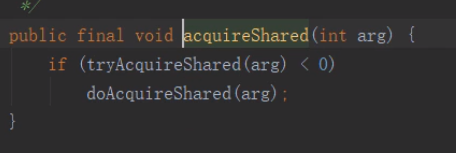
#### ****ReadLock.lock--acquireShared****
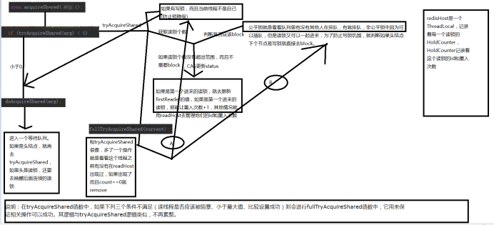
#### ****ReadLock.unlock****

读锁是共享锁，每个线程都要维护一个重入的次数标志，就是一个重入锁的释放步骤。。并唤醒等待的线程

### ****WriteLock--写锁****
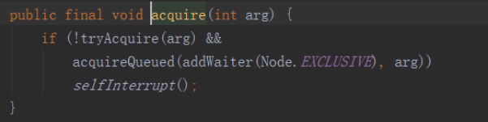
#### ****WriteLock.lock****

读写互斥，写写互斥原则，成功了还要更新重入的次数，如果没有协议成功就去排队，写锁的block操作也有非公平和公平，但是对于非公平的实现，写锁永远不需要排队，也是为了防止饥饿，如果不需要block那就设置当前持有线程是自己

#### ****WriteLock.unlock****

重入锁释放原则。。

****StampedLock--不可重入****
=========================

****管道流通信--线程通信****
===================
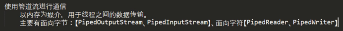
PipeInputStream对应着写进来的数据

PipeOutputStream对应着写出的数据

写出去的数据要和写入的管道连接

所以PipeOutputStream.connext(PipeInputStream)

public static void main(String\[\] args) throws IOException {  
     PipedInputStream pipedInputStream = new PipedInputStream();  
     PipedOutputStream pipedOutputStream = new PipedOutputStream();  
    try {  
        pipedOutputStream.connect(pipedInputStream);  
    } catch (IOException e) {  
        e.printStackTrace();  
    }  
  
    new Thread(new Reader(pipedInputStream)).start();  
    BufferedReader bufferedReader = null;  
    try{  
        bufferedReader = new BufferedReader(new InputStreamReader(System.__in__));  
        pipedOutputStream.write(bufferedReader.readLine().getBytes());  
    }finally {  
        if(bufferedReader!=null)  
        {  
            bufferedReader.close();  
        }  
        pipedOutputStream.close();  
    }  
}

public class Reader implements Runnable {  
  
    private  PipedInputStream pipedInputStream;  
    public Reader(PipedInputStream pipedInputStream) {  
        this.pipedInputStream = pipedInputStream;  
    }  
  
    @Override  
    public void run() {  
        if(pipedInputStream!=null)  
        {  
            String info = new BufferedReader(new InputStreamReader(pipedInputStream)).lines().collect(Collectors.__joining__("\\n"));  
            System.__out__.println(info);  
        }  
  
        try {  
            pipedInputStream.close();  
        }catch (Exception e)  
        {  
            e.printStackTrace();  
        }  
    }  
}

****Thread.join--线程交互****
=========================
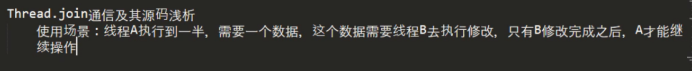
Thread.join（）不带参就是等待执行完毕，带参就是设定最多等多久，底层也是调用的wait
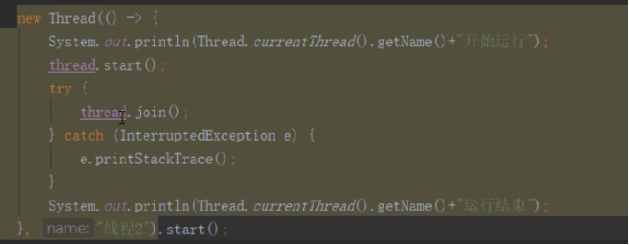
****ThreadLocal--本地线程副本****
===========================
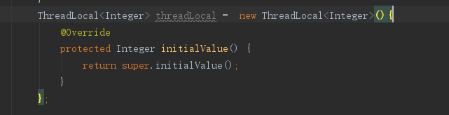
以ThreadLocal对象为键，任意对象为值得存储结构，为每个线程存放一份本地副本
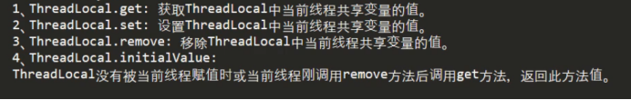
****Condition--等待条件****
=======================

通过Lock获得Condition

例如 ReenTrantLock lock = new ReenTrantLock

然后通过这个lock 可以分为很多种条件
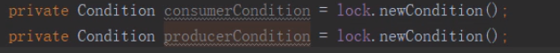
ConsumerCondition.await-->线程wait并且条件是ConsumerCondition 就相当于wait

ConsumerCondition.signAll-->唤醒所有ConsumerCondition 相当于notifyall

****原子类****
===========

****原子基本类型****
--------------
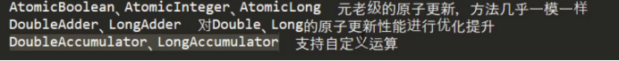
### ****AtomicInteger****

AtomicInteger i = new AtomicInteger(0);

### ****LongAccumulator---自定义运算****
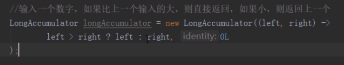
****原子数组****
------------

### ****创建****
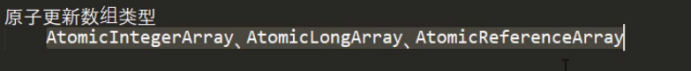
### ****使用****
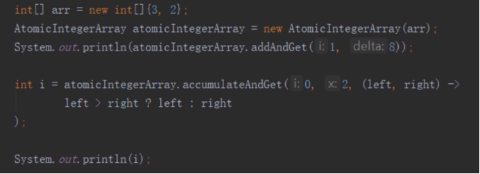
****原子更新属性--类中属性的更改****
-----------------------
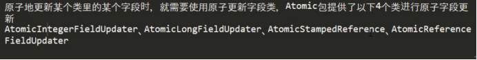
修改Integer
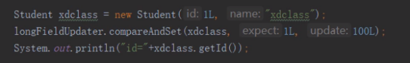
修改其他类型
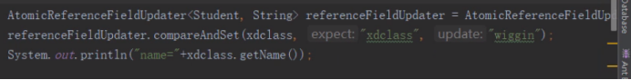
注意点

修改的字段类型一定要加上volitile，子类无法操作父类的字段，字段不能使用final，static修饰

****原子更新引用--修改对象的引用****
-----------------------
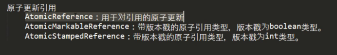
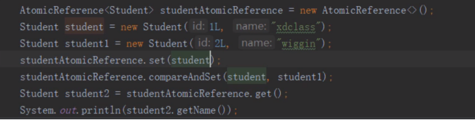
****同步容器和并发容器****
=================

同步容器：

就是通过sychronized关键字进行加锁实现的，多线程串行执行，如vector，HashTable，以及Collections.synchronizedSet，synchronizedList等方法返回的容器。但是如果进行复合操作会发生问题，比如我在访问最后一个元素的时候刚计算出最后一个值得下标，另外一个线程把这个值删除了，就会产生问题，解决方法添加对象锁，但是这样会消耗性能

并发容器：

就是多个线程可以一起访问一个容器，不用串行的访问了

****同步容器****
------------
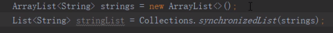
在单线程环境下正确的迭代方式是用迭代器！
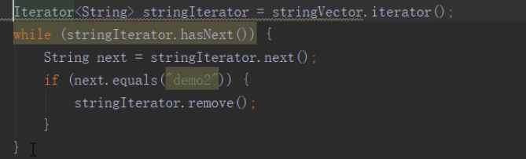
在多线程环境下就要对迭代器上锁
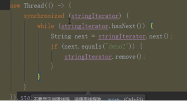
****并发容器****
------------
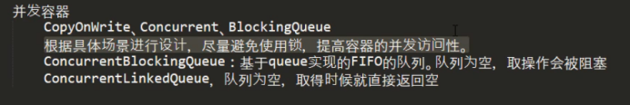
### ****使用****

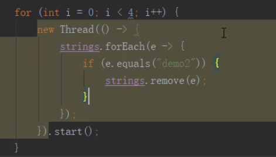
****LinkedBlockingQueue--相当于是消费者和生产者的中间商****
============================================

****Add,Offer,Put的区别---生产数据****
-------------------------------

Add:调用Offer

Offer:使用了ReentrantLock来确保线程安全，同时使用condition来作为条件，如果队列满了就入队失败，如果队列没有满，就调用notFull.signal来唤醒生产数据的线程继续生产，如果是第一个入队的，那就唤醒消费者消费

Put:和offer差不多

****Remove,poll,Take的区别--消费数据****
---------------------------------

Remove:调用poll

Poll:从队列的头取数据，如果还有数据，就执行notEmpty.signal唤醒消费者取数据

如果取完了就唤醒生产者生产数据

Take和pull差不多
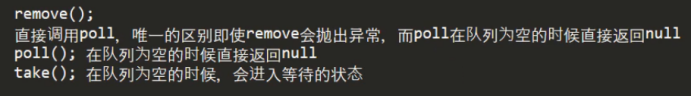
****并发工具****
============

****CountDownLatch---线程等待其他线程****
---------------------------------

CountdownLatch.Await--->先挂起，当CountdownLatch.getCount==0的时候继续执行

countDown--->减1

使用AQS来控制

await调用的是sync.acquiresharedInterruptly，和reentrantreadwriteLock的读锁差不多，然后去看看CountdownLatch设置的sattus到0没，如果没有就挂起(wait)

CountDown减到0最后结束了也和reentrantreadwriteLock释放锁差不多，就是从队列的头unpark一个节点
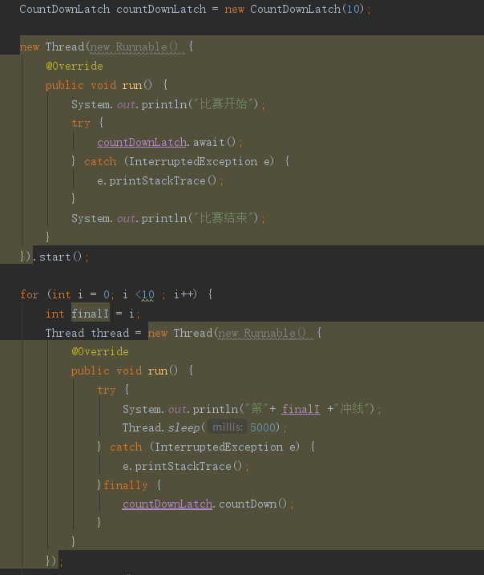
****CyclicBarrier--线程同步状态****
-----------------------------

和countDownLatch的异同
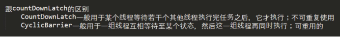
原理：采用ReentrantLock，线程运行发现栅栏没有减到0就await，一旦线程个数减少0，就是所有线程都就绪了就siginalAll,并且把栅栏重新赋值到一开始的状态--->可重复用
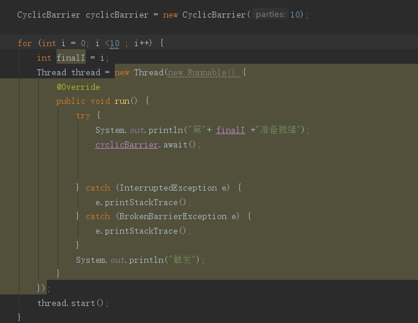
****Semaphore********---控制线程并发访问数量****
--------------------------------------

### ****使用****
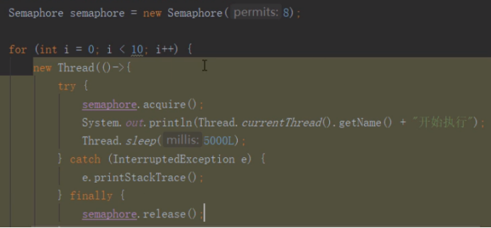
****Exchanger---线程间交换数据，一定要成双成对的线程****
--------------------------------------

****线程池--线程复用****
=================

****创建和使用****
-------------

ThreadPoolExecuter pool = new ThreadPoolExecuter()

****Callable,Future,FutureTask****
----------------------------------

****线程池的组成与运行机制****
-------------------

cSize核心线程数 mSize最大线程数  nWorks工作队列大小  

创建线程池的参数：

****CorePoolSize****:

核心线程数，在ThreadPoolExcutor中有一个与它相关的配置：allowCoreThreadTimeOut（默认为false），当allowCoreThreadTimeOut为false时，核心线程会一直存活，哪怕是一直空闲着。而当allowCoreThreadTimeOut为true时核心线程空闲时间超过keepAliveTime时会被回收。

****maximumPoolSize****:

最大线程数，线程池能容纳的最大线程数，当线程池中的线程达到最大时，此时添加任务将会采用拒绝策略，默认的拒绝策略是抛出一个运行时错误（RejectedExecutionException）。值得一提的是，当初始化时用的工作队列为LinkedBlockingDeque时，这个值将无效。

****keepAliveTime****：

存活时间，当非核心空闲超过这个时间将被回收，同时空闲核心线程是否回收受allowCoreThreadTimeOut影响。

****unit****：keepAliveTime的单位。

****workQueue****：

任务队列，常用有三种队列，即SynchronousQueue,LinkedBlockingDeque（无界队列）,ArrayBlockingQueue（有界队列）。

****threadFactory****：

线程工厂，ThreadFactory是一个接口，用来创建worker。通过线程工厂可以对线程的一些属性进行定制。默认直接新建线程。

****RejectedExecutionHandler****：

也是一个接口，只有一个方法，当线程池中的资源已经全部使用，添加新线程被拒绝时，会调用RejectedExecutionHandler的rejectedExecution法。  
默认是抛出一个运行时异常

****线程池拒绝策略****
---------------

### ****AbortPlicy****

直接抛出异常

### ****CallerRunsPolicy****

直接去运行thread.run

### ****DiscardPlicy****

什么都不干

### ****DiscardOldestPolicy****

把队列中最早进入的丢弃，再把当前的提交

### ****自定义拒绝策略--->implements RejectedExcutionHandler****

****Excuter框架****
-----------------

****先行发生原则****
==============

注意:  
如果不在上面的依据中的操作，就可以进行指令重排序；

先行发生原则和时间先后没有关系

****指令重排序****
=============

指令重排序不会改变程序的依赖性(单个处理器中或者同一个线程中)：
