**NodeJS(运行JS的环境)安装**
=====================
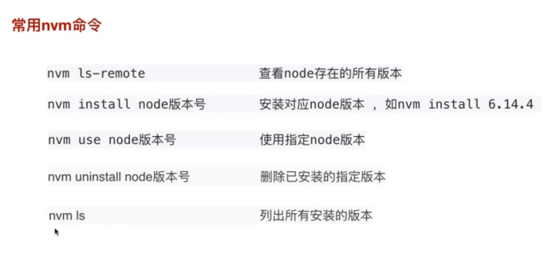

****Nvm安装----node版本管理****
=========================

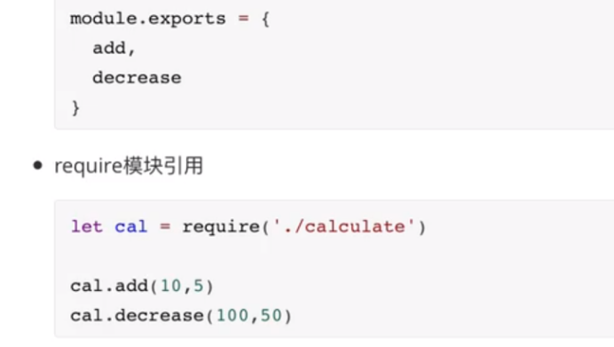

****CommonJs的代码规范****
=====================

****Loadsh（工具库）****
-------------------

****Buffer****
==============

长度固定，0-255的16进制，超过255对256取余
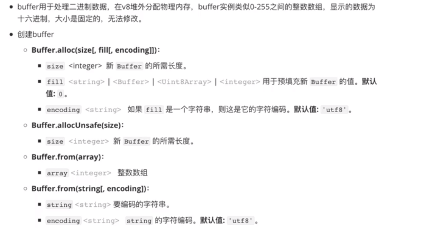

****FS文件操作****
==============

Require（“fs”）

****读取文件****
------------
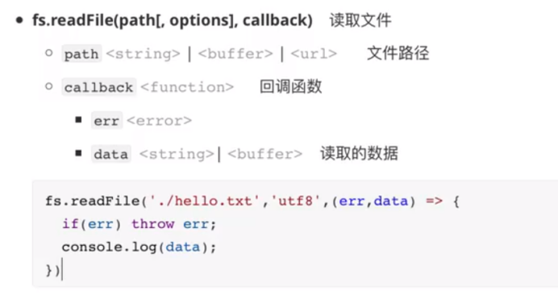

****写入文件****
------------

****追加内容到文件****
---------------

****同步/异步读取文件****
-----------------
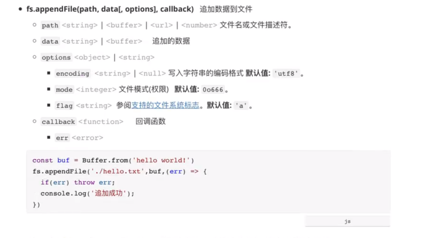

****获取文件信息****
--------------

****重命名****
-----------
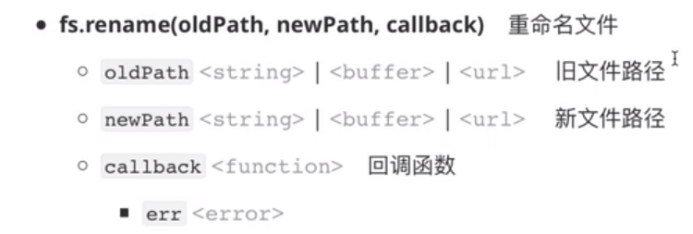
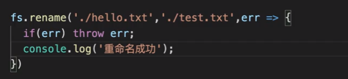
****删除文件****
------------
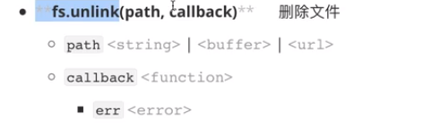
****创建文件****
------------
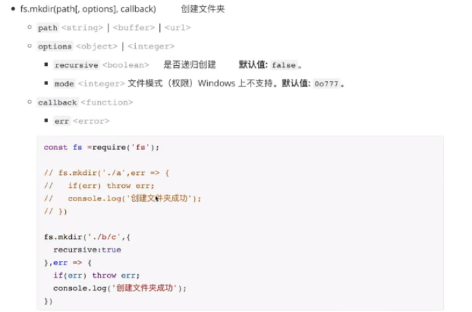
****删除文件夹****
-------------
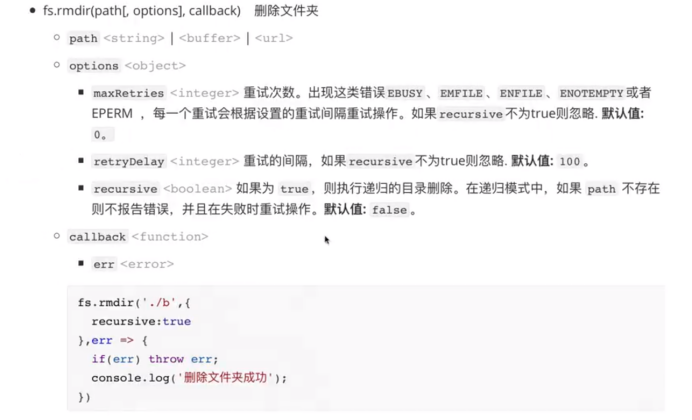
****写入流和输出流****
---------------

****管道流(把A文件内容读取到B文件)****
-------------------------
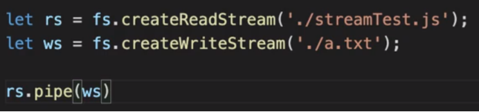
****Path（处理路径）****
==================

****事件触发器****
=============

****Uitl****
============
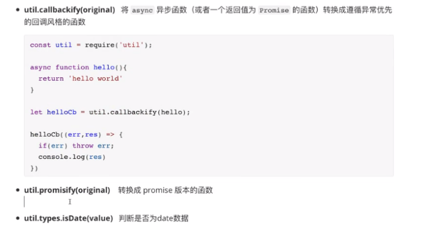
****Http****
============

****http响应方法****
----------------

****http响应头（response headers）****
---------------------------------

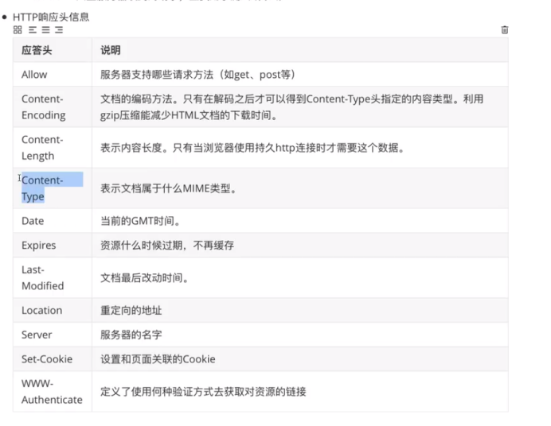
****状态码****
-----------
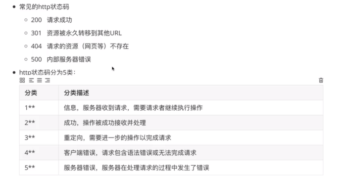
****Content-type****
--------------------
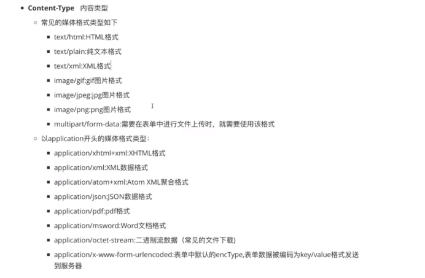
****搭建http服务器****
-----------------

一旦有人访问3000端口就会显示hello world

****发送get请求****
---------------

****处理get请求****
---------------

解析get请求的url，然后返回json字符串到前端
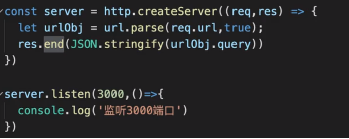
****处理post请求****
----------------

****通过路径匹配****
--------------

****Cheerio(通过jq操作dom)****
==========================
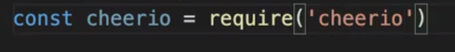
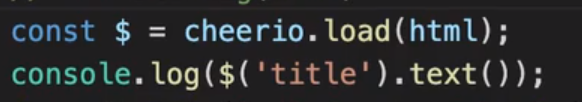
****Nodemon（相当于nodejs的热部署）****
==============================

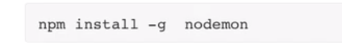（-g全局安装）

然后用nodemon启动就行了

****跨域问题解决****
==============
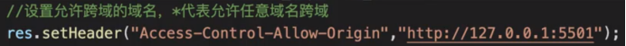
****NODEJS连接mysql****
=====================
