**Let**
=======

****特点****
----------

只在申明的代码块中生效

暂时性死区：在变量申明前不能操作变量

不能重复申明

没有变量提升：console(b);let b = 5；这样就访问不了b，但是如果var b就可以访问

****Const****
=============

申明常量，但是只保证内存地址不变。

****Symbol****
==============

****解构赋值（一种匹配机制）****
====================
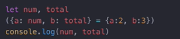

****ES6字符串****
==============

****双字节中文()****
---------------
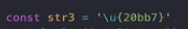

****For-of****
--------------
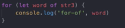

****字符串判断****
-------------
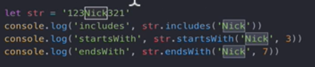
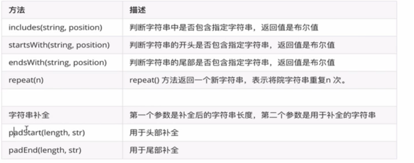

****字符串拼接``****
---------------

****ES6数组操作****
===============

****...运算符（浅拷贝，只是拷贝的内容  传参）****
-------------------------------
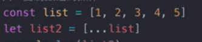
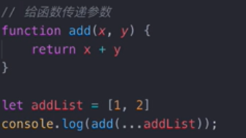
Console.log(...\[1,2,3,4,5\])==1,2,3,4,5 会展开

****，分割运算符****
--------------
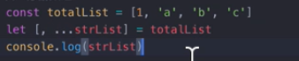
取出 a,b,c

****Fill--填充数组****
------------------
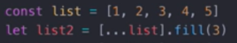
全部都变成3
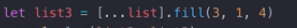

1 3 3 3 5，第二个参数代表从哪里开始，第3个代表到哪里之前结束

****Find findindex--查找****
--------------------------
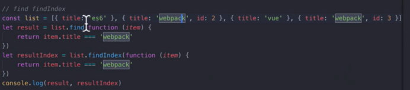

****Include--是否包含****
---------------------
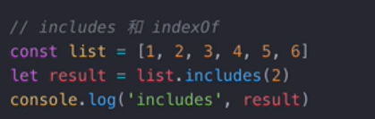

****Flat--数组展开****
------------------

Let a = \[1,2,3,\[4,5,6\]\]

Let t = a.flat() 默认展开一层数组

如果是Let a = \[1,2,3,\[4,5,\[7,8,9\]\]

Let t = a.flat(2) 展开2层

****Map--->变成map****
--------------------
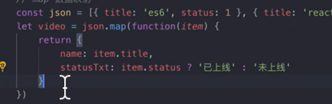

****Reduce****
--------------
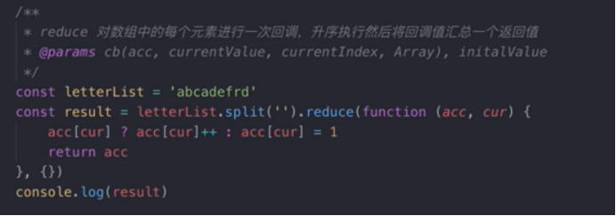
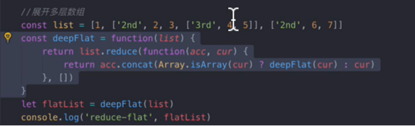

****Map和WeakMap****
-------------------

### ****Map****
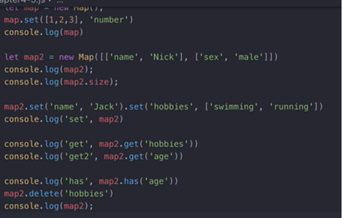

### ****weakMap---无法遍历，有点像弱引用一旦引用的key被销毁，内容也会自动回收****
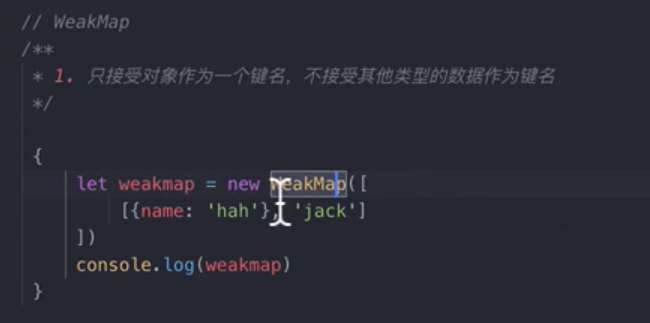

****Set和WeakSet--和Map的一样****
----------------------------

****Map，Set，Obj，数组的增删改查****
---------------------------

### ****增加****
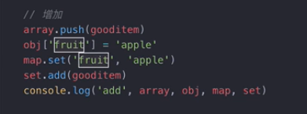

### ****删除****
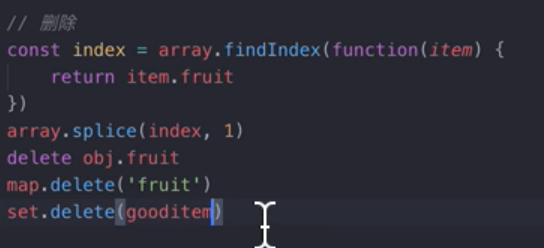

### ****修改****
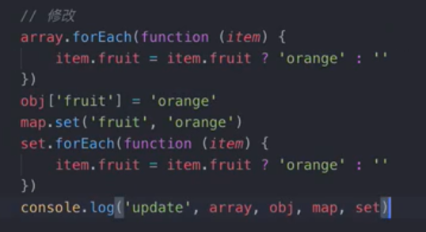

### ****查询****
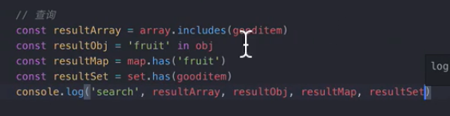

****Map，set，数组，对象类型转换****
-------------------------
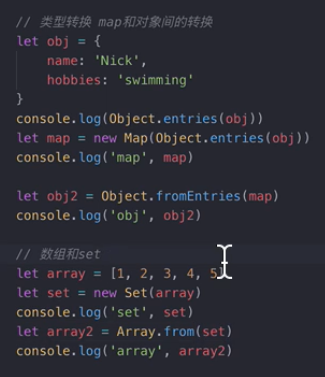
****Proxy和reflect****
=====================
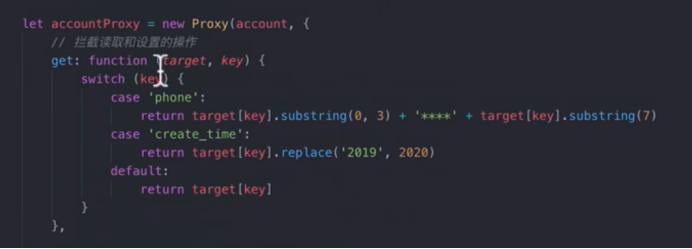
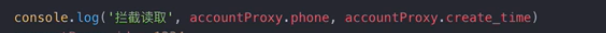
### ****Reflect****
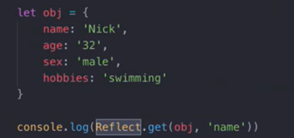

****函数****
==========

****默认参数****
------------
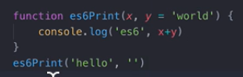

****箭头函数(this默认指向的是当前实例)****
----------------------------

setTimeout因为是windows自带的，所以this变成windows，所以用箭头函数
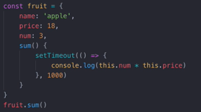

****构造函数****
------------
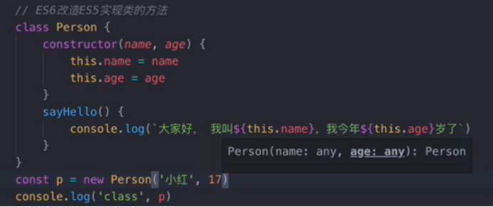

### ****类的继承****
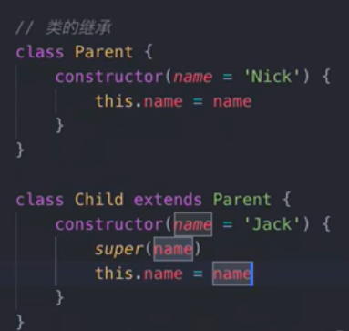

****GET/SET方法****
-----------------
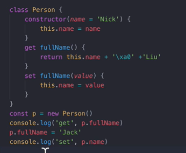

****静态方法****
------------
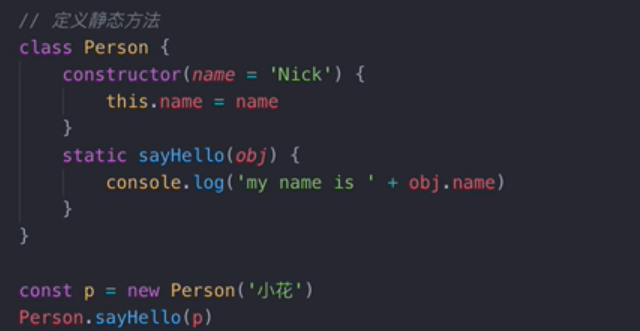

****Promise---链式调用(resolve执行下一个函数，reject抛出异常)****
=================================================
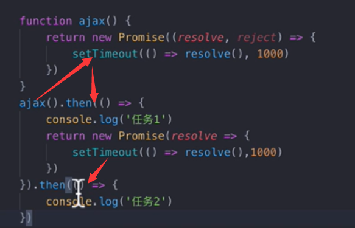
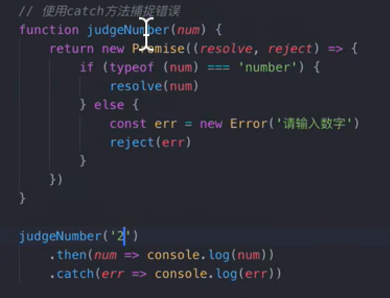

****Promise.all---->保证括号里的函数都执行完了再执行then****
--------------------------------------------
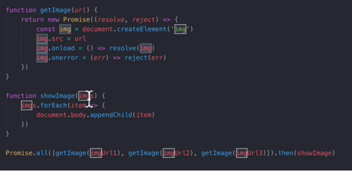

****Promise.race****
--------------------

3个getimage哪个先返回成功就执行哪个，其他都不执行了
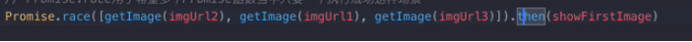

****Iterator****
================
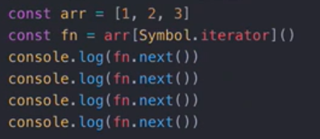

****如果是对象类型要自己定义****
--------------------
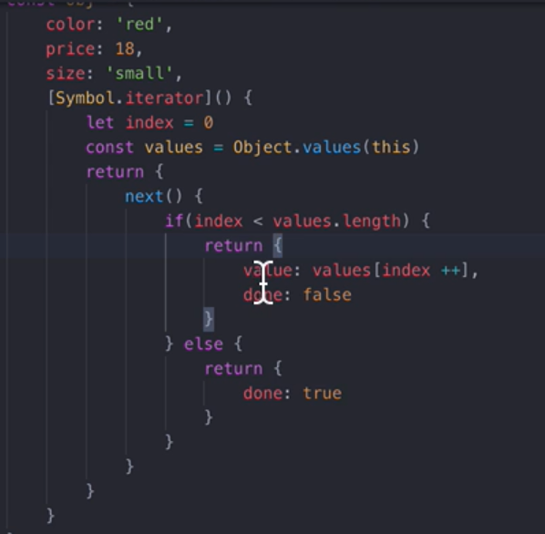
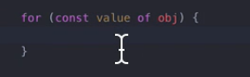

****Generator--生成一个迭代器（yield）****
=================================
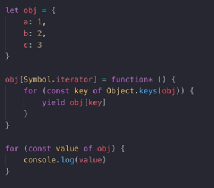

****function**** \* xx()  
{  
    ****const**** res = ****yield**** a;  
    console.log("111");  
    ****yield**** b;  
    console.log("222")  
    ****return**** 2;  
    ****yield**** 3;  
}

第一次执行next 只会执行yield a，不会执行复制

第二次执行next  会执行赋值，console，和yield b

第三次   会执行console 并且返回2，结束

第四次   不会继续执行，一旦return就结束（没有return 默认return undefined）

****实现异步编程****
--------------
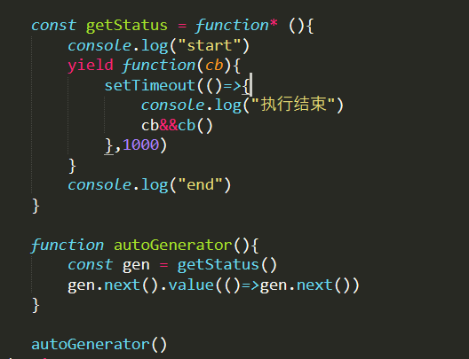

****Async--await会等到resolve执行才去执行下一个await****
============================================
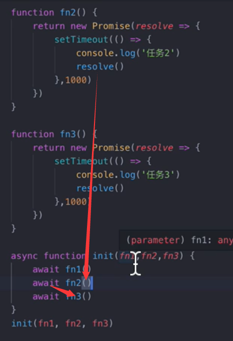
