**创建项目**
========

Create-react-app xxx(项目名)

****项目结构****
------------
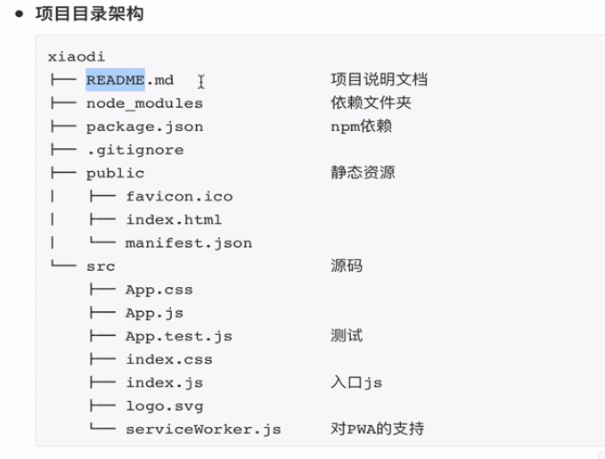
****JSX---JS+HTML****
---------------------
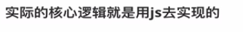

****修改值****
===========
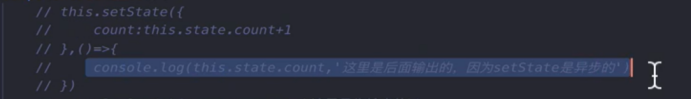
第一个参数是修改的值(异步操作)，第二个是回调函数

****第二种****
-----------
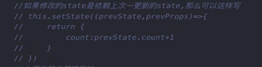
****第三种****
-----------
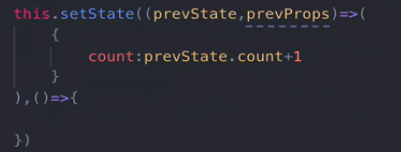
****值传递****
===========

****第一种（类）****
--------------

引入组件并传值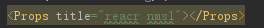
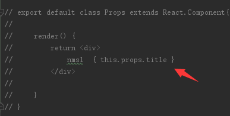

****第二种（暴露方法）****
-----------------
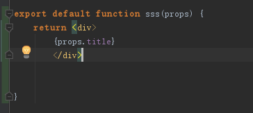
****条件渲染****
============
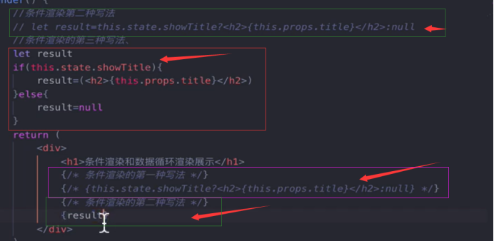
****循环渲染****
============
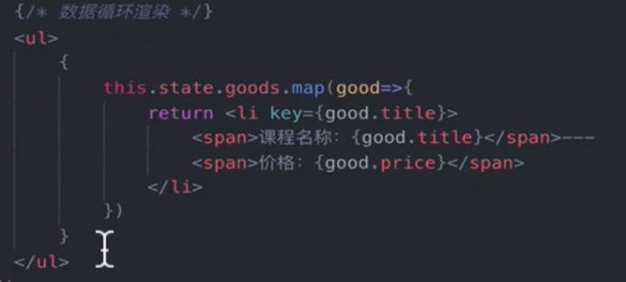
****函数****
==========

****事件绑定****
------------

### ****第一种（用的少）****

在函数中的this指向的不是全局的this，所以要对this做绑定
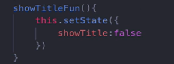
绑定this（在construct中）
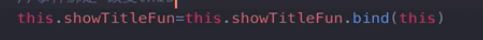
### ****第二种****
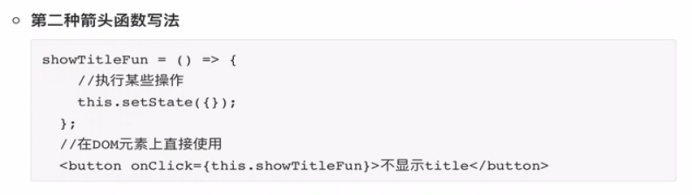
### ****第三种****
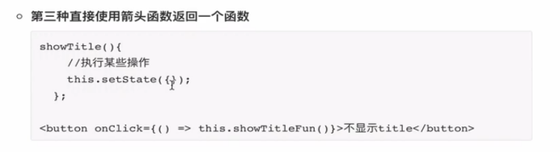
****样式编写---例如 img的src****
=========================
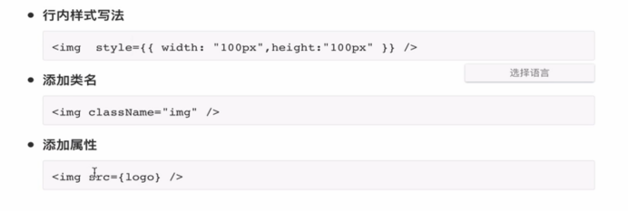
****数据绑定****
============
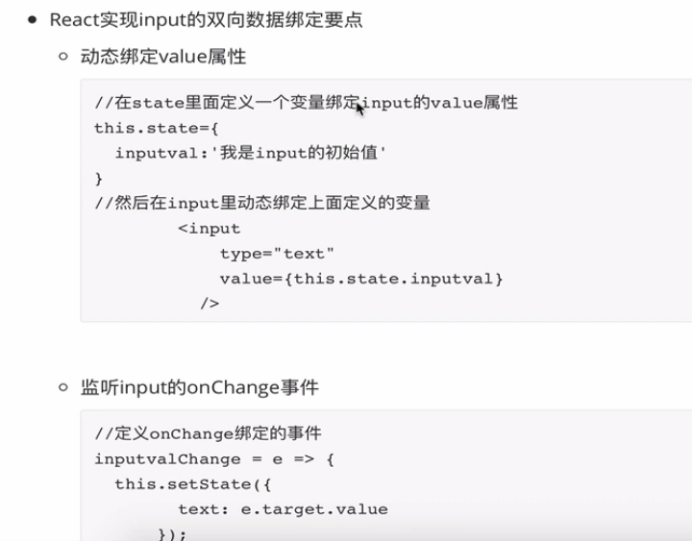
**组件生命周期**
==========
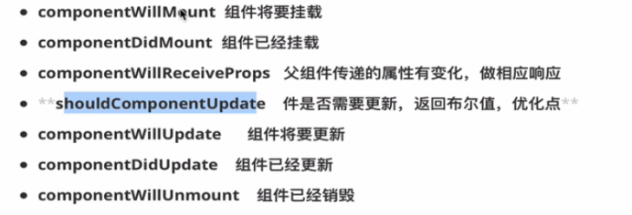
****执行顺序（一开始）****
-----------------
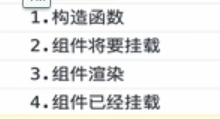
****如果父组件的属性进行了更新****
---------------------
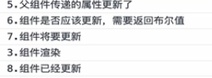
****组件****
==========

****函数式组件****
-------------
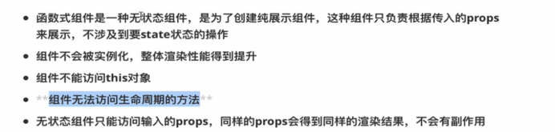
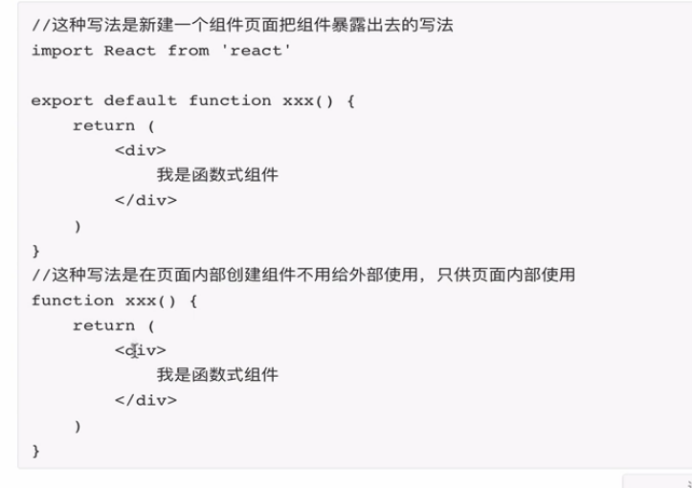
****Class组件****
---------------
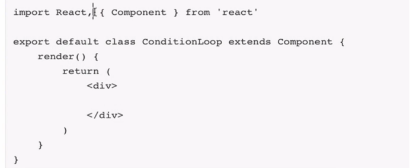
****PureComponent****
=====================

就是一旦数据改变了会调用render重新渲染，所以一般的操作是在shouldComponentUpdate中判断数据是否改变，PureComponent已经帮你实现好了
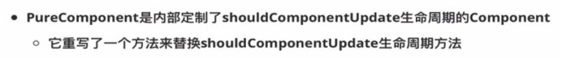
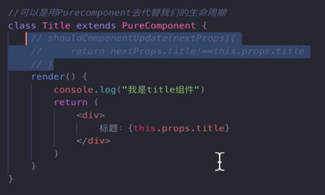
****React.memo--让函数组件实现PureComponent的功能****
===========================================
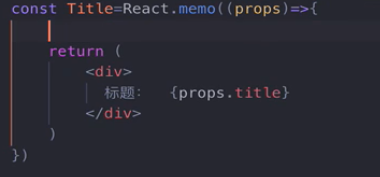
****复合组件****
============
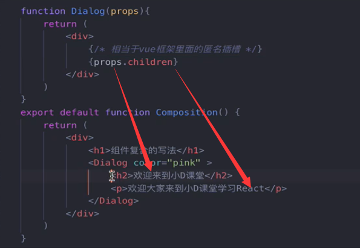
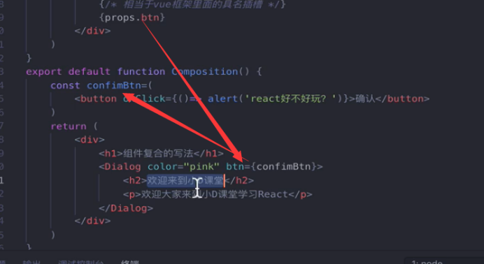
****HOC---高阶组件****
==================

****基本使用****
------------

### ****函数式****
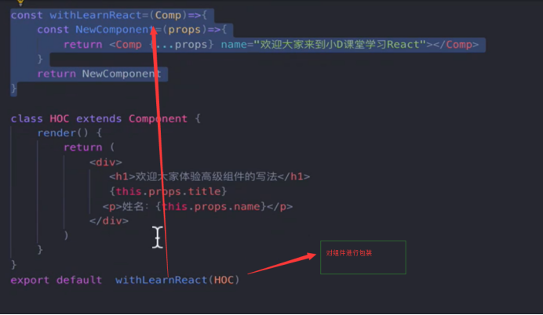

### ****Class式****
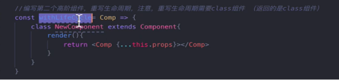
****链式调用---就是嵌套包装****
---------------------
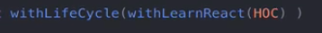
****修饰器写法****
-------------

### ****安装****
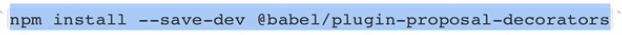
添加配置文件 config-overrides.js
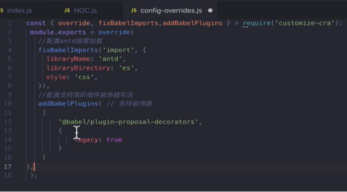
### ****使用（从上到下依次递进）****
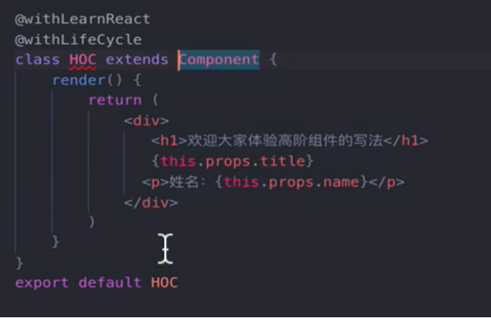
**Context全局数据源，解决嵌套数据传递问题**
===========================

1.  创建context
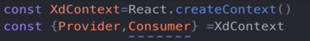
2.  创建provider--就是数据提供者
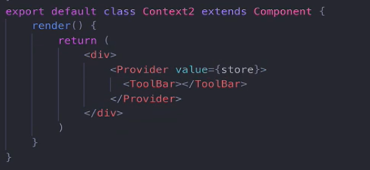
3.  创建consumer
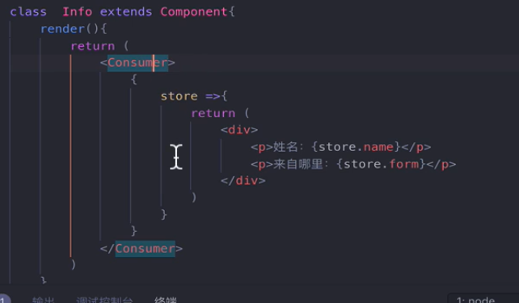
****Hooks****
=============

****优点****
----------
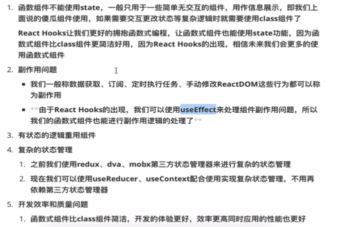
****UserState使用****
-------------------
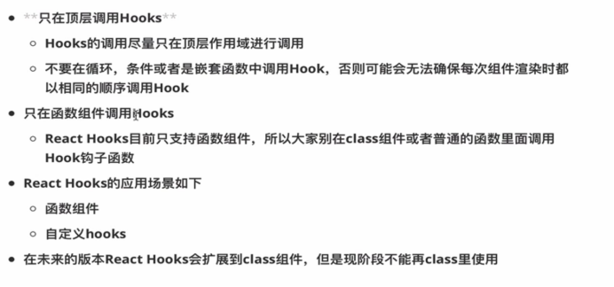
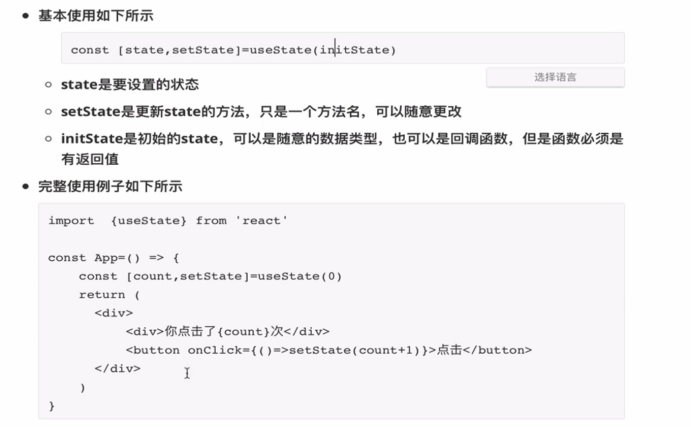
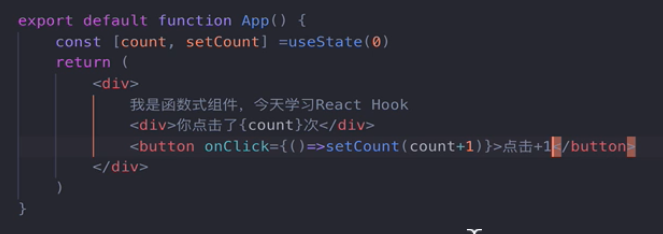
****useEffect---处理副作用****
-------------------------
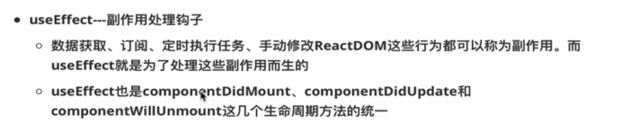
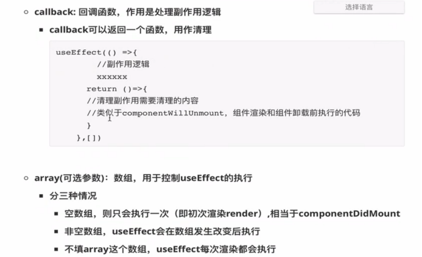
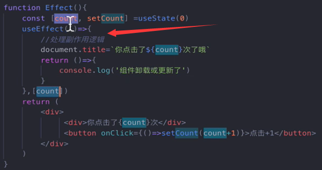
****UseContext-----处理全局数据****
-----------------------------
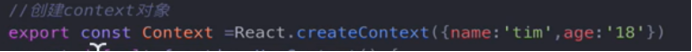
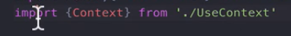
****UseReducer----增强版useState****
---------------------------------

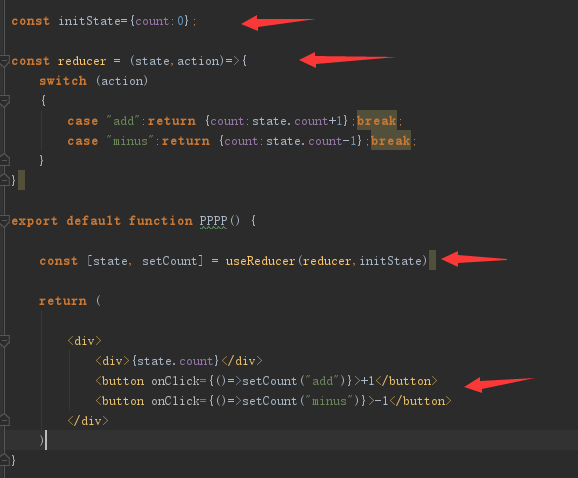
****UseRef---获取dom****
----------------------
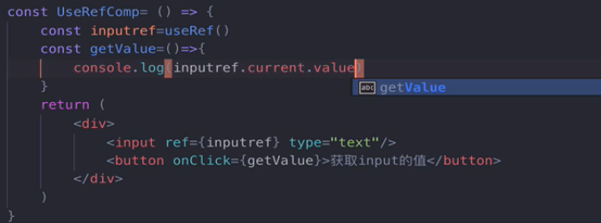
****UseMemo和UseCallback----操作对象****
-----------------------------------
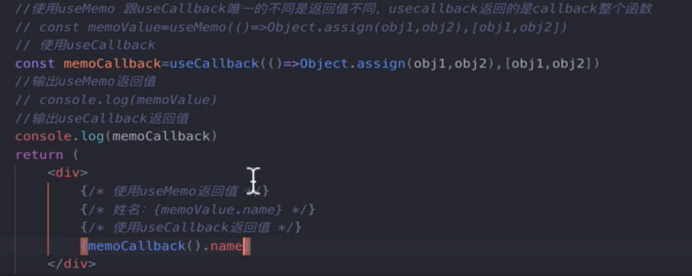
****自定义hooks---要用use开头****
--------------------------
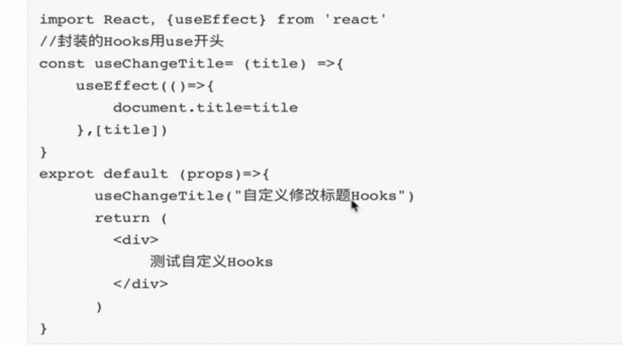
**Redux**
=========
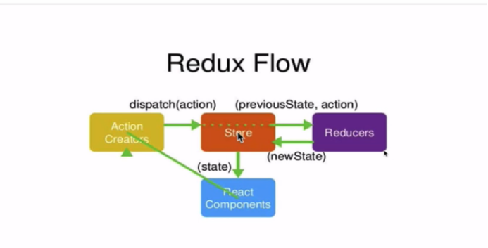
****安装****
----------

****步骤****
----------

****使用****
----------

1.  建立数据仓库，并用createStore包装并暴露

2.  在页面中使用

3.  数据仓库订阅 subscribe  render

****React-redux---react对redux的封装****
------------------------------------

就是通过provider提供store数据，然后直接在组件中使用，就省去了redux的subscribe

### ****使用****

1.  构造使用需要的方法和变量

2.  调用构造好的方法和变量

3.  暴露组装好的组件

4.  render包装

### ****注解版****

****中间件---rudux-thunk（解决简单异步问题）****
-----------------------------------

### ****使用****

****React-router 路由****
=======================

****下载****
----------

****使用****
----------

****import**** React ****from**** 'react'  
****import**** { BrowserRouter,Link,Route } ****from**** 'react-router-dom'  
  
  
****function**** App() {  
    ****return**** (  
        
  
            <ul>  
                <li>  
                    <Link to="/">首页</Link>  
                </li>  
                <li>  
                    <Link to="/class">课程</Link>  
                </li>  
                <li>  
                    <Link to="/mine">我的</Link>  
                </li>  
            </ul>  
            <Route path={"/"} component={Home}></Route>  
            <Route path={"/class"} component={Class}></Route>  
            <Route path={"/mine"} component={Mine}></Route>  
  
        
  
    )  
}  
  
  
****function**** Home() {  
    ****return**** (  
        
  
            Home  
        
  
    )  
}  
  
****function**** Class() {  
    ****return**** (  
        
  
            Class  
        
  
    )  
}  
  
  
****function**** Mine() {  
    ****return**** (  
        
  
            Mine  
        
  
    )  
}  
  
****export default function**** RouterDemo() {  
  
    ****return**** (  
        
  
            路有演示  
            <BrowserRouter>  
                <App></App>  
            </BrowserRouter>  
        
  
    )  
  
}

### ****也可以不使用route-->下面的就可以用<RouteGuard></RouteGuard>****

### ****Exact属性---完全匹配路径才去找，默认是包含匹配****

### ****Switch----匹配到第一个合适的就不再继续往下匹配****

****路由传参****
------------

反正参数都在match  location  history中 自己去找。

****嵌套路由和路由重定向（Redirect）****
----------------------------

Redirect 就是设置刚进来页面没有匹配的东西时候应该跳转到哪里

不能设置exact属性

****路由守卫****
------------

****Redux-saga---处理复杂异步操作****
=============================

1.  编写saga（就是reducer的编写和暴露一个方法作为action的入口）
2.  编写真正的saga逻辑（就是用于派发相应的action 的type）

3.运行saga中间件

****安装****
----------

****Umi开发框架****
===============

****安装****
----------

****使用步骤****
------------

1.  cnpm init创建package.json
2.  修改json

3.  创建src文件夹
4.  在src目录下输入umi g page index
5.  在src目录下输入umi g page about

****Umi嵌套路由和动态路由****
--------------------

****配置文件编写路由配置****
------------------

****配置式路由守卫****
---------------

1.  配置路由守卫的逻辑（这个是大于5就跳转到登录否则正常）

2.  在你需要配置路由守卫的路由下添加Routes属性

****antd的引入****
---------------

### ****安装（-S就是和项目一起打包  -D就不一起）****

****Axios安装****
---------------

Cnpm install axios -S

****Dva--一种开发模式（Page页面 Model逻辑 Service Http接口对接）****
====================================================

****Model--核心（通过namespace（如果没有设置，默认是文件名）来找到这个model，文件夹必须是mdels）****
-------------------------------------------------------------------

State.goods（goods就是model的namespace 从而获取model的state）

GetList通过传递type（前缀是goods）来对effects中的内容进行调用

****Antd****
============

****Ant-design-pro****
----------------------
