**何时要在属性前加:  v-bind**
=====================

如果传递的是字符串‘xxx’  可以不加，其他情况都要加

****El****
==========

指定根节点
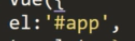
****Template****
================

模板，只能有一个根节点
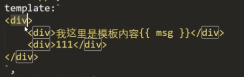
****Data****
============
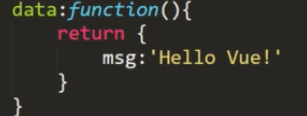
****{{ }}****
=============

获取数据

****Methods****
===============
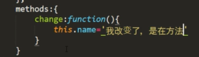
****Vue生命周期函数****
=================

****Created---数据加载****
----------------------

创建前拿不到msg，创建后就拿到了
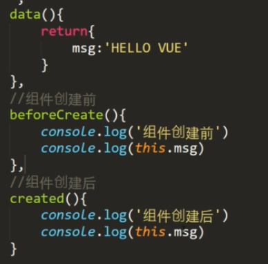
****Mounted--Dom加载完成（JS生成的dom）****
----------------------------------
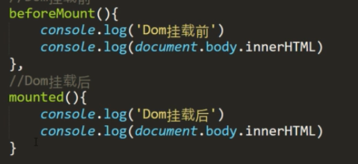
****Update--数据更新前后****
----------------------
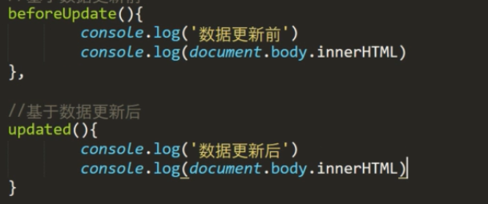
****Destory--销毁前后****
---------------------
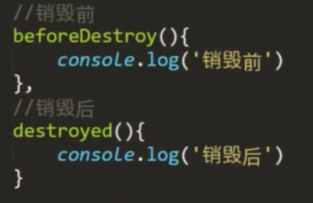
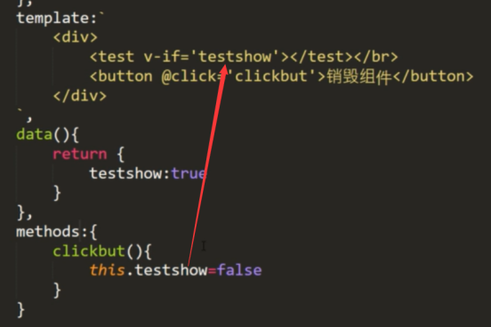
****Filters---过滤器****
=====================
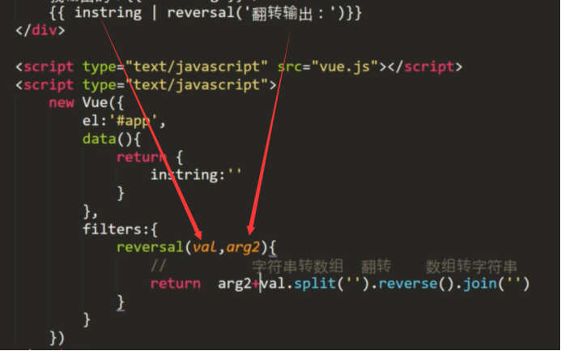
****全局过滤器****
-------------
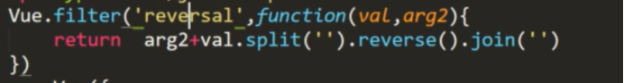
****数据绑定****
============

****V-bind--单向数据绑定****
----------------------

页面数据受控于JS，页面数据的改变不能改变JS，简写就是:
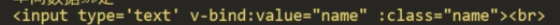
****V-model--双向****
-------------------
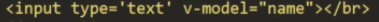
****事件绑定****
============

****V-on****
------------

****监听****
==========

****Watch--单个监听****
-------------------
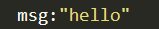
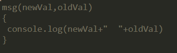
### ****深度监听****
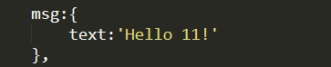
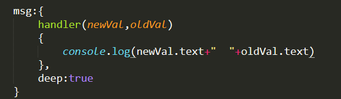
****Computed--多个监听****
----------------------

触发条件（ 在computed中定义的每一个计算属性，都会被缓存起来，只有当计算属性里面依赖的一个或多个属性变化了，才会重新计算当前计算属性的值。上面的代码片段中，在reversedMessage中，它依赖了message和number这两个属性，一旦其中一个变化了，reversedMessage会立刻重新计算输出新值。）
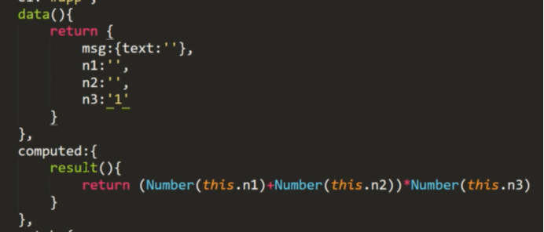
****组件化****
===========

****方式1****
-----------
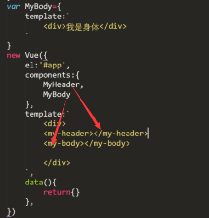
****方式2(还是要去component注册组件)****
------------------------------
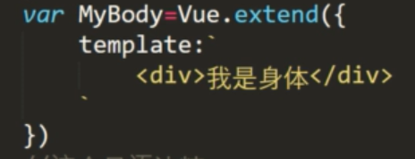
****方式3(不用去注册了，直接用<my-fotter>)****
----------------------------------
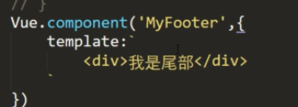
****slot插槽****
==============
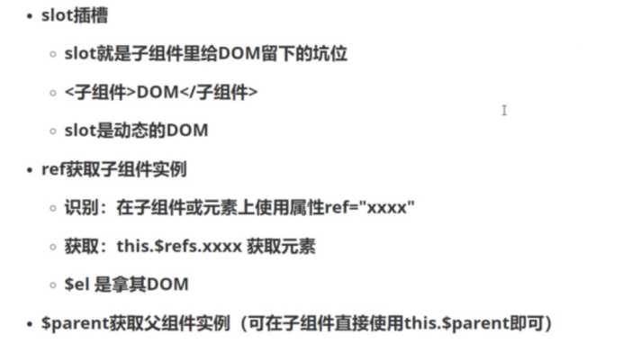
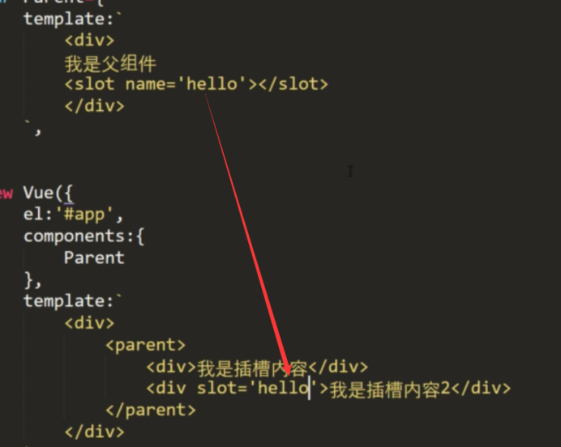
****父子间的通信****
==============

****父传子****
-----------
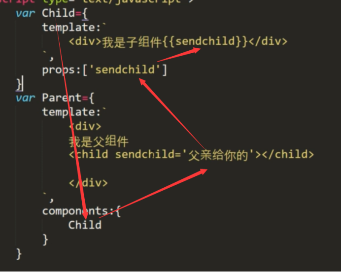
****子传父****
-----------
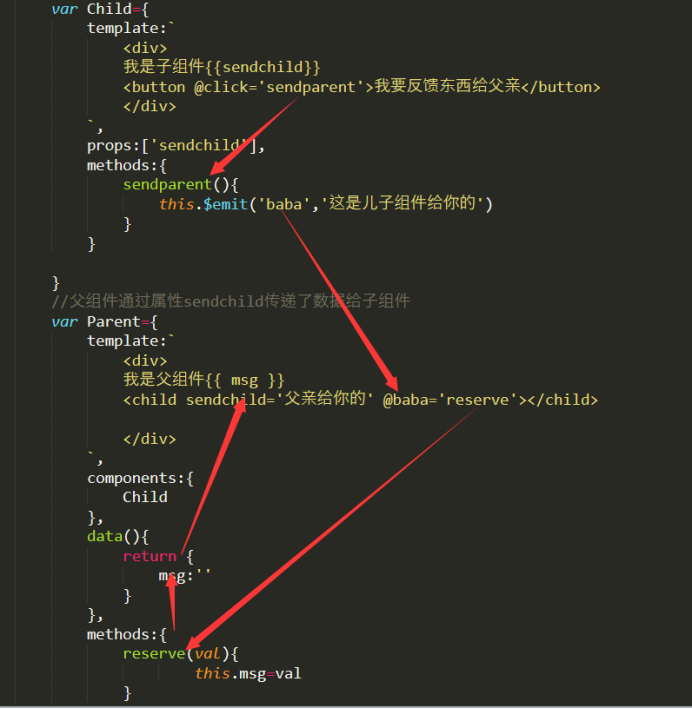
****非父子间通信****
==============

****路由跳转(监听hash锚点(url)的改变)****
==============================

****Vue-router--路由器****
-----------------------
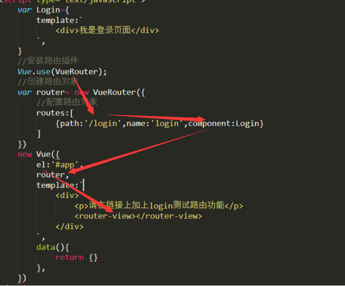
****跳转方式****
------------

### ****Router-link****
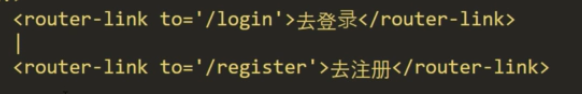
### ****$router****
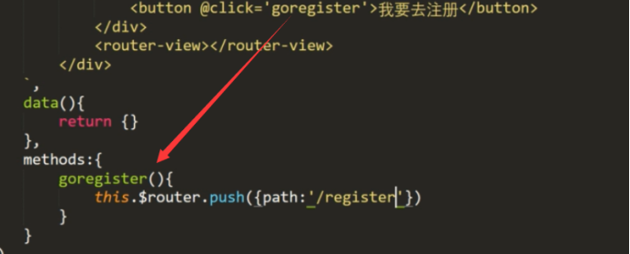
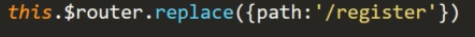
Replace没有历史记录

****路由传参****
============

****查询参数---相当于发送get请求  用？****
-----------------------------

/login?Id=123
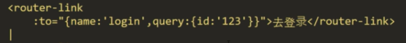
获取id
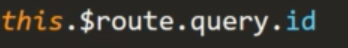
****Params---相当于restful查询****
-----------------------------

/register/bar
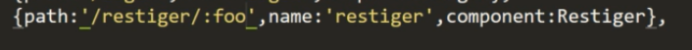
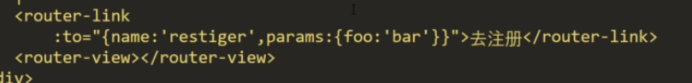
获取参数
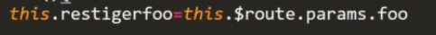
第二种获取参数的方式
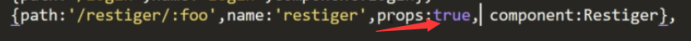
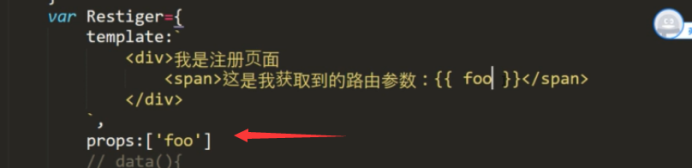
****:key="$route.fullPath"****
------------------------------

如果只是改变参数的路径改变可能不会引起路由跳转，所以加上这个参数就可以监听整个路径包括参数的改变
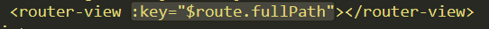
****动态路由（path：********”********/aa/:id********”********）****
============================================================

****嵌套路由****
============

就是router-view里面又有一个router-view

/nav是一个 router-view （Nav）

/nav下面又有4个路由对应着/nav下的router-view
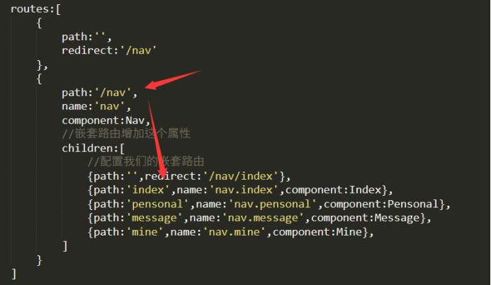
****路由守卫****
============

执行next()才会跳转，
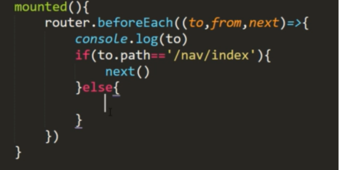
**VeuX**
========
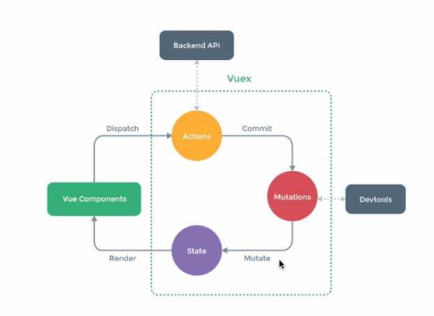
Actions:异步 通过this.$store.dispatch(“xxx”)触发

Mutations：同步 通过this.$store.commit(“xxx”)触发

****初始化 store****
-----------------
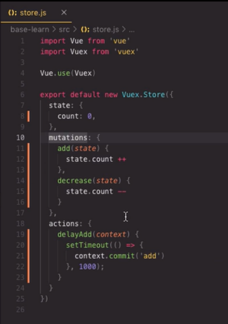
****第一种使用方法****
---------------
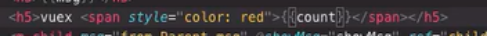
-->调用count函数获取
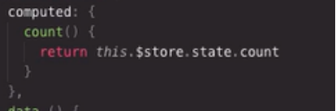
****第二种方式--辅助函数（需要多个数据的时候，省的一个一个拿）****
--------------------------------------
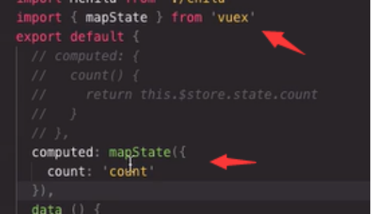
****将mapstate中的数据与本地computed中的数据混用****
--------------------------------------

只需要将mapstate展开（...运算符）...mapstate
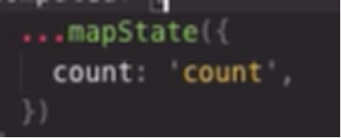
****高级用法****
------------

### ****Getters---相当于computed****
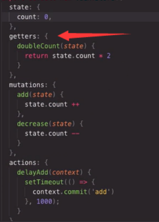
使用（如果使用的字符串就数组）
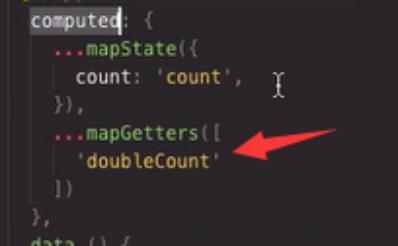
### ****Modules模块化****

创建一个count的模块
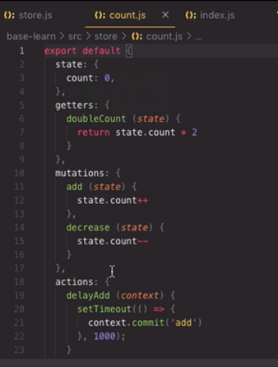
创建模块化store
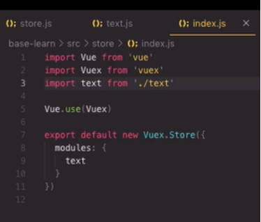
在main.js中引入相应的模块
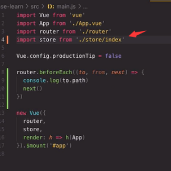
使用

****创建项目****
============

Nodejs 输入 vue create 项目名字

****添加cube-ui****
-----------------

Vue》3.0  vue add cube-ui

****添加axios--->es6封装的ajax****
-----------------------------

Cnpm install axios

挂载axios

发送请求

****axios的配置****
================

****Axios实例创建****
-----------------

****Request请求拦截器****
--------------------

****Response拦截器****
-------------------

****挂载到vue****
--------------

****项目结构****
============

****Store.js----就是vuex****
--------------------------

this.$store.dispatch("increment");---调用action中的方法 （异步）

this.$store.commit("increment");---调用mutations方法 （同步）

****Axios的拦截****
================

****项目打包****
============

Cnpm run build

****MVVM****
============

****Mock****
============

****安装****
----------

****使用（url，请求方法，返回数据）****
-------------------------

****引入到vue****
--------------

****ElementUi****
=================

****安装****
----------

Yarn  add element-ui -S

****挂载****
----------

****布局组件的使用（el-row  content）****
--------------------------------

****弹出组件（dialog --->使用了sync  popover用的较少）****
---------------------------------------------

Sync就是为了实现props的双向绑定，sync就是添加了事件监听，然后子组件通过$emit(“update:xxx”,newVal)改变父组件内容

****表格表单组件****
--------------

Lable  就是表单的描述

V-model 就是表单数据的绑定

### ****表单验证rules****

****Scss和Sass--就是css解析器****
===========================

****Eslint---设置代码规则解析器，代码格式化****
================================

****Echarts****
===============