**GIT**
=======

****GIT各个状态的关系****
------------------

工作区

Git add

暂存区

Git commit

本地仓库

远程仓库
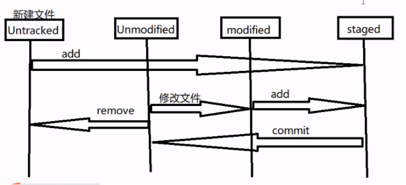
****GIT命令****
-------------

### ****Git push****

#### ****Git push origin xxx****
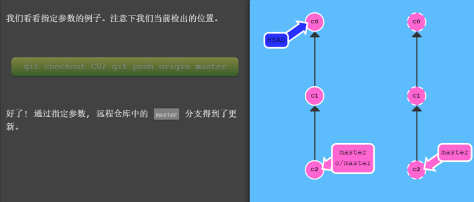
#### ****Git push origin xxx:zzz****

把xxx的之前的提交 提交远端到zzz分支上
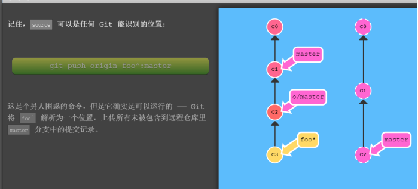
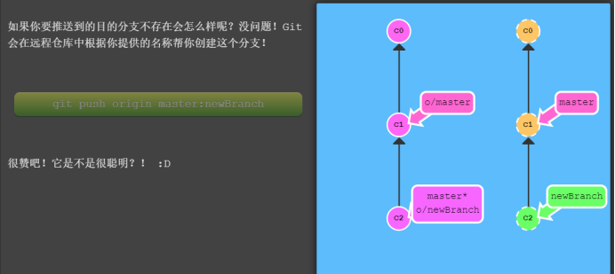
删除
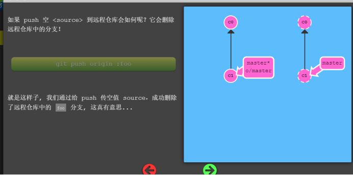
### ****Git pull --rebase****

Git pull+git rebase
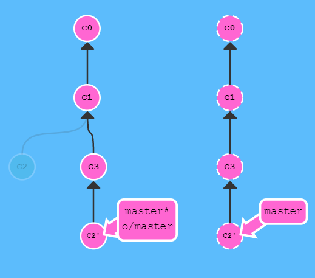
### ****Git branch -f xxx yyy****

xxx移动到yyy

### ****Git cherry-pick xx xx xx..****

移交提交记录到当前分支
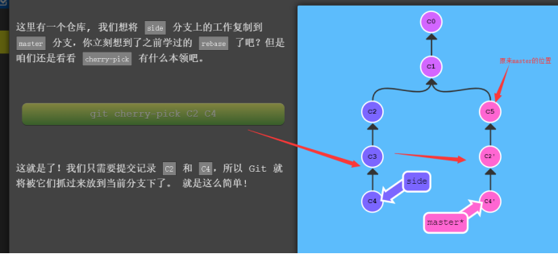
### ****Git reset****
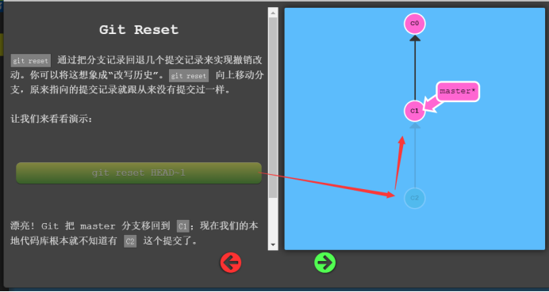
### ****Git revert****
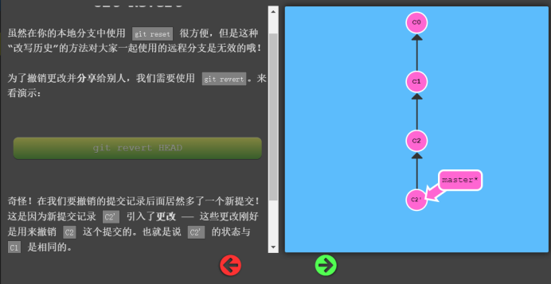
### ****Git rm--删除文件****
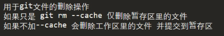
### ****Git checkout--恢复文件，切换分支****

git checkout -b xxx 创建并切换到xxx分支
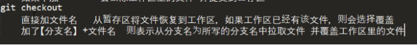
#### ****Git checkout -b xxx o/master****

### ****Git rebase---复制****

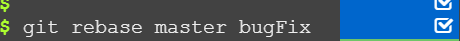直接指定，让bugFix复制到master
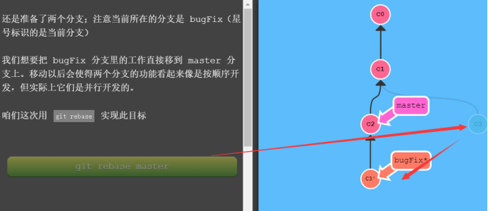
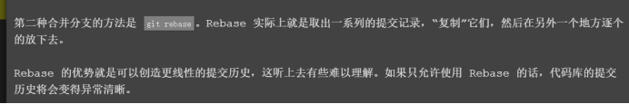
### ****Git rebase -i HEAD~3****

打开交互界面

Git rebase -i HEAD~3  --->将head之前的3个提交进复制到head之前的第4个提交
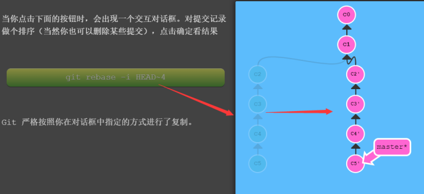
### ****Git branch--查看分支****

Git branch -d 分支名--删除分支，不能删除当前所在分支

Git branch -m 旧分支名 新分支名---改名字

Git branch -u o/master xxx--->让xxx追踪o/master

### ****Git log--查看commit历史****

Git log -x  查看最近x次提交

Git log -p -x 查看最近x次提交的不同

Git log --author xxx -y查看xxx的最近y次提交

Git log --oneline简要信息

Git log --graph 简单线串联历史信息

### ****Git diff--查看不同****

git diff --->工作区和暂存区比较

git diff --cached/--staged 本地仓库和暂存区

git diff HEAD 仓库和工作区

git diff 分支名 查看当前分支(工作区)和指定分支名(因为已经checkout过来，肯定是比较的仓库)的区别

git diff 分支1 分支2 比较2个分支仓库

git diff 文件名 查看指定文件的差异(可以与上面的结合)->(这个和git diff结合所以比较的是工作区和暂存区文件差异)

git diff commitid1 commitid2 通过2次提交id比较

git diff --stat -->罗列有变更的文件(同样可以结合)

#### ****示例****

\-\-\- a/file2 表示变更前的版本

\+\+\+ b/file2 表示变更后的版本

@@ -1 +1,2 @@ -1表示原来的只要一行如果是(-1,2-->表示原来2行)  +1,2表示现在的文件有2行

+xxx 表示新增

-xxx 表示删除

+xxx和-xxxx出现 表示修改

### ****Git reset--撤回提交****

git reset HEAD（回滚暂存区到工作区）

git reset HEAD^(回滚本地仓库+暂存区到工作区)

（这2个是针对的本次操作）

git reset --soft HEAD^ (回滚到上一次提交的将要commit状态)

git reset --mixed HEAD^ (回滚到上一次提交的将要add状态)

git reset --hard HEAD^ (回滚到上一次提交的本地文件状态)

### ****Git Merge--分支的合并****

Git merge 分支名---当前分支和指定分支合并

可能产生冲突

Git diff --name-only --diff-filter=U 查看冲突文件路径

### ****Git Fetch--拉取****

Git pull = git fetch + git merge orgin/master

### ****Git Tag--打标签****

Git tag---显示标签（按字母序），不按时间

Git tag 标签名---默认给最近的一次提交打上标签

Git tag 标签名 commitid --- 给相应的提交打上标签

Git show 标签名---显示该标签相关的那次提交的信息

Git tag -d 标签名---删除该标签

Git push 远程分支名(就是git remote add origin xxx 的orgin) 标签名---把某个标签推送到远程服务器上.
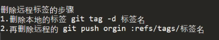
****.GitIgnore文件---用来忽略某些文件****
-------------------------------

### ****直接写文件夹名字---这个文件夹将被忽略****

Target  .idea  

### *****.xxx  123?.log  /error.log--通配符****

**/java/ 和*/java/的区别  **就是 a/b/c都可以不管前面有多少

*只能一个 a/java  b/java

### ****!--否定之前的规则****

****GitLab****
==============

### ****安装****
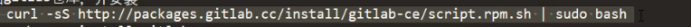
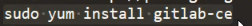

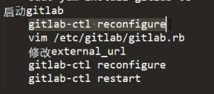修改配置是因为创建项目默认的路径是gitlab.examole.com...所以要改成自己本机的ip

### ****GitLab邮件服务****
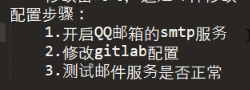
gitlab配置修改（邮箱开启smtp会返回给你一个秘钥，要写入配置文件的password中）

首先进入gitlab配置文件 vim /etc/gitlab/gitlab.rb，然后搜索smtp,git\_user\_email

Git\_email\_from
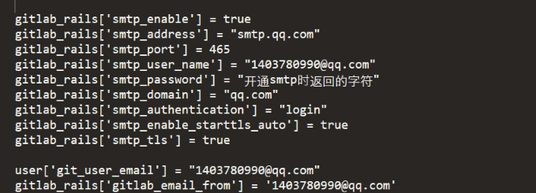
配置完之后gitlab_ctl reconfigure

邮件发送测试

Gitlab-rails console---进入控制台

Notify.test\_email(‘xxxx@qq.com’,’标题’，’内容’).deliver\_now

### ****分支保护****

Setting里面

****持续集成****
============

****Nexus--maven私服仓库****
------------------------

#### ****安装：****

新建nexus用户：useradd nexus

更改文件的权限：让nexus文件夹和sonatype属于nexus用户

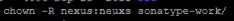
打开nexus网页如果提示

Vim /etc/security/limits.conf

添加\* soft nofile 65536

\* hard nofile 65536

#### ****maven配置nexus****
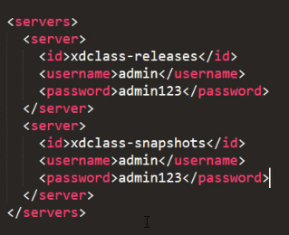
<profiles>

+
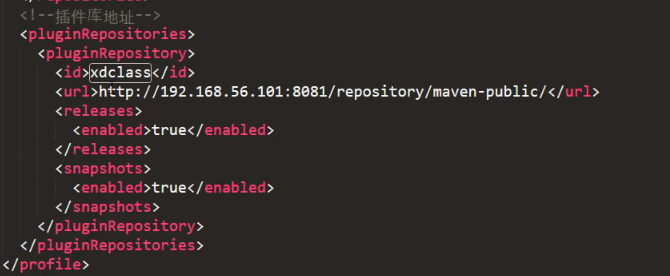
</profiles>
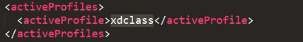
打jar包到nexus上--id要和配置文件中的一致
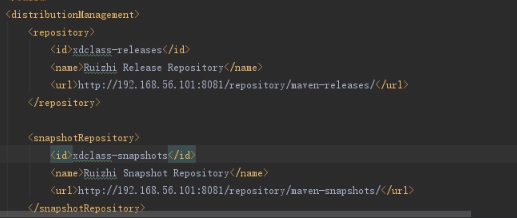
****Jenkins--持续集成构建引擎****
-------------------------

### ****安装****

把jenkins.war放到tomcat下的webapp文件夹，然后使用tomcatip/jekins访问
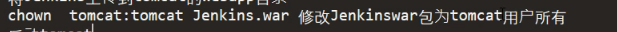
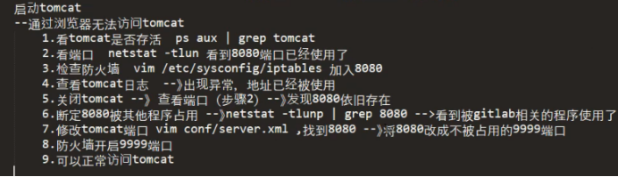
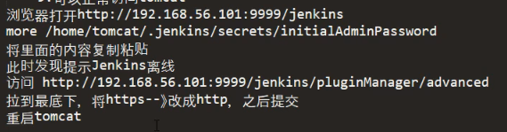
### ****插件****
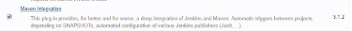
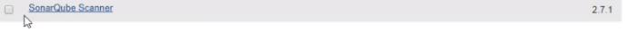
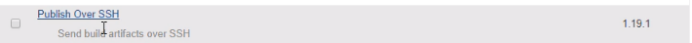
### ****整合sonar****

系统设置-->sonarQube servers-->Add sonarQube

### ****整合gitlab****

Credentials->System->global credentials=>add credentials
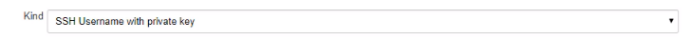
Ssh-keygen -t rsa 生成秘钥（如果不行 yum -y install openssh-clients）

然后more ~/.ssh/id_rsa.pub

然后在gitlab的settint里的SSH KEYs 新增这个

****Sonarqube--代码质量管理****
-------------------------

#### ****安装****

1.  Unzip
2.  在mysql中创建数据库sonar--CREATE DATABASE sonar DEFAULT CHARACTER SET utf8
3.  修改sonar的配置
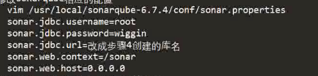
4.  新增用户，并将目录所属权赋予该用户

5.  启动

    Su sonar

Ip:9000/sonar(防火墙打开vim /etc/sysconfig/iptables)

然后产生令牌，并使用mvn命令构建