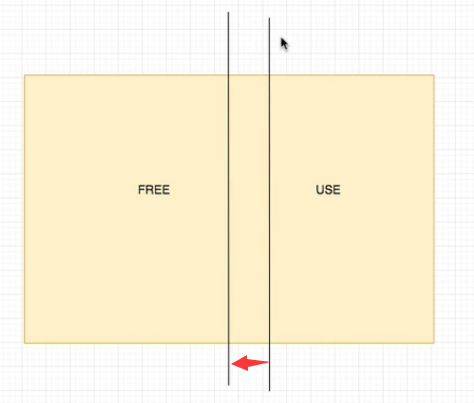
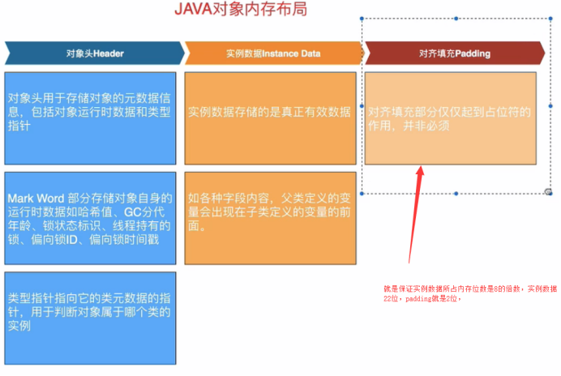
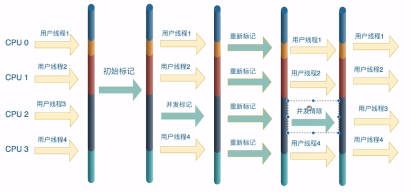
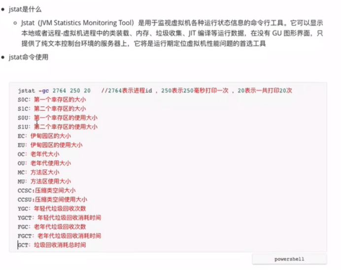
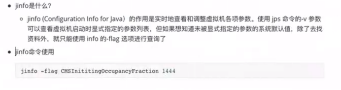
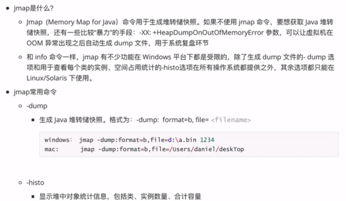
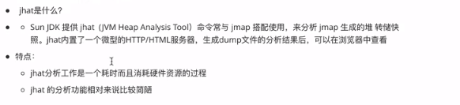
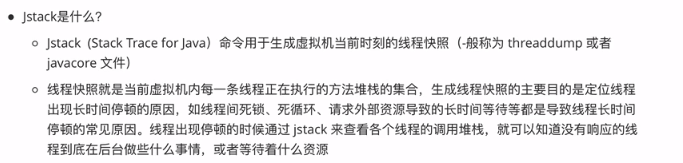
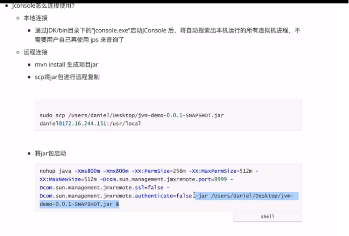

**JVM**
=======

Java虚拟机栈 程序计数器和本地方法栈都是线程私有的，和线程生命周期一样

****程序计数器****
-------------

用来记录程序执行到了哪一行，比如调用一个函数，然后返回，要知道之前执行到哪一行了

****Java虚拟机栈（执行的是java方法）****
----------------------------

就是一个栈，调用一个方法就往栈里面存放该方法，后调用的先退出

每一个栈中还存放了栈帧，用来存放局部变量表(基本数据类型和reference)，操作数栈(+ - * /)，动态链接(new的对象)，方法出口等信息

****本地方法栈（执行的是native方法）****
---------------------------

****JAVA堆****
-------------

用来存放java对象的区域，几乎所有java对象的实例都在这里分配内存

****方法区****
-----------

****运行时常量池****
--------------

String a = “abc”

String b = “abc”

A==b (true)因为变量是存放在运行时常量池中的StringTable（底层是HashSet）地址相同

但是String C = new String（“abc”）

A==C（false）因为C是new的一个对象就会放在java堆中，地址就不同

A==C.intern()（true）因为intern就相当于把C的内存放到运行时常量池中的StringTable和A比较

****JVM参数****
=============

-verbose:gc

-XX:+printGCDetails 打印GC日志

-XX:+UseSerialGC 使用Serial收集器

-XX:PretenureSizeThresholrd=3154728 放入新生代的最大内存不能超过3154728B=3MB

****JAVA对象的内存分配（在java堆中）****
============================

****指针碰撞****
------------

指针从右移到左边，那么中间的一块就是分配的内存

****空闲列表****
------------

存储堆内存空闲的地址（因为内存的分配是不均匀对的）

****JAVA对象的内存分布****
===================

****访问对象的方法****
---------------

通过java虚拟栈中的局部变量表中的reference

1.  直接指针访问-->reference指向java堆中的实例对象数据，并由实例对象数据中的对象数据指针指向方法区中的实际数据
2.  句柄访问-->reference指向一个句柄快，句柄块中存放实例地址和数据地址

****GC（查看内存存活的方法）****
=====================

****引用计数法****
-------------

每个对象都有一个计数器，每次使用到对象，也就是在java虚拟栈中的reference，那么计数该对象的计数+1，一旦不用了出栈就-1，到0就回收（不是马上回收，等到触发垃圾回收的时候再去回收）

缺点：不能解决循环引用，如果设为null只是断开连接，并不是出栈

****可达性分析法****
--------------

通过GCroot去跑连通图，能联通的节点都算活的

可以作GCroot的节点：虚拟机栈/本地方法栈中引用的对象，静态属性对象，常量

****内存回收****
============

****标记-清除（老年代）****
------------------

标记了，再清除，缺点是效率不高每次都要2个步骤，碎片多，

****复制（新生代）****
---------------

把内存复制到一块新的区域中，然后把以前的内存全部清除（不适合存活较多的情况）

****标记-整理（老年代推荐）****
--------------------

把存活的统一整理好之后，把剩下的全删了

****分代收集****
------------

Java堆中对不同的对象分代，用不同的算法

****垃圾收集器****
=============

****Serial 复制****
-----------------

单线程的，运作的时候所有工作进程都要停止

****ParNew 复制****
-----------------

Serial的多线程版本

****Parallel Scavenge(新生代，并行多线程，复制算法)****
-----------------------------------------

注重的是吞吐量，就是用户进程运行时间:总时间，如果设置吞吐量越大，那么留给GC的时间就越少，GC会频繁

并发：一起执行（用户线程和GC一起运行，交替）

并行：指一起工作（多线程GC一起工作，用户线程阻塞）

****CMS（并发，上面的多线程都是并行）标记清除****
------------------------------

****G1****
----------

G1的没有老年代和新生代的纠结问题，他把内存划分为多个大小相等的区域成为region

每一个region又对应着一个remembered Set，G1采用的是标记-整理（各个region内部），region之间采用复制算法，最后清除标记的时候就不用像CMS一样全部扫描，G1只需要扫描remembered Set就行了，G1还有一个特点是他的可预测停顿时间，因为他维护着一个优先队列，保存着各个region中垃圾的价值，优先回收价值多的

****MinorGC和MajorGC****
=======================

****逃逸分析****
============

就是判断这个对象是分配到栈上还是内存中，逃逸分析分为方法逃逸和线程逃逸

方法逃逸就是，调用方法返回一个对象，

线程逃逸就是，外部别的线程引用一个对象

****JAVA虚拟机工具****
=================

****JPS****
-----------

Jps

Jps -v

Jps -

****Jstat（查看进程情况）****
---------------------

****Jinfo（查看jvm虚拟机参数）****
-------------------------

****JMAP(生成堆快照)****
-------------------

Jmap -histo pid|more (分页查看)

****Jhat（分析dump文件，通常和jmap搭配）****
--------------------------------

最简单的：Jhat <file>  会在7000端口生成一个分析文件

****Jstack（查看线程运行状态）****
------------------------

****Jconsole（可视化图形界面）****
-------------------------

****线程状态****
============

NEW

RUNNABLE

BLOCK

WAITING

TIMED_WATING 有最大等待时间的waiting，普通waiting没有时间限制

TERMINATED

BLOCK和WAITING区别： BLOCK是等待锁，WAITING是在执行过程中缺少某种条件是，先暂停叫做waiting
