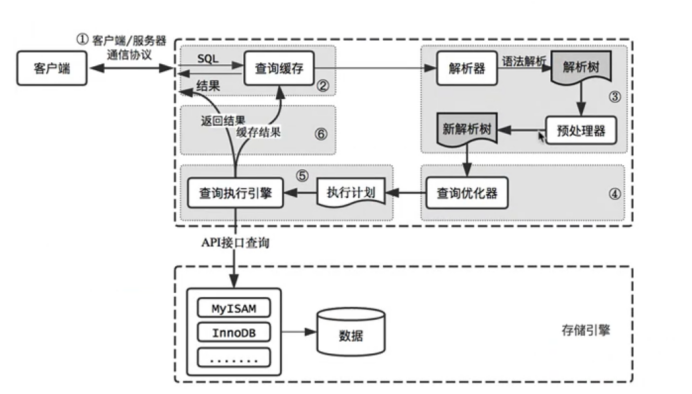
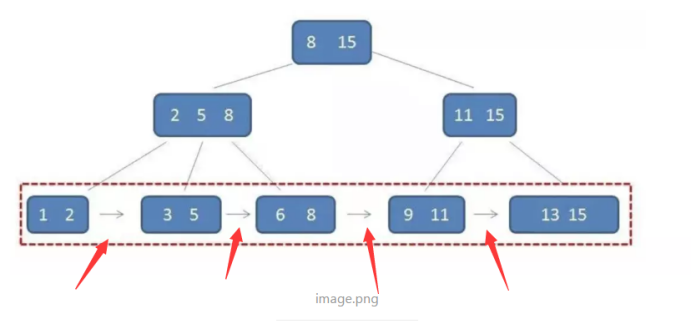
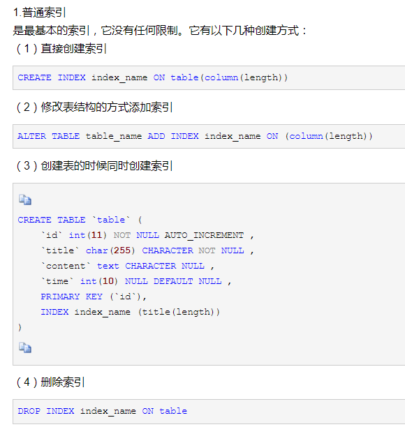
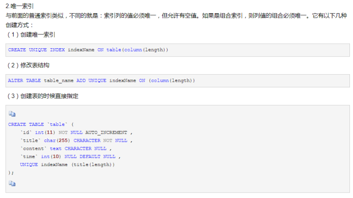
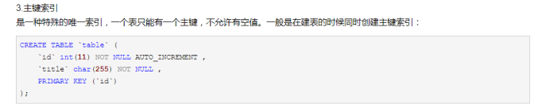
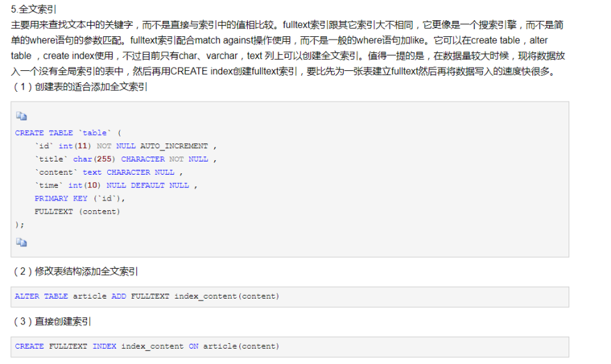

**流程图**
=======

****常用工具****
============

****Explain****
---------------

Explain select * from xxx

****Profile****
---------------

****数据三范式****
=============

****第一范式****
------------

就是每一列的字段不能再分，比如有一个字段是用户信息，用户信息的内容为’刘翔昊21岁’，这个字段可以分割成姓名和年龄所以不满足第一范式

****第二范式--->不满足会造成字段的冗余****
---------------------------

就是非主键字段必须完全依赖于主键，例如，主键有(orderId,productId),但是有一个字段productName只依赖于productId，不依赖于orderId，所以这就是部分依赖，不满足2NF

****第三范式---消除传递依赖****
---------------------

第三范式就是在第二范式的基础上，就是非主键完全依赖与主键，但是优先非主键的依赖是传递依赖，例如主键是orderId,然后有2个非主键costumeId，costumeName都依赖于orderId，就是下这个订单的用户和用户姓名，但是用户姓名是依赖于用户id，用户id依赖于orderId，这是传递依赖，第三范式就是要消除传递依赖

****数据库事务数据4大特性****
===================

****脏读(读未提交)****
----------------

事务A插入了数据，但是还没有提交，其他事务就能读取到这个插入的数据

****不可重复读(读已提交)---这个是注重的修改，查询结果不一致****
--------------------------------------

事务A在操作一条数据，第一次操作的结果是xxx，但是在操作第二次的时候，事务B对这条数据进行了操作，事务A读取同一条数据的结果就不一样了

****幻读--针对的是事务B的插入和删除，强调的是数量查出来不一致****
--------------------------------------

事务A在修改所有行，但是事务B插入了一条数据，事务A就会发现还有数据没有修改，针对的是insert操作

****B+树****
===========

****索引****
==========

****普通索引****
------------

****唯一索引****
------------

****主键索引****
------------

****组合索引****
------------

****全文索引****
------------

****索引失效的情况**** [https://blog.csdn.net/qq_34258346/article/details/80272198](https://blog.csdn.net/qq_34258346/article/details/80272198)
----------------------------------------------------------------------------------------------------------------------------------------

### ****最左匹配---就是组合索引****

指的是查询要从索引的最左前列开始并且不跳过索引中的列。

### ****索引函数调用****

explain select * from reply where LEFT(rid,1) = 1

不在索引列上做任何操作（计算，函数，（自动或者手动）类型装换）

### ****使用不等于****

！或者<\> 会让索引失效

### ****mysql中使用is not null 或者 is null会导致无法使用索引****

### ****mysql中********like查询是以%开头，索引会失效变成全表扫描，覆盖索引。****

### ****mysql中，字符串不加单引号索引会失效。正确写法：select * from t_user where username = 'lujin';****

****mysql中，********如果条件中有or，即使其中有条件带索引也不会使用(这也是为什么尽量少用or的原因)。要想使用or，又想让索引生效，只能将or条件中的每个列都加上索引****

****如果mysql使用全表扫描要比使用索引快,则不会使用到索引****

****ACID****
============

*   Atomicity（原子性）：一个事务（transaction）中的所有操作，或者全部完成，或者全部不完成，不会结束在中间某个环节。事务在执行过程中发生错误，会被恢复（Rollback）到事务开始前的状态，就像这个事务从来没有执行过一样。即，事务不可分割、不可约简。
*   Consistency（一致性）：在事务开始之前和事务结束以后，数据库的完整性没有被破坏。这表示写入的资料必须完全符合所有的预设约束、触发器、级联回滚等。
*   Isolation（隔离性）：数据库允许多个并发事务同时对其数据进行读写和修改的能力，隔离性可以防止多个事务并发执行时由于交叉执行而导致数据的不一致。事务隔离分为不同级别，包括读未提交（Read uncommitted）、读提交（read committed）、可重复读（repeatable read）和串行化（Serializable）。
*   Durability（持久性）：事务处理结束后，对数据的修改就是永久的，即便系统故障也不会丢失。