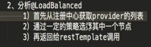

**Eureka--注册中心**
================

启动类上添加

****注册中心服务器配置文件****
-------------------

****服务配置文件****
--------------

****Ribbon****
==============

****调用远程方法方式****
----------------

****自定义负载均衡策略****
-----------------

Product-service是你要调用的服务的application-name

****Feign****
=============

****使用步骤****
------------

mapping一定要和sprduct-service里的一样，参数也是

****Hystrix****
===============

****引入****
----------

****添加注解（2个都可以）****
-------------------

****使用（参数名称一定要一致）--->降级****
---------------------------

****与feign整合--->熔断****
----------------------

### ****添加配置****

### ****声明熔断方法****

熔断方法继承feign接口，一旦调用findbyid失败就会熔断，然后抛出异常，之后降级处理

****Feigin设置的超时时间不生效的原因--hystrix的超时时间没有设置****
---------------------------------------------

不能起到作用

### ****解决方法--对hystrix也设置超时时间****

****Zuul网关---暴露在公网中，其他服在内网，相当于nginx****
=======================================

****依赖****
----------

****配置文件****
------------

### **1. ******向eureka注册网关****

### **2. ******在启动类上添加注解 enablezuulproxy****

### **3. ******通过网关访问规则****

例如有一个order-service的服务--端口是8781

现在通过zuul访问--zuul端口是9000  order-service就是服务在eureka注册的名字

****自定义访问规则和拒绝访问****
--------------------

自定义规则路径不能完全一样不能都是/apigateway/**，会覆盖

如果觉得/order-service写起来麻烦

访问就变成了192.168.0.107:9000/apigateway/api/v1/xxxxxxxxxxx

### ****拒绝访问****

Ignored-services：指定在eureka的服务名字

Ignored-patterns：正则表达式指定

****Cookie过滤****
----------------

默认过滤以下内容

解决方法

****自定义过滤器--extends ZuulFilter，实现4个方法****
-----------------------------------------

### ****FilterType****

### ****FilterOrder****

### ****ShouldFilter****

### ****Run****

****限流处理--也是基于zuulfilter实现****
------------------------------

采用guava---就是生产100个令牌，每个线程进来都会拿一个，如果拿不到就不让他运行，从而限流

****集群部署****
------------

直接启动多个相同的节点就行了，只要名字一样就行

****Sleuth----打印日志****
======================

****Zipkin****
==============

添加地址

****Config-Server****
=====================

****引入&添加注解****
---------------

****配置****
----------

基础配置

添加git配置

****访问****
----------

如果要访问配置服务提交的application.yml

### ****访问的多种形式****

返回master（默认），以json格式

以properties格式

****使用****
----------

### ****引入依赖****

****配置--配置到bootstrap.yml****
----------------------------

这样就会去读取  服务器的名称-profile   product-service-test