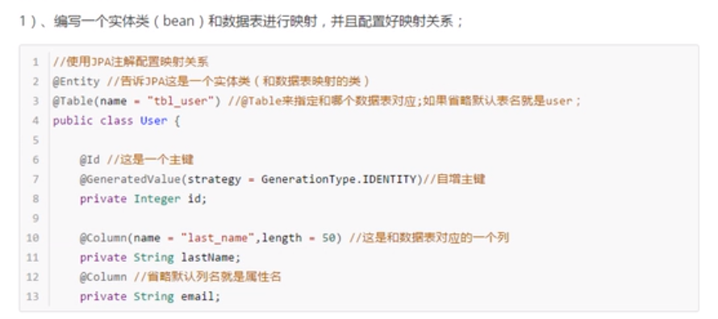

# springboot
@RestController = @Responsebody+@controller

配置文件后缀名---->yml或者xml

@SpringBootApplication 作为程序入口类

Session中取值要用${session.key}
其他的只要${key}
# 通过配置文件注入:
创建application.yml (例如)
hello:
    name: lxh
hello为你起的前缀名字；
name为你要注入类的属性名，要一一对应
如果是数组
list:
  - apple
  - lllll
map: {k1:(空格)v1,.....}

如果是properties
hello.name = 张三
(list)person.list = a,b,c;
(map)person.map.k1 = v1;
(pojo)person.stu.name=zhangsan

然后用@ConfigurationProperties(prefix = "hello")来注入到相应的类上

@PropertySources(value = {配置文件的名字})--->引入配置文件

@importResources(classpath:......)--->导入spring的配置文件就是配置bean的文件

@Autowired如果标注在方法上，对方法（）中的参数进行赋值

springboot推荐使用全注解方法--->创建一个类并标注@Confirguration----->对你需要加入的bean的方法添加@bean方法，方法返回值就是bean
id为方法名称

配置文件中就可以修改项目名通过 server.servlet.context-path=/abc

高优先级的配置会覆盖低优先级的配置，但是如果都不相同就会形成互补配置

# 日志文件
日志文件的组成是由----->门面+实现；springboot 底层日式配置是slf4j+logback
门面就是说为了统一日志写了各种接口     例如slf4j...
实现就是实现相对应门面中的接口 从而达到日志的效果   logback

但是很多时候，以前版本的日志没有考虑到接口层，所以如果要实现这种模式要添加相应的适配包，例如log4j 和 slf4j  就要使用 slf4j-log412 jar 包

还有一种情况就是很多底层框架的门面并不是slf4j  例如Spring底层是commons,hibernate底层是logging-boss

所以要先用对应的jar包来替换底层框架的jar包来和slf4j进行适配

# 静态资源
"classpath:/META-INF/resources/", 
"classpath:/resources/",
"classpath:/static/", 
"classpath:/public/" 
"/"：当前项目的根路径

/**的所有静态资源文件都去上面的3个文件夹中找---->resources static public 

# 模板引擎
thymeleaf
首先导入thymeleaf-starter
如果想用高版本再导入相应的依赖和布局版本  3.0以上的依赖版本对应的布局版本为2
## thymeleaf语法
先导入约束，
th:text ===导入文本内容.

通过继承WebMvcConfigurerAdapter或者WebMvcConfigurer接口来实现各种方法的调用
只要继承了WebMvcConfigurer。。。类就相当于书写springmvc.xml  ，底层会调用setConfirguers来调用所有关于WebMvcConfigurer子类的配置
如果使用@EnableWebMvc相当于不需要springboot帮我们配置好的配置，全面接管springmvc

# 国际化
在resource下创建i18n文件夹
格式: 文件名.properties(默认)
         文件名_zh_CN.properties中文
         文件名_en_US.properties英语.......
记住要在application.properties中写上spring.message.basename=i18n.文件名 更改默认配置
'#{}'用来获取国际化信息（在标签内）
（在标签外）用[[#{....}]]
如果要带参数不要用?---->用()  例如（id='1'）

如果要实现点击跳转的方式进行语言的切换  可以将一个类继承LocaleResolver

html中判断是否存在一个值th:if = "  ${not #strings.isempty(name) }"

表单提交最好使用重定向，防止重复提交

# 拦截器
创建一个类继承HandlerInterceptor

然后把拦截器配置到WebMvcConfigurer中

# 代码抽取
1、抽取公共片段

&copy; 2011 The Good Thymes Virtual Grocery

2、引入公共片段

~{templatename::selector}：模板名::选择器
~{templatename::fragmentname}:模板名::片段名

3、默认效果：
insert的公共片段在div标签中
如果使用th:insert等属性进行引入，可以不用写~{}：
行内写法可以加上：[[~{}]];[(~{})]；

3中插入方式
th:insert：将公共片段整个插入到声明引入的元素中  （引入的元素就是用什么包裹，div。。。）

th:replace：将声明引入的元素替换为公共片段

th:include：将被引入的片段的内容包含进这个标签中

<footer th:fragment="copy">
&copy; 2011 The Good Thymes Virtual Grocery
</footer>

引入方式

效果

    <footer>
    &copy; 2011 The Good Thymes Virtual Grocery
    </footer>

<footer>
&copy; 2011 The Good Thymes Virtual Grocery
</footer>

&copy; 2011 The Good Thymes Virtual Grocery

可以给引入的片段加上相应的参数，例如

如果要修改date ---> 使用dates.format(格式化的对象，'yyyy-MM-dd HH:mm')
spring.mvc.date-format --->修改日期提交格式

如果要使用method=put方法，（method在html中只有post和get）
要配置HiddenHttpMethodFilter
在form表单下添加一个隐藏的input框
<input type="hidden" name="_method" value="delete"/> (value就是你要传递的method)

# 错误页面自定义（自己访问的是界面，其他人访问返回JSON数据）
1.可以在templates模板引擎下创建error文件夹，也可以在static静态资源中，不过不会有模板引擎的加载内容

别人访问你的页面如果错误返回的是JSON 格式的数据 如果想要自定义
需要重写一个类然后使用ExceptionHandler(异常类的名字.class)
public Map<String,Object> xxx(Exception e)
{
     map = new map();
     map.put
     map.put
     return map;
}
这样没有自适应效果，页面显示和别人访问都是相同的样子

2.转发error进行自适应
 返回值 Map<String,Object>--->String
   return map;---> return "forward:/error"
一定要设置相对应的错误状态码request.setAttribute("javax.servlet.error.status_code",500);

如果想要在JSON中返回自己的错误字段  可以让一个类继承DefaultErrorAttributes
并重写getErrorAttributes  返回一个map，map可以用父类的getErrorAttributes方法来获得原始的map，然后再map中put你想要添加的字段

如果想要吧自定义错误中的字段也显示出来，可以先存到request域中，然后再继承DefaultErrorAttributes的类中取出并添加到map中。

# 注册servlet
ServletRegistrationBean
创建一个类继承HttpServlet作为你自定义的Servlet
然后再配置类中 添加一个方法
@Bean
public ServletRegistrationBean myservlet（）
{
     ServletRegistrationBean xxx = new ServletRegistrationBean(new 自定义的servlet，要拦截的uri)
     return xxx;
}

# Springboot-JDBC

springboot会自动加载schema.sql或者schema-*.sql创建表单，（加上一句initialization-mode:always）

Mapper文件配置（如果有自动生成的属性，可以在方法上添加@Options让其返回结果的时候带上自动生成的属性）

# Springboot-mybatis
## 注解版
首先可以通过书写接口，直接在接口类上加上@Mapper,然后再相应的方法上添加sql语句
例如：

## 配置文件版
在Resources包下创建相应的xml文件（配置文件和mapper.xml文件），
然后再application配置文件中通过mybatis-config-location :classpath:.... 配置，mybatis配置文件的位置
mapper-location：classpath:....  配置mapper.xml文件位置

# Springboot 整合SpringData JPA
## 创建
1.编写一个实体类来映射数据库

2。然后用一个类来实现JPA接口<User,Integer>第一个是要实现的数据库映射类，第二个是主键的类型

3.使用JPA自动建库（配置）前提是要有一个实体类来映射

## CRUD操作

