 # springboot2.0
 单元测试
 
resources下的  static,public,resources,META-INF/resources包下的东西都不用加包名
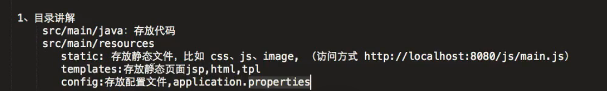
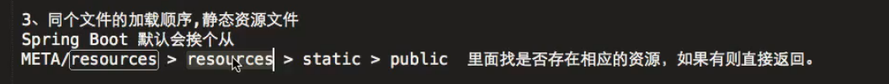
## JSON
如果pojo中的属性不想返回JSON字符串给前端，可以在属性上添加上@JsonIgnore
如果想返回给前端的JSON字符串不和数据的字段相同，可以给他起一个别名@JsonProperty("xxxx")
还可以设置JSON返回格式  @JsonFormat(pattern="yyyy-MM-dd hh:mm:ss",locl="zh",timezone="GMT+8")
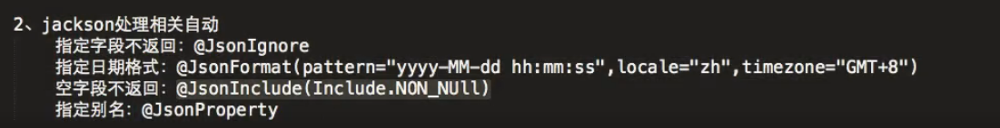

## 静态资源
如果想自定义静态资源的包，可以配置，在后面添加就行了
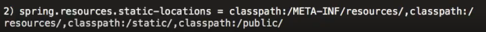

## 文件上传
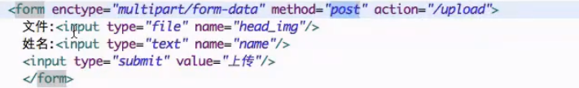
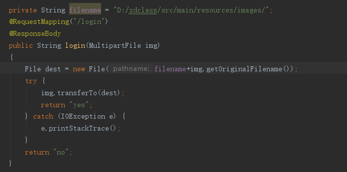

设置文件上传大小
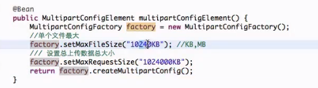

## 热部署
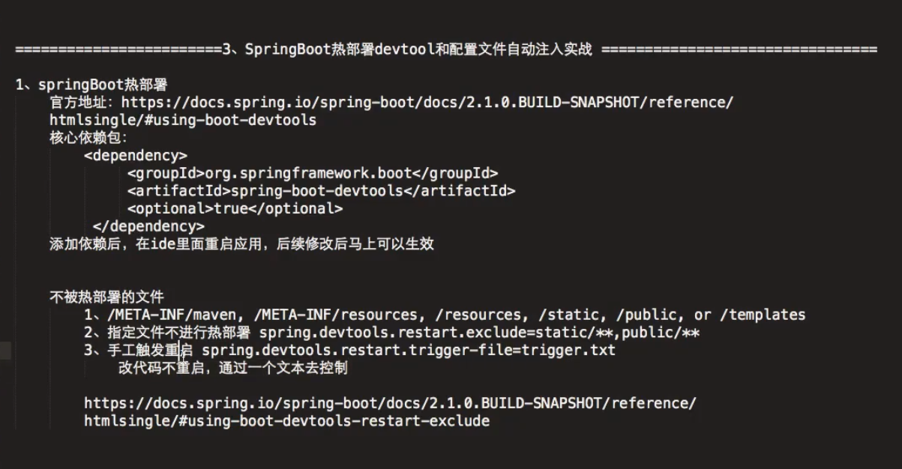

## MockMvc

相当于一个http的客户端
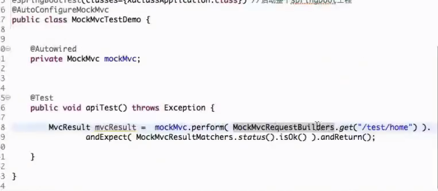

## 异常捕获
在一个类上添加@RestControllerAdvice(返回Json)  如果是其他的就添加@ControllerAdvice
然后再方法上添加需要捕获的异常种类例如：@ExceptionHandler(value=Exception.class) 表示捕获所有异常
然后就可以在方法中实现相应的跳转操作。
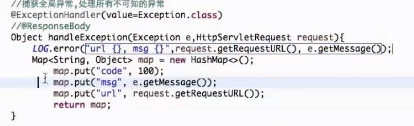
自定义异常，也是同样的用ExceptionHandler捕获
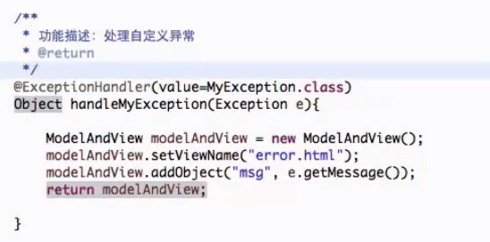

## 过滤器
实现一个类implements Filter
然后实现相应的方法
在类上添加@WebFilter(urlPatterns=" xxx ")
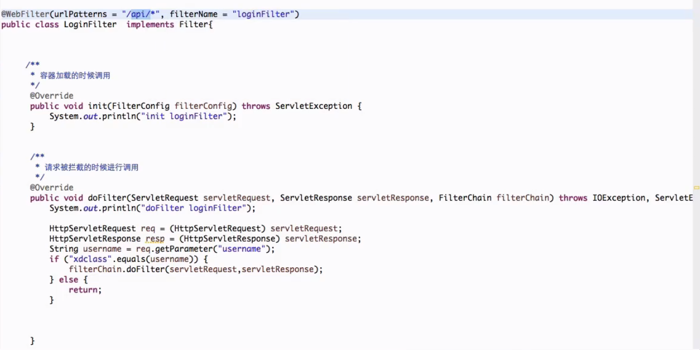
## 原生Servlet  @WebServlet
在一个类上添加@WebServlet 就行了
然后再启动类上添加@ServletComponentScan
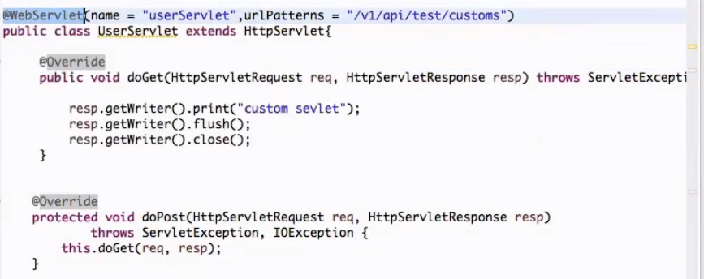

## 原生Listener   @WebListener
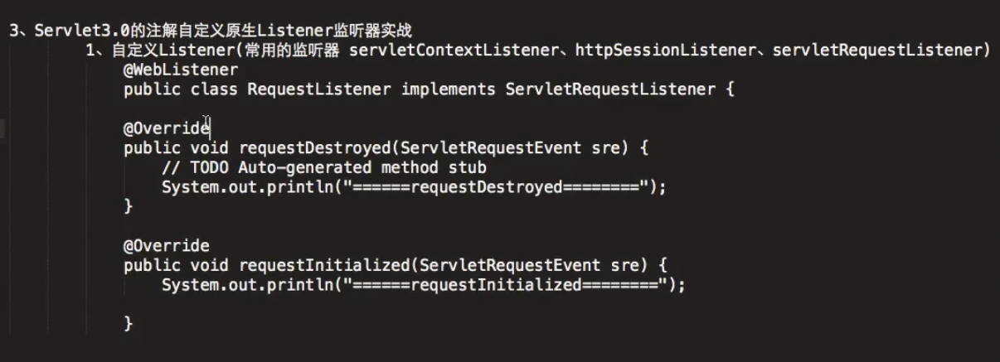

## 拦截器
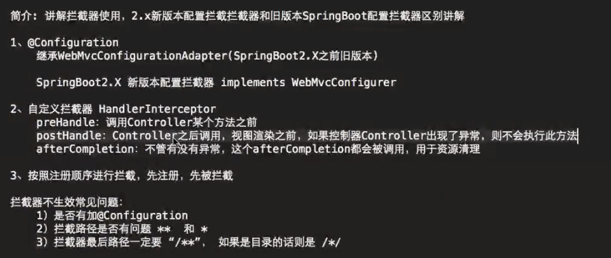

拦截器和filter的区别
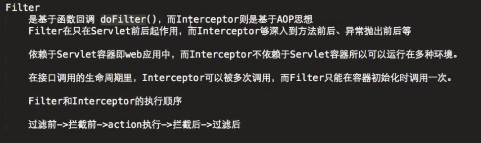

# 整合mybatis
引入jar包
mybatis-springboot
JDBC驱动包
连接池druid

配置文件：
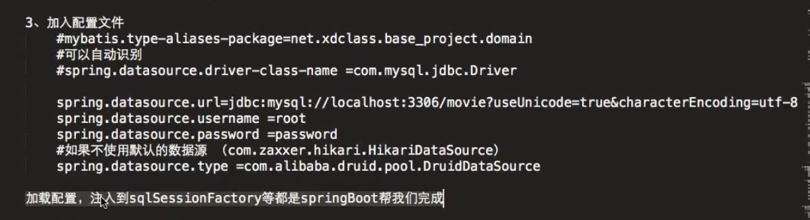

## 数据库
字段不同可以用@Results({@Result(column = "xxx" ,property = "xxx"},@Result......)column为数据库中的字段，property是pojo中的字段

事务

## Redis

## 整合定时任务和异步处理
在启动加载类上添加@EnableScheduling
在需要定时的方法上添加
@Scheduled(fixedRate = xxx)xxx秒执行一次，如果内部操作超过xxx秒，那么就按xxx秒
@Scheduled(fixedDelay = xxx)上一次执行完之后过xxx秒
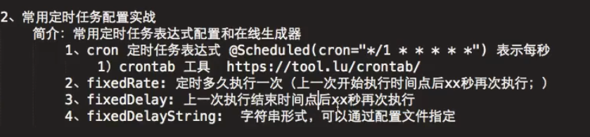

## 异步任务
在启动类上添加@EnableAsync
在你需要的方法上或者类上添加@Async注解表示是异步处理
获取异步结果
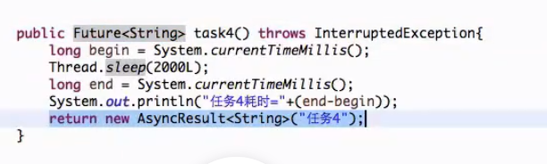
接收结果

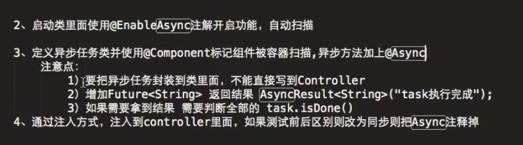

## LogBack

## 搜索框架
整合elasticSearch
1.导入和spring-data整合的jar包
2.创建一个文章对象@Document(indexName="", type="") indexname相当于数据库名，  type相当于表名
3.创建一个接口去继承ElasticsearchRepository<xxx,xxx>第一个参数是一个实体类就是2创建的   
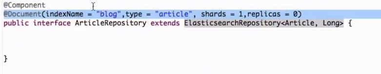

4.基本插入样式
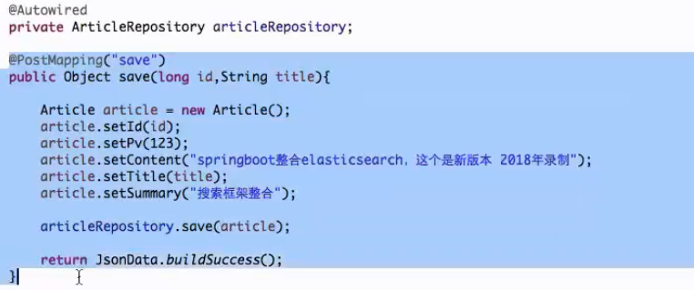

5.搜索
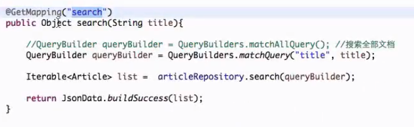

## 消息队列JMS--->AMQ(JMS是接口，AMQ是实现)
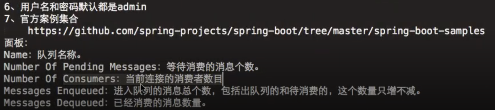

1.导包
2.配置文件
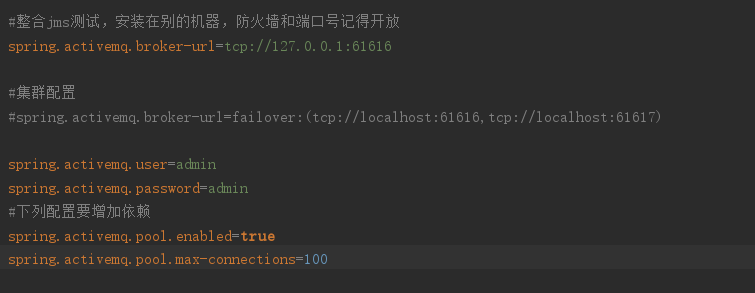
3.首先在启动类上添加@EnableJms
4.编写发送信息模板
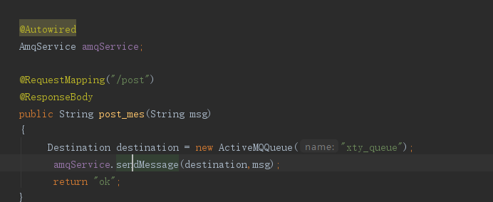
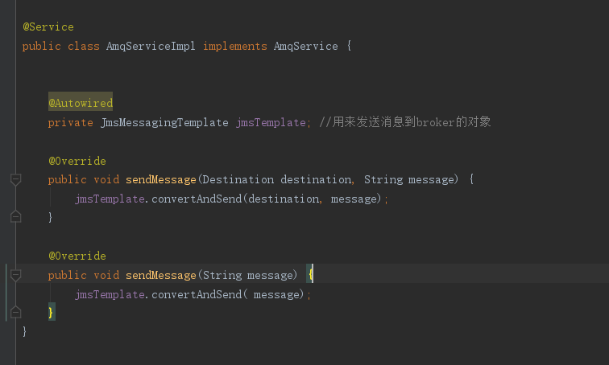
5.编写监听者
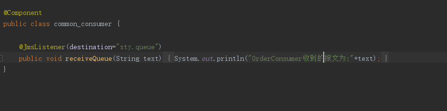
（默认只支持点对点）

## AMQ的订阅-->topic
1.配置文件--->一旦加了这个注释就能支持订阅，但是不支持点对点了，所以要想都支持，需要重写jmslistener
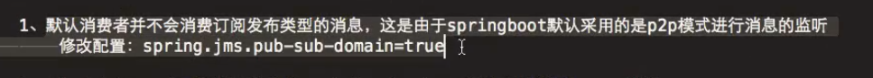
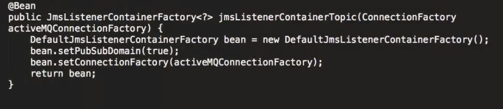

2.其他的格式和书写queue点对点一样，除了在订阅者上加上
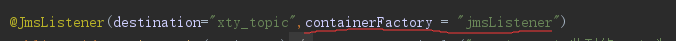

# RMQ消息队列

## 多环境配置
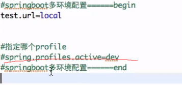
配置文件格式application-xxx       spring.profiles.active=xxx
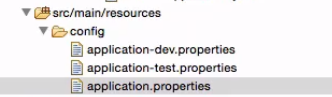

# WebFlux
1.也有controller层，但是返回的类型有些不一样，
2.如果返回的是一个，则用Mono<xxx>,如果是多个就用Flux<xxx>接收----->Flux和Mono可以转化
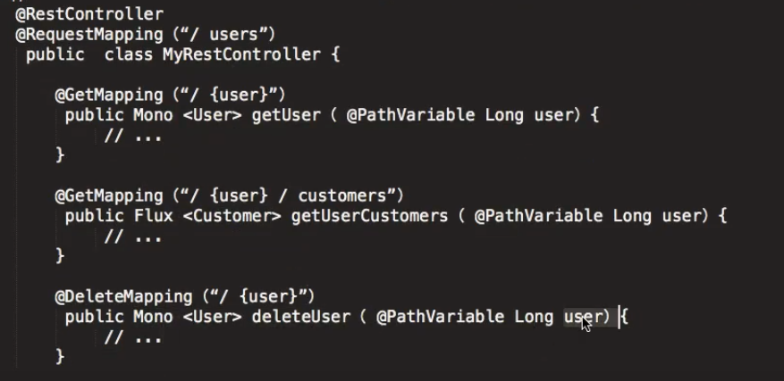
3.返回值
Mono---->Mono.just
Flux---->Flux.from
4.如果返回值设置了延迟，每一条数据之间间隔了几秒，如果什么都不加，默认会等全部加载完了才会全部展示出来，
可以使用produces=xxx 来加载每一个流产生的数据，产生一个加载一个

## WebClient
模拟客户端的访问

##  服务端与客户端的交互
1.ajax  单向
2.websocket  双向

3.Server-Sent Events--->SSE  单向
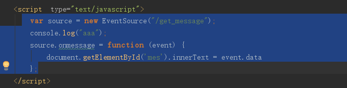
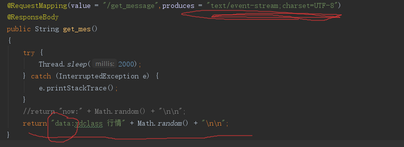

