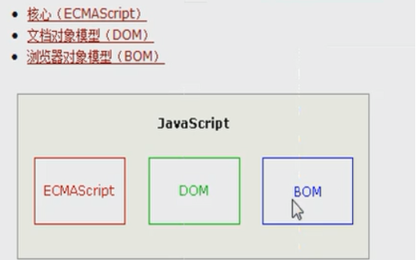
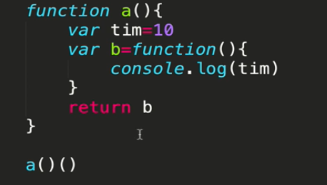
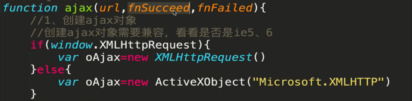
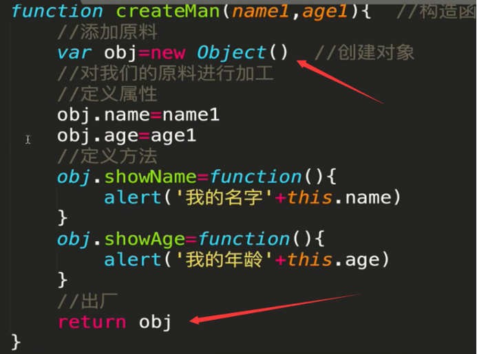

****//表示每隔3000ms执行changImg()函数****

注意点
===

获取样式
----

****Xxx.style.background--->这样只能获取内联样式****

获取元素
====

数据类型
====

数据转换
====

创建数组和对象
=======

函数的创建和使用
========

****括号内的方法可以(function fun(){})()或者(function fun(){}())执行****

不定参数arguments
=============

闭包
==

数组操作（没见过的）
==========

****Slice(a,b)  选取下标从\[a,b)的元素****

****arr.splice(0,1,排球） 删除下标为0开始的一个元素，并且在下标为0开始的地方插入一个元素排球****

定时器
===

使用
--

清除
--

获取节点
====

插入，删除元素
=======

文档碎片
====

快速获取表单元素
========

事件对象和事件冒泡
=========

事件冒泡
----

****就是比如div2包裹着div1，如果都有点击事件点了div1，div2也会触发****

事件绑定和解绑
=======

****第三个参数是事件捕获，相同事件比子类优先执行****

阻止默认行为
======

原生ajax
======

创建对象的2种方法
=========
通过return
--------

****创建对象只要var a = createMan(xxx,xxx);****

通过new
-----

****创建对象只要var a = new createMan(xxx,xxx)****

Bom属性和对话框
=========

