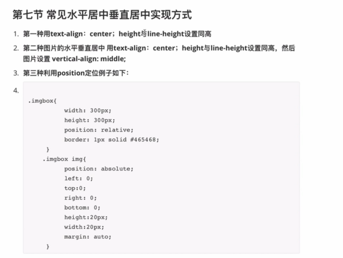

**注意点**
=======

****选择器****
===========

****Border****
==============

border-style：属性1，属性2，属性3，属性4

上->右->下->左

border-style：属性1，属性2，属性3

上->左右->下

border-style：属性1，属性2

上下->左右

border-style：属性1

上下左右属性相同

****Float****
=============

float和fixed,absolute（绝对定位和相对定位）脱离文档流，float脱离文本流

（top left bottom right）

****清除浮动（就是让下面的（第一个）元素不要被之前的浮动元素带跑）****
---------------------------------------

第二种最好

****css定位****
=============

****relative:****
-----------------

相对于自身原来的位置进行移动

****absolute:****
-----------------

相对于祖上元素定位，如果祖上元素没有设置定位，就相对于最外层祖先元素(html)定位，如果祖上元素设置了（relative，absolute，fixed）（不包含static）就相对于第一个设置了定位的祖先进行移动

****fixed:****
--------------

相对于浏览定位

****static:****
---------------

没有定位，默认值

****Inherit:****
----------------

****自适应布局****
=============

****依靠浮动****
------------

****依靠相对定位****
--------------

****设置水平居中****
==============

是针对的容器大小设置的

如果子属性有图片还要设置vertical-align
