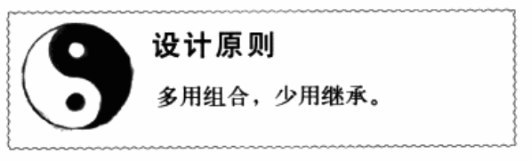
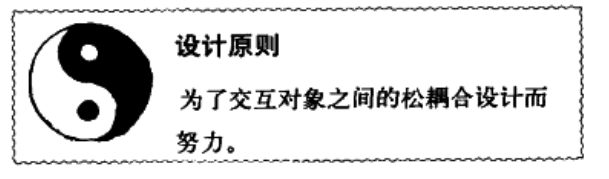
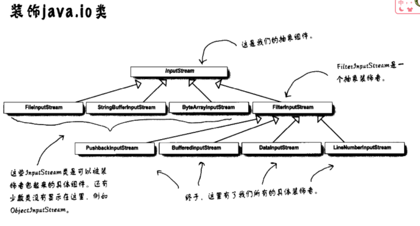
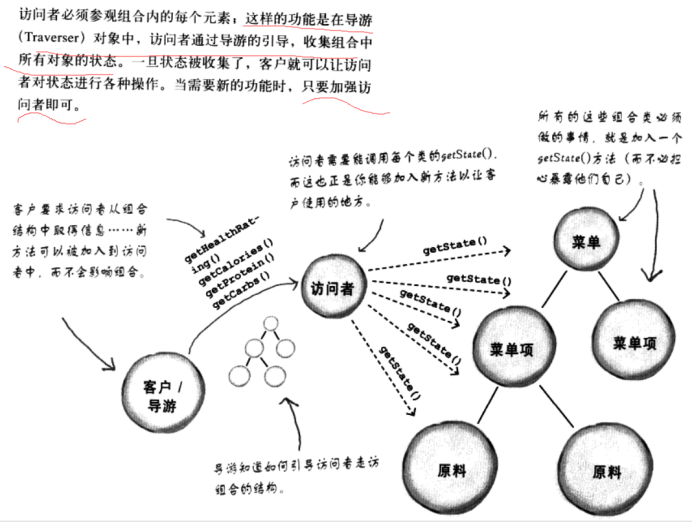

**策略模式（鸭子不同品种）**
================

就是将不同类型的类分开（例如不变的属性和变化的属性），然后用接口去实现他们，形成一个家族，然后再主类中使用组合的操作，使得程序灵活

（组合就是类结合到一起使用）

****观察者模式---就是订阅（报纸）****
========================

****主题Subject****
-----------------

****订阅者****
-----------

****Java自带---（主题（被观察者）Observable  观察者Oberver）****
-------------------------------------------------

Observable.add（Observer）添加观察者

一旦改变数据只要调用被观察者的setChanged()和notifyObservers()方法

Observer的update方法就会被唤醒

****设计原则****
------------

****装饰者模式---属性多且容易变化的时候（咖啡加料）****
=================================

就是有一个总的接口或者抽象类，所有的装饰着都继承这个类，然后需要用装饰类去装饰该接口的实现类时，只要用实现类去new装饰类就可以实现对子类的扩充。

装饰者有一个接口的变量，用于获取传递过来的子类附加属性

初始子类没有这个接口变量

****工厂模式---工厂（abstrract）提供接口来给子类实现产品制造（做披萨）****
===============================================

****定义****
----------

****方法格式****
------------

****简单工厂---引用的是对象而工厂模式是提供的接口让子类自己实现****
---------------------------------------

****依赖倒置原则****
--------------

使用依赖倒置原则之前，pizzastor依赖pizza的具体实现

使用依赖倒置原则之后，双方都依赖于pizza抽象类

****抽象工厂模式（接口）****
------------------

****与工厂方法的区别****
----------------

子类的实现和工厂方法类似，也是通过子类来实现具体产品，不同的是抽象工厂的超类是接口，而工厂方法提供的是抽象类，是一种框架，他本身已经实现了一部分内容，工厂使用的是继承，而抽象工厂是组合

### ****工厂方法****

是一个抽象类，让子类自己去实现具体的创建

### ****抽象工厂****

是一个接口，子类去实现完整方法。

****单件模式----双重检索****
====================

把构造方法设置为私有，然后设置静态方法getinstance获得实例

****单线程****
-----------

****多线程****
-----------

****全局变量----随时可能改变（不推荐）****
---------------------------

****命令模式（遥控器）****
=================

就是要要操作的对象封装成类，然后所有的操作都实现一个相同的接口（Command接口），

Command接口只暴露execute方法，然后再execute中去使用操作对象的方法，然后Client只需要使用Command接口就可以操作所有对象

****Client---->遥控器****
----------------------

****Command--->Command接口（所有的操作都要实现这个接口）****
-------------------------------------------

****Invoker---->实现Command接口的类，实现execute方法来调用操作对象的具体方法****
---------------------------------------------------------

****Receiver--->就是具体要操作的对象****
------------------------------

、

****适配器模式（火鸡变鸭子）****
====================

****简单例子----类适配器（想要变成的作为接口，需要改变的作为值传入）****
------------------------------------------

有一个duck接口

实现普通duck的类

但是我现在有一个火鸡接口

一个普通的火鸡类

但是我现在想要一个duck，可是我现在只有火鸡，所以需要用火鸡来冒充duck，用火鸡传入，然后再duck方法中调用火鸡方法

****简单例子---对象适配器****
--------------------

就是对象用继承的方式实现，但是java不支持多继承

外观模式（家庭影院功能整合）
==============

和适配器模式一样是针对接口，不过外观模式是简化接口，而适配器模式是改变接口

****最少知识原则---注意和你交互的类****
-------------------------

### ****如何做到--不要创建新的对象，调用这个对象内的方法和对象****

具体实现：

首先是对象本身的方法

传递进来的参数

方法内实例化的对象

对象内本地变量

****模板方法（sort）****
==================

就是超类定义一组方法的执行，方法可以是抽象的由子类实现也可以是实现好的

****钩子****
----------

就是选择模板中的一些方法可以选择性使用

****好莱坞原则--子类可以通过钩子来进行一些操作****
------------------------------

****迭代器模式---就是迭代器****
=====================

DinnerMenuIterator实现iterator（自己定义的）接口

****一个责任原则****
--------------

****组合迭代器(外部迭代器)------递归的思想****
-------------------------------

就是如果一个类有子类如何用迭代器遍历他本身和他的子类

所有的非叶子节点都去创建一个createIterator方法，这样就可以返回一个包含所有子类的迭代器，遍历的时候只要判断是不是叶子节点，如果不是就用一个栈来维护这些迭代器

****外部迭代器和内部迭代器****
-------------------

外部迭代器就是实现一个迭代器接口，然后方法直接返回一个迭代器，我们用这个迭代器遍历

内部迭代器就是我们调用方法，他自己会用迭代器遍历，不需要我们获取迭代器自己遍历

****状态模式（饮料机状态）****
===================
还是用了多态，一个总的状态接口，然后很多个状态实现类，动态改变总接口的状态实现不同状态的调用

****和策略模式的区别****
----------------

类图基本一样，都是通过组合，运用多态，不过一个是用户手动指定组合对象，而状态模式是封装好的用户并不知道

****代理模式****
============

****JAVA底层实现****
----------------

客户端的代理叫做STUB   服务端的叫做SKELETON

### ****服务端的实现****

1.  实现一个远程接口，显示出客户端可以调用的方法（继承Remote方法，RMI的规则，兵抛出异常）

2.制作远程实现---为了成员远程服务（最简单的方法实现UnicastRemoteObject方法）

****但是****UnicastRemoteObject可能会抛出异常，所以子类要去捕获，做法是创建一个构造类

3.向Rmi register注册这个服务（Naming.rebind(“服务名”,服务实例)）

4.  产生Stub和Skeleton

5.  启动rmiregistry

6.  启动远程服务

### ****客户端****

获取远程服务

****虚拟代理（请求大数据时）****
--------------------

****动态代理---动态创建proxy****
------------------------

Proxy.newProxyInstance,上面的代理都是通过rmiregistry生成的

比普通的代理多了一个控制代理，通过实现InvocationHandler来操作

****保护代理----控制代理访问实例****
------------------------

运用的也是动态代理的技术，在动态代理的基础上新增了handler来控制访问

****复合模式****
============

****MVC****
-----------

### ****模型与视图和控制器的模式（观察者模式）****

### ****控制器和视图的模型（策略模式，组合模式）****

控制器提供了很多策略，就是很多个对于同个接口的不同实现，对于控制器、菜单等组件，通过组合模式将他们组合进来，这样就可以用顶层容器通过多态去完成不同的任务。

****Web和MVC****
---------------

****总结****
==========

**额外的模式**
=========

****桥接模式****
------------

****生成器模式****
-------------

****责任链模式(多个对象共同处理)****
-----------------------

****蝇量模式(比如说用数组来保存你的所有实例变量，然后通过传值动态改变对象，这样就不用创建很多个实例)****
---------------------------------------------------------

例子：

例如一棵树有一个坐标

Public class Tree{

  Private int x;

  Private int y;

}

我要创建100棵树就要100个Tree对象

利用蝇量我可以把所有的x,y保存在二维数组中state\[100\]\[100\]；

只要创建一个Tree对象，通过构造函数动态改变x，y就行了

****解释器模式(解释形成一个类)****
----------------------

****中介者****
-----------

各个部件之间互相之间与联系，可以通过把要求交给中介者来处理安排。

****备忘录****
-----------

****原型模式****
------------

****访问者模式(访问一个方法，而且想加强的时候，加强是临时的，不改变原方法)****
--------------------------------------------

